1.  **Basics of Fourier Transform**

Fourier transform is a process to convert a spatial domain signal (i.e.,
time domain signal) into a frequency domain signal. Oppositely, the
inverse Fourier transform is a process to convert the frequency domain
signal to the primary time domain signal.

**Fourier transform**

The Fourier transform of a time-domain signal is defined as follows

$$X(\omega) = \int_{-\infty}^{\infty} x(t) \cdot \exp(-j \omega t) \, dt$$

*\*\*x(t) denotes the signal in the time domain,* $X(\omega)$ *denotes
the signal in the frequency domain and* $\omega$ is the angular
frequency.

**Inverse Fourier transform**

$$x(t) = \frac{1}{2\pi} \int_{-\infty}^{\infty} X(\omega) \cdot \exp(j \omega t) \, dt$$

**Discrete Fourier Transform (DFT)**

For digital systems, the Fourier transform is realized by:

For complex numbers $$\( x_0, x_1, x_2, x_3, \dots, x_{n-1} \)$$

$$ X[k] = \sum_{n=0}^{N-1} x[n] \cdot W_N^{kn} $$

where $$\( k = 1, 2, 3, \dots, N-1 \)$$

Where $$\ W_N \$$ is the $$\ n \$$-th root of unity given by:

$$ W_N = \exp\left(-j \left(2 \frac{\pi}{N}\right) \right) $$

***DFT Algorithms are at the end of this article***

**Fast Fourier Transform (FFT)**

The basic idea of a fast Fourier transform is to break up a transform of length \( N \) into two transforms of length \( N/2 \).

For complex numbers $$\( x[n] \)$$ where $$\( n = 1, 2, 3, \dots, n-1 \)$$

$$ X[k] = \sum_{n=0}^{N-1} x[n] \cdot W_N^{kn} $$

This can be expanded as:

$$ X[k] = \sum_{r=0}^{(N/2)-1} x[2r] \cdot e^{-j 2\pi k (2r)/N} + \sum_{r=0}^{(N/2)-1} x[2r+1] \cdot e^{-j 2\pi k (2r+1)/N} $$

***In the above transform of length \( N \), it is broken into two transforms of length \( N/2 \), and on the other hand, they pick up even and odd samples of \( x[n] \) separately.***

This can be rewritten as:

$$ X[k] = \sum_{r=0}^{(N/2)-1} x[2r] \cdot e^{-j 2\pi k r/(N/2)} + e^{-j 2\pi k/N} \sum_{r=0}^{(N/2)-1} x[2r+1] \cdot e^{-j 2\pi k r/(N/2)} $$

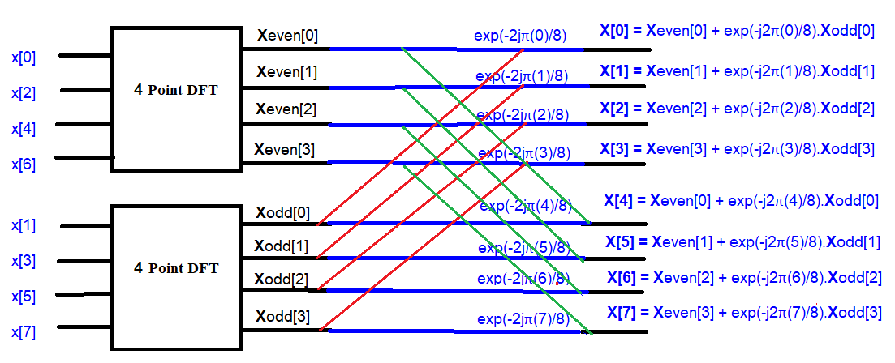

In the above diagram {**X\[0\], X\[1\], X\[2\], X\[3\], X\[4\], X\[5\],
X\[6\], X\[7\]**} is the Fourier transform of {x\[0\], x\[1\], x\[2\],
x\[3\], x\[4\], x\[5\], x\[6\], x\[7\]}

*\*\*FFT algorithms are at the end of this article*

2.  **Advantages of FFT over DFT**

To compute the DFT of an N-point sequence it take O(N^2^) multiplies and
adds. The FFT algorithm computes the DFT using O(N log N) multiplies and
adds.

The fast Fourier transform (FFT) is a discrete Fourier transform
algorithm which reduces the number of computations needed for N points
from 2N^2^ to 2Nlog~2~N.

3.  **Properties of Fourier Transform**

<!-- -->

1.  **Linearity**

The Fourier Transform satisfies linearity & principle of superposition

Consider two functions x~1~(t) & x~2~(t)

If F(x~1~(t)) = X~1~(ω), F(x~2~(t)) = X~2~(ω)

Then F\[a~1~x~1~(t) + a~2~x~2~(t)\] = a~1~X~1~(ω) + a~2~X~2~(ω)

2.  **Scaling**

F(x(t)) = X(ω)

If 'a' is real constant then

F(x(at)) = $\frac{1}{|a|}$X(ω),

3.  **Symmetry**

When x(t) is real and even then X(ω) = X^\*^(-ω)

When x(t) is real and odd then X(ω) = X(-ω)

4.  **Convolution**

Fourier transform makes the convolution of 2 signals into the product of
their Fourier Transform. There are two types of convolutions, one for
time domain and other for frequency domain.

a.  **Time domain convolution**

F(x~1~(t)) = X~1~(ω), F(x~2~(t)) = X~2~(ω)

Then F(x~1~(t)\* x~2~(t)) = X~1~(ω) . X~2~(ω), \['\*' -- convolution
sign)\]

b.  **Frequency domain convolution**

F(x~1~(t) . x~2~(t)) = 1/2$\pi$.X~1~(ω) \* X~2~(ω) \['\*' -- convolution
sign)\]

5.  **Shifting Property**

F(x(t -- t~0~)) = e^-jωt0^ X(ω)

As a consequence, transforms leave the Fourier spectrum \| X(ω)\|^2^
unchanged.

6.  **Duality**

F(x(t) = X(t) = 2$\pi$ x(-ω)

7.  **Differentiation**

F($\frac{dx(t)}{dt}$ ) = jωX(ω)

8.  **Integration**

F$(\int_{- \infty}^{\infty}x$*(t) dt*) = X(ω)/jω

When a function (i.e., x(t)) is not an energy function and hence the
Fourier transform of $\lbrack\int_{- \infty}^{\infty}x$*(t) dt*\]
includes an impulse function.

F$(\int_{- \infty}^{\infty}x$*(t) dt*) = X(ω)/jω +
$\mathbf{\pi}$X$(0)\delta(\omega)$

9.  **Modulation Property**

F{x(t)*cosat*} = ½ {X(ω + a) + X(ω - a)}

F{x(t)*sinat*} = ½ {X(ω + a) - X(ω - a)}

10. If the Fourier transform of f(x) is F(k), then f^\*^(x) \<=\>
    F^\*^(-k)

As a consequence Fourier transform of a real function must satisfy the
symmetry relation.

F(k) = F^\*^(-k), meaning that the Fourier transform is symmetric about
the origin in k-space. \|F(k)\|^2^ = \|F(-k)\|^2^

11. **Parseval's theorem**

Energy =
$\int_{\mathbf{- \infty}}^{\mathbf{\infty}}\mathbf{|x}$***(t)\|^2^dt =
1/2***$\mathbf{\pi}$
$\int_{\mathbf{- \infty}}^{\mathbf{\infty}}\mathbf{|X}$***(*ω*)\|^2^d*ω**

The total energy in the time domain signal, x(t) \[i.e., the left
integral\] can be easily calculated from the frequency domain signal,
*X(ω)* \[i.e., from the right integral\]

12. **Time reversal**

F(x(-t)) = X(-ω)

4.  **Fourier Transform of some common signals**

    1.  **Fourier Transform of a delta function**

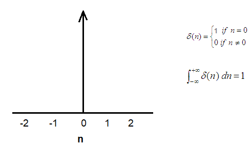{width="5.104166666666667in"
height="1.6608694225721785in"}

If x(t) = 𝛅(t), then Fourier transform,

X(ω) = $\int_{- \infty}^{\infty}x$*(t)e^-j^*^ωt^ *dt*

*=* $\int_{- \infty}^{\infty}\delta$*(t)e^-j^*^ωt^ *dt*

*=* $\int_{- \infty}^{\infty}{1.}$*e^-j^*^ω0^ *dt*

*= 1*

Thus Fourier transform of a delta/impulse is a constant equal to 1,
independent of frequency. Remember that derivation is used the shifting
property of the impulse to eliminate the integral.

2.  **Fourier transform of a unit step function**

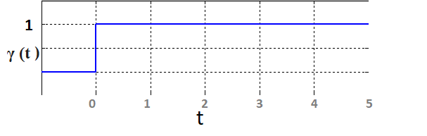{width="4.136000656167979in"
height="1.551388888888889in"}

γ (t) = 0 for t\<0

= 1 for t ≥1

We know that a unit-step function is an integration of a delta function.
So for a unit step function,

γ (t) = $\int_{- \infty}^{\infty}\delta$*(t) dt*

So, X(ω) = $\frac{1}{j\omega}$ F($\delta(t)$) +
$\mathbf{\pi}$F($\delta(0)$)$\delta(\omega)$

*\[See the property of integration above\]*

= $\frac{1}{j\omega}$ + $\mathbf{\pi}\delta(\omega)$ \[as
F($\delta(t)$)= F($\delta(0)$)=1\]

When a function (i.e., x(t)) is not an energy function and hence the
Fourier transform of $\lbrack\int_{- \infty}^{\infty}x$*(t) dt*\]
includes an impulse function.

3.  **Fourier Transform of a unit pulse function**

A pulse function can be represented as,

x(t)=Π(t) = γ (t + ½) - γ(t - ½)

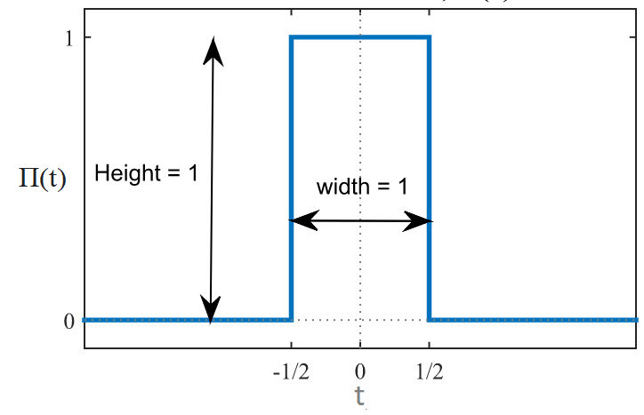{width="4.492055993000875in"
height="2.897490157480315in"}

For a function rect(t) = Π(t) = 1 for \|t\| ≤ ½

= 0 otherwise

Given that

x(t) = Π(t)

Hence from the definition of the Fourier transform we have

F (Π(t)) = X($\omega$) = $\int_{- \infty}^{\infty}{x(t)}$e ^-jωt^ dt

= $\int_{- 1/2}^{1/2}{1.}$e ^-jωt^ dt \[as Π(t) = 1 for \|t\| ≤ ½\]

= \[(e ^--jωt^)/-jω\]~-1/2~^1/2^

= \[e ^--jω/2^ - e ^jω/2^\] / -jω

= \[e ^jω/2^ - e ^-jω/2^\] / jω

= 2/ω . {\[e ^jω/2^ - e ^-jω/2^\] / 2j}

= 2/ω . sin(ω/2)

= {sin(ω/2) / (ω/2)}

= {sin($(\pi$(ω/2$\pi$)) / ($\pi$(ω/2$\pi$))}

= sinc(ω/2$\pi$)

For the above case, the rectangular function has a pulse width value of
1 over the interval of \[-½, ½\]; 0 otherwise.

Now we'll discuss a rectangular pulse that has a width of T

Then, rect(t/T) = Π(t/T) = 1 for \|t\| ≤ T/2

= 0 otherwise

Given that

x(t/T) = Π(t/T)

Hence from the definition of the Fourier transform we have

F (Π(t/T)) = $\int_{- \infty}^{\infty}{x(t/T)}$e ^-jωt^ dt

= $\int_{- T/2}^{T/2}{1.}$e ^-jωt^ dt \[as Π(t/T) = 1 for \|t\| ≤ T/2\]

= \[(e ^--jωt^)/-jω\]~-T/2~^T/2^

= \[e ^--jωT/2^ - e ^jωT/2^\] / -jω

= \[e ^jωT/2^ - e ^-jωT/2^\] / jω

= 2/ω . {\[e ^jωT/2^ - e ^-jωT/2^\] / 2j}

= 2/ω . sin(ω(T/2))

= {sin(ω(T/2)) / (ω/2)}

= {sin($\pi($ωT/2$\pi$)) / ($\pi($ω/2$\pi$))}

= {sin($\pi($ωT/2$\pi$)) / ($\pi($ωT/2$\pi$))}.T

= T. sinc(ωT/2$\pi$)

4.  **Fourier Transform of a unit triangle pulse**

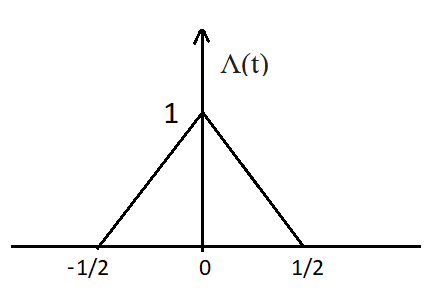{width="2.9679997812773404in"
height="2.087159886264217in"}

A unit triangle pulse is simply the convolution of a unit pulse function
with itself.

Here, Λ(t) = Π(t) \* Π(t)

*\[Π(t) is a unit pulse function & '\*' denotes convolution\]*

So, Λ(ω) = sinc(ω/2$\pi$) . sinc(ω/2$\pi)$ = sinc^2^(ω/2$\pi)$

5.  **Fourier Transform of a Sawtooth function**

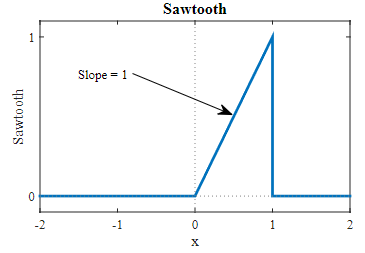{width="3.2395833333333335in"
height="2.296000656167979in"}

s(t) = 0, for t \< 0 and t \> 1

= 1, for 0 ≤ t ≤ 1

We can represent sawtooth as the integral of shifted unit pulse function
(to give the ramp) and a negative impulse (delayed by one second) to
give the discontinuity at the end of the ramp

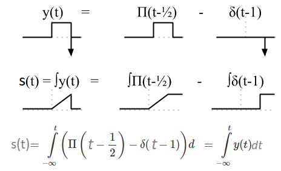{width="3.783333333333333in"
height="2.2in"}

s(t) = $\int_{- \infty}^{t}{\Pi(t - \frac{1}{2})}$dt -
$\int_{- \infty}^{t}{\delta(t - 1)}$dt =$\int_{- \infty}^{t}{y(t)dt}$

y(t) = $\Pi(t - \frac{1}{2})$ - $\delta(t - 1)$

Now, we've to find the Fourier transform of y(t),

Y(ω) = sinc(ω/2$\pi$)e^-jω/2^ - e^-jω^

We can now apply integral property with Y(0) = 0, to find S(ω)

S(ω) = F($\int_{- \infty}^{t}{y(t)dt}$) = Y(ω)/jω - $\pi$Y(0)$\delta$(0)
= Y(ω)/jω

= {(sinc(ω/2$\pi$)e^-jω/2^ - e^-jω^) / jω}

= {((sin(π . ω/2$\pi$) / (π . ω/2$\pi$))e^-jω/2^ - e^-jω^) / jω}

= (((sin(π . ω/2$\pi$) / (π . ω/2$\pi$))e^-jω/2^) / jω) -- (e^-jω^ / jω)

= (2(sin(ω/2)e^-jω/2^) / jω^2^) -- (je^-jω^ / j^2^ω)

= (2((e^jω/2^ - e^-jω/2^) / 2j)e^-jω/2^) / jω^2^) + (je^-jω^ / ω) \[as
j^2^ = -1\]

= (((e^jω/2^ - e^-jω/2^)e^-jω/2^) / j^2^ω^2^) + (je^-jω^ / ω)

= (((e^-jω/2^ - e^jω/2^)e^-jω/2^) / ω^2^) + (je^-jω^ / ω)

= (((e^-jω/2^ - e^jω/2^)e^-jω/2^) / ω^2^) + (je^-jω^ / ω)

= ((((e^-jω/2^ - e^jω/2^)e^-jω/2^) + jωe^-jω^) / ω^2^)

= ((e^-jω^ - 1 + jωe^-jω^) / ω^2^)

= ((e^-jω^(1+jω) - 1) / ω^2^)

5.  **Algorithms**

**For DFT & FFT**

Look at the aforementioned formula for DFT. The term ***W**^k^~**N**~
(*= exp(-j(2$\frac{\mathbf{\pi}}{\mathbf{N}}$ **.k) )** can be
represented as follows

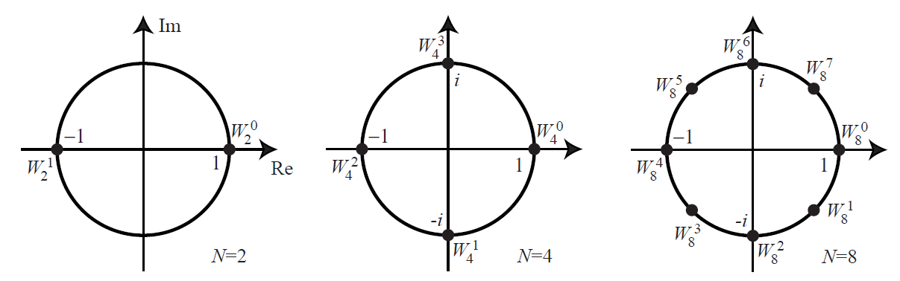{width="5.703274278215223in"
height="1.5570614610673665in"}

In the above figure the values for N = 2, 4, and 8 are shown in the
complex plain. Where 'N' denotes N point DFT.

For example,

**For a 2 point DFT**

**W~2~ = e^-2jπ/N^ = e^-2jπ/2^ = e^-jπ^ = -1**

Now, discrete Fourier transform for complex numbers a~1~ and a~2~ is

**A~K~** = $\sum_{n = 0}^{1}a$~n~ *W~2~^kn^*

= $\sum_{n = 0}^{1}a$~n~ *(-1)^kn^*

= a~0~ *(-1)^k\ .0^ +* a~1~ *(-1)^k\ .1^*

As **K =** 0 and 1 (for 2 point DFT)

So, **A~0\ ~**= a~0~ *+* a~1~

And **A~1~ =** a~0~ *-* a~1~

**Similarly for a 4-point DFT**

**W~4~ = e^-2jπ/4^ = e^-2jπ/4^ = e^-jπ/2^ = -j**

Now, discrete Fourier transform for complex numbers a~1~, a~2~, a~3~,
and a~4~ is

**A~K~** = $\sum_{n = 0}^{3}a$~n~ *W~4~^kn^*

= $\sum_{n = 0}^{3}a$~n~ *(-j)^kn^*

= a~0~ *(-j)^k\ .0^ +* a~1~ *(-j)^k\ .1^ +* a~2~ *(-j)^k\ .2^ +* a~3~
*(-j)^k\ .3^*

So, **A~0\ ~**= a~0~ *+* a~1~ + a~2~ *+* a~3~

**A~1~ =** a~0~ *- j*a~1~ - a~2~ *+ j*a~3~

**A~2~ =** a~0~ *-* a~1~ + a~2~ *-* a~3~

**A~3~ =** a~0~ *+ j*a~1~ - a~2~ *- j*a~3~

To compute **A** quickly, we can pre-compute common sub-expressions:

**A~0\ ~**= (a~0~ *+* a~2~) + (a~1~ *+* a~3~)

**A~1~ = (**a~0~ - a~2~) *-- j(*a~1~ *-* a~3~)

**A~2~ = (**a~0~ *+* a~2~) - (a~1~ *+* a~3~)

**A~3~ = (**a~0~ - a~2~) *+ j(*a~1~ - a~3~)

Then we can diagram the 4-point like so,

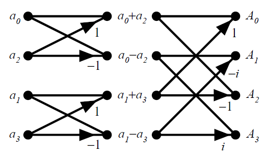{width="4.254671916010499in"
height="2.3639260717410324in"}

Fig: Three stages in the computation of an N=8-point DFT

{width="5.4501848206474195in"
height="2.511738845144357in"}

Fig: Three stages in the computation of an N=8-point DFT

**Matrix Relations in DFT**

The DFT samples defined by

*W~N~^kn\ ^* can be expanded as NXN **DFT matrix**

In the matrix the elements in first row and first column all are
*W~N~^.k.0^ or W~N~^.0^=1.* In the third row powers are multiplied by 2
and in the fourth row powers are multiplied by 3 and so on.

So,

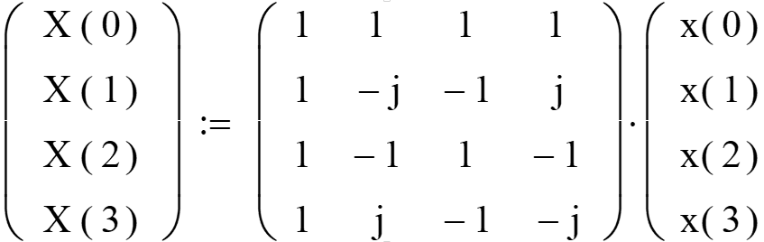{width="5.237485783027122in"
height="1.5151924759405075in"}

Oppositely, to find **inverse DFT** we replace the 'j' with '-j' in the
matrix or we take complex conjugates of the matrix elements.

So,

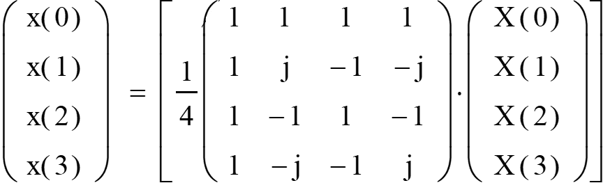{width="6.268055555555556in"
height="1.9076388888888889in"}

The effective determinant of above is 1/4

**For a 8-point FFT**

The FFT is a fast algorithm for computing the DFT. If we take the
2-point DFT and 4-point DFT and generalize them to 8-point, 16-point,
\..., 2^r^-point, we get the FFT algorithm.

**N=8-point radix-4 DIT-FFT**

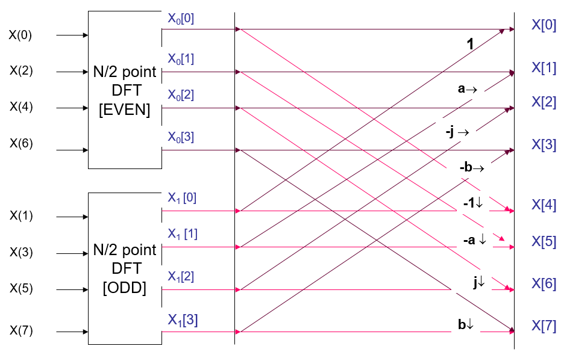{width="5.448472222222223in"
height="3.2711034558180225in"}

Where, -W^4^ = W^0^=1; -W^5^= W^1^ = a = (1-j)/√2; -W^2^ = W^6^=j and
-W^3^ = W^7^ = b = (1+j)/√2

The above diagram is same as illustrated in section 'Fast Fourier
Transform' under 'Basics of Fourier Transform'

**N=8-point radix-2 DIT-FFT**

{width="6.280231846019247in"
height="3.199833770778653in"}

**\*\*** *W^x^ = W~8~^x^*

6.  **Applications**

Fourier transform is used in circuit analysis, signal analysis, cell
phones, image analysis, signal processing, and LTI systems. The Fourier
transform is most probably the best tool to find the frequency in an
entire field. This makes it a useful tool for LTI systems and signal
processing. Partial differential equations reduce to ordinary
differential equations in Fourier Transform.
