<head>
  <meta charset="UTF-8">
  <meta name="viewport" content="width=device-width, initial-scale=1.0">
  <link href="https://cdn.jsdelivr.net/npm/tailwindcss@2.2.19/dist/tailwind.min.css" rel="stylesheet">
  <link rel="stylesheet" href="./css/imgstyles.css">
  
  
</head>
<body>
<h2>Continuous Time Fourier Transform (CTFT)</h2>

	Fourier transform is a process to convert a spatial domain signal (i.e., time domain signal) into a frequency domain signal. Oppositely, the inverse Fourier transform is a process to convert the frequency domain signal to the primary time domain signal.

<h2>Notation of CTFT</h2>

Let <strong>x(t)</strong> be a continuous-time signal. Then the CTFT is defined as:

\( X(j\omega) = \int_{-\infty}^{\infty} x(t) \cdot e^{-j\omega t} \, dt \)

<h3>Where:</h3>
<ul>
<li>\( \omega \) is the angular frequency in radians/second.</li>
<li>\( X(j\omega) \) is the frequency-domain representation of \( x(t) \).</li>
<li>The transform assumes signals are absolutely integrable over time.</li>
</ul>

<h3>Inverse CTFT:</h3>

\( x(t) = \frac{1}{2\pi} \int_{-\infty}^{\infty} X(j\omega) \cdot e^{j\omega t} \, d\omega \)

&#xa0;

<h2>Discrete Time Fourier Transform (DTFT)</h2>

The Discrete-Time Fourier Transform (DTFT) is used to analyze discrete-time signals, i.e., signals that are defined only at discrete intervals of time.

<h2>Notation of DTFT</h2>

Let <strong>x[n]</strong> be a discrete-time signal. Then the DTFT is defined as:

\( X(e^{j\omega}) = \sum_{n=-\infty}^{\infty} x[n] \cdot e^{-j\omega n} \)

<h3>Where:</h3>
<ul>
<li>\( \omega \) is the angular frequency in radians/sample.</li>
<li>\( X(e^{j\omega}) \) is periodic with period \( 2\pi \).</li>
</ul>

<h3>Inverse DTFT:</h3>

\( x[n] = \frac{1}{2\pi} \int_{-\pi}^{\pi} X(e^{j\omega}) \cdot e^{j\omega n} d\omega \)

 

<h2>Properties of Continuous-Time Fourier Transform (CTFT)</h2>

<li><h3>Linearity</h3></li>

The Fourier Transform is linear. For signals \(x_1(t)\) and \(x_2(t)\) with constants \(a_1, a_2\):

\( \mathcal{F}\{a_1 x_1(t) + a_2 x_2(t)\} = a_1 X_1(j\omega) + a_2 X_2(j\omega) \)

<li><h3>Scaling</h3></li>

Time-scaling changes the width of the signal in time and inversely scales the frequency axis:

\( \mathcal{F}\{x(at)\} = \frac{1}{|a|} X\left(j\frac{\omega}{a}\right) \)

<li><h3>Symmetry</h3></li>

Depending on whether the signal is real and even/odd:

<ul>
  <li>Real and even: \(x(t) = x(-t) \Rightarrow X(j\omega) = X^*(-j\omega)\)</li>
  <li>Real and odd: \(x(t) = -x(-t) \Rightarrow X(j\omega) = -X^*(-j\omega)\)</li>
</ul>

Magnitude is always even, phase is odd for real signals.

<li><h3>Convolution</h3></li>

CTFT converts:

<ul>
  <li>Time-domain convolution to frequency-domain multiplication: \( \mathcal{F}\{x_1(t) * x_2(t)\} = X_1(j\omega) \cdot X_2(j\omega) \)</li>
  <li>Time-domain multiplication to frequency-domain convolution: \( \mathcal{F}\{x_1(t) \cdot x_2(t)\} = \frac{1}{2\pi} X_1(j\omega) * X_2(j\omega) \)</li>
</ul>

<li><h3>Shifting Property</h3></li>

Shifting in time introduces a linear phase shift in frequency domain:

\( \mathcal{F}\{x(t - t_0)\} = e^{-j\omega t_0} X(j\omega) \)

<li><h3>Duality</h3></li>

If \( x(t) \leftrightarrow X(j\omega) \), then the roles of time and frequency can be interchanged:

\( X(t) \leftrightarrow 2\pi x(-\omega) \)

<li><h3>Differentiation</h3></li>

Differentiating in time corresponds to multiplication by \(j\omega\) in frequency domain:

\( \mathcal{F} \left\{ \frac{d}{dt}x(t) \right\} = j\omega X(j\omega) \)

<li><h3>Integration</h3></li>

Integration in time corresponds to division by \(j\omega\) in frequency domain (with a delta term if signal is not energy-limited):

\( \mathcal{F} \left\{ \int_{-\infty}^{t} x(\tau)\, d\tau \right\} = \frac{X(j\omega)}{j\omega} + \pi X(0)\delta(\omega) \)

  In the Continuous-Time Fourier Transform (CTFT), <strong>X(0)</strong> represents the Fourier Transform of the signal at zero frequency, also called the <em>DC component</em>. It is defined as 
  \( X(0) = \int_{-\infty}^{\infty} x(t)\, dt \) and corresponds to the total area under the time-domain signal. 

<li><h3>Modulation Property</h3></li>

Multiplying by sine or cosine shifts frequency:

\( \mathcal{F} \{ x(t) \cos(at) \} = \frac{1}{2} \left[ X(j(\omega + a)) + X(j(\omega - a)) \right] \)

\( \mathcal{F} \{ x(t) \sin(at) \} = \frac{1}{2j} \left[ X(j(\omega + a)) - X(j(\omega - a)) \right] \)

<li><h3>Complex Conjugate Symmetry</h3></li>

If \(x(t)\) is complex, the Fourier Transform of the conjugate is:

\( x^*(t) \longleftrightarrow X^*(-j\omega) \)

For real signals, this gives conjugate symmetry:

\( X(j\omega) = X^*(-j\omega) \Rightarrow |X(j\omega)| = |X(-j\omega)| \)

<li><h3>Parseval’s Theorem</h3></li>

Total energy in time equals total energy in frequency:

\( \int_{-\infty}^{\infty} |x(t)|^2 \, dt = \frac{1}{2\pi} \int_{-\infty}^{\infty} |X(j\omega)|^2 \, d\omega \)

<li><h3>Time Reversal</h3></li>

Reversing the time signal flips the frequency axis:

\( \mathcal{F}\{x(-t)\} = X(-j\omega) \)

 

<h2>Properties of Discrete-Time Fourier Transform (DTFT)</h2>

<li><h3>Linearity</h3></li>

\( \mathcal{F}\{a_1 x_1[n] + a_2 x_2[n]\} = a_1 X_1(e^{j\omega}) + a_2 X_2(e^{j\omega}) \)

<li><h3>Time Shifting</h3></li>

\( \mathcal{F}\{x[n - n_0]\} = e^{-j\omega n_0} X(e^{j\omega}) \) – shifts introduce linear phase.

<li><h3>Frequency Shifting</h3></li>

\( \mathcal{F}\{x[n] e^{j\omega_0 n}\} = X(e^{j(\omega - \omega_0)}) \) – shifts in frequency domain.

<li><h3>Convolution</h3></li>

Time-domain convolution ↔ frequency-domain multiplication:

\( \mathcal{F}\{x_1[n] * x_2[n]\} = X_1(e^{j\omega}) \cdot X_2(e^{j\omega}) \)

<li><h4>Frequency Domain Convolution</h4></li>

Multiplication in time ↔ convolution in frequency:

\( \mathcal{F}\{x_1[n] \cdot x_2[n]\} = \frac{1}{2\pi} \int_{-\pi}^{\pi} X_1(e^{j\theta}) X_2(e^{j(\omega - \theta)}) d\theta \)

<li><h3>Symmetry</h3></li>

For Real and even \(x[n]\): \(X(e^{j\omega}) = X^*(e^{-j\omega})\), For Real and odd \(x[n]\): \(X(e^{j\omega}) = -X^*(e^{-j\omega})\)

<li><h3>Differencing</h3></li>

First difference in time: \(\mathcal{F}\{x[n]-x[n-1]\} = (1-e^{-j\omega})X(e^{j\omega})\)

<li><h3>Accumulation (Discrete Integration)</h3></li>

\(\mathcal{F}\{\sum_{k=-\infty}^n x[k]\} = \frac{X(e^{j\omega})}{1-e^{-j\omega}} + \pi X(e^{j0}) \delta(\omega)\)

<li><h3>Modulation Property</h3></li>

Multiplication by discrete cosine/sine:

\(\mathcal{F}\{x[n]\cos(\omega_0 n)\} = \frac12[X(e^{j(\omega-\omega_0)}) + X(e^{j(\omega+\omega_0)})]\)

\(\mathcal{F}\{x[n]\sin(\omega_0 n)\} = \frac{1}{2j}[X(e^{j(\omega-\omega_0)}) - X(e^{j(\omega+\omega_0)})]\)

<li><h3>Complex Conjugate Symmetry</h3></li>

For real \(x[n]\): \(X(e^{j\omega}) = X^*(e^{-j\omega})\) and \(|X(e^{j\omega})| = |X(e^{-j\omega})|\)

<li><h3>Parseval’s Theorem</h3></li>

\(\sum_{n=-\infty}^{\infty}|x[n]|^2 = \frac{1}{2\pi}\int_{-\pi}^{\pi}|X(e^{j\omega})|^2 d\omega\)

<li><h3>Time Reversal</h3></li>

\(\mathcal{F}\{x[-n]\} = X(e^{-j\omega})\)

<li><h3>Periodicity</h3></li>

DTFT is periodic with period \(2\pi\): \(X(e^{j\omega}) = X(e^{j(\omega+2\pi)})\)

 
<h2>Fourier Transform of Some Common Signals (CTFT)</h2>
<ul>
  <li>
    <h3>Fourier Transform of a Delta Function</h3>
    

      \( \delta(t) =
      \begin{cases}
      \infty & t = 0 \\
      0 & t \neq 0
      \end{cases}
      \quad \text{(informal definition)} \)
    

    

      \( \int_{-\infty}^{+\infty} \delta(t)\, dt = 1 \)
    

    
Thus Fourier transform of a delta/impulse is a constant equal to 1, independent of frequency:

    
\( \mathcal{F}\{\delta(t)\} = 1 \)

    
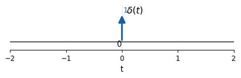

    <strong>Fig 1: Dirac Delta Function</strong>
    
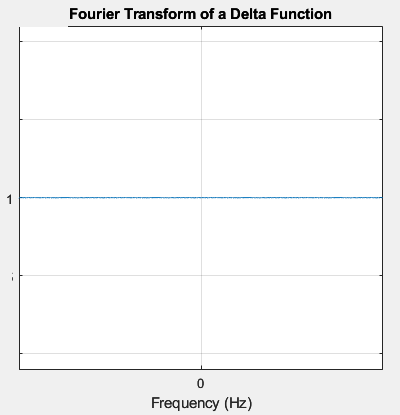

    <strong>Fig 2: Fourier Transform of a Delta Function</strong>
  </li>

  <li>
    <h3>Fourier Transform of a Unit Step Function</h3>
    
u(t) = 0 for \( t < 0 \), and u(t) = 1 for \( t \ge 0 \)

    
Its Fourier transform is given by:

    

      \( \mathcal{F}\{u(t)\} = \pi\delta(\omega) + \left(\frac{1}{j\omega}\right) \)
    

    <h3>Fourier Transform of a Unit Step Function</h3>
    
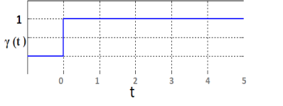

    <strong>Fig 3: Unit Step Function</strong>
  </li>

  <li>
    <h3>Fourier Transform of a Unit Pulse Function</h3>
    
A pulse function can be represented as:

    
\( x(t) = \Pi(t) = u(t + 1/2) - u(t - 1/2) \)

    
For the rectangular pulse \( \text{rect}(t) = \Pi(t) \) defined as 1 for \( |t| \leq 1/2 \), and 0 otherwise:

    
The Fourier transform of \( \text{rect}(t/\tau) \) is:

    

      \( \mathcal{F}\{\text{rect}(t/\tau)\} = \tau \frac{\sin(\omega \tau / 2)}{\omega \tau / 2} \)
    

    
For \( \tau = 1 \),

    

      \( X(\omega) = \frac{\sin(\omega/2)}{\omega/2} = \text{sinc}(\omega/2) \)
    

    
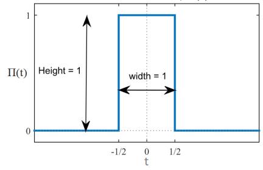

    <strong>Fig 4: Unit Pulse / Rectangular Pulse</strong>
    
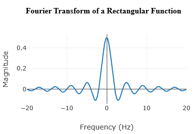

    <strong>Fig 5: Fourier Transform of the Continuous-Time Rectangular Pulse Π(t)</strong>
  </li>

  <li>
    <h3>Fourier Transform of a Unit Triangle Pulse</h3>
    
A unit triangle pulse is the convolution of a unit pulse with itself:

    
\( \Lambda(t) = \Pi(t) * \Pi(t) \)

    
\( \mathcal{F}\{\Lambda(t)\} = \text{sinc}^2(\omega/2) \)

    
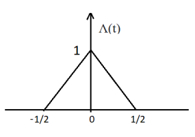

    <strong>Fig 6: Unit Triangle Pulse</strong>
    
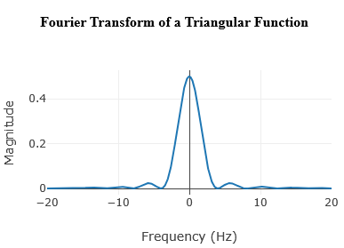

    <strong>Fig 7: Fourier Transform of the Continuous-Time Unit Triangle Pulse Λ(t)</strong>
  </li>
</ul>

<h2>Common Discrete-Time Signals and their DTFT</h2>

<strong>Note:</strong> DTFT is periodic with period \(2\pi\).

<ul>
  <li>
    <h3>Unit Impulse Sequence</h3>
    
Signal: \( x[n] = \delta[n] \)

    
DTFT: \( X(e^{j\omega}) = 1 \)

    
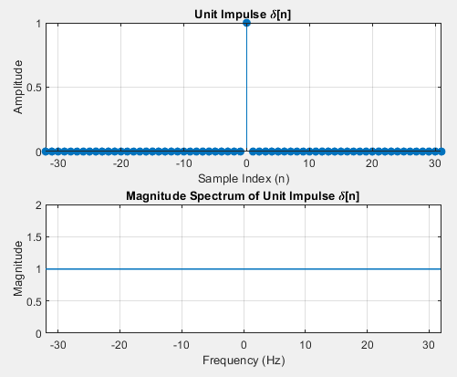

    <strong>Fig 8: DTFT of the Discrete-Time Unit Impulse \(\delta[n]\)</strong>
  </li>

  <li>
    <h3>Unit Step Sequence</h3>
    
Signal: \( x[n] = u[n] \)

    
DTFT: \( X(e^{j\omega}) = \pi \delta(\omega) + \left(\dfrac{1}{1 - e^{-j\omega}}\right) \)

    
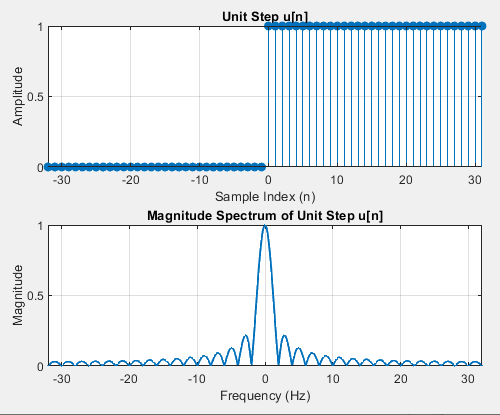

    <strong>Fig 9: DTFT of the Discrete-Time Unit Step u[n]</strong>
  </li>

  <li>
    <h3>Discrete-Time Sinusoid</h3>
    
Signal: \( x[n] = \cos(\omega_0 n) \) or \( x[n] = \sin(\omega_0 n) \)

    
DTFT: \( X(e^{j\omega}) = \pi \left[\delta(\omega - \omega_0) + \delta(\omega + \omega_0)\right] \)

    
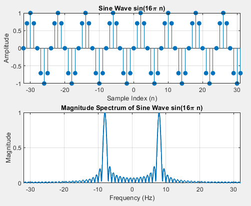

    <strong>Fig 10: DTFT of the Discrete-Time Sinusoid</strong>
  </li>

  <li>
    <h3>Finite-Length Rectangular Pulse</h3>
    
Signal (length \(N\), starting at \(n=0\)):

    

      \( x[n] = \begin{cases} 1, & 0 \le n \le N-1 \\ 0, & \text{otherwise} \end{cases} \)
    

    
DTFT:

    

      \( X(e^{j\omega}) = e^{-j\omega\frac{N-1}{2}} \cdot \frac{\sin\left(\frac{N\omega}{2}\right)}{\sin\left(\frac{\omega}{2}\right)} \)
    

    
Starting at \(n=n_0\) gives:

    

      \( X_{\text{shifted}}(e^{j\omega}) = e^{-j\omega n_0} \cdot e^{-j\omega\frac{N-1}{2}} \cdot \frac{\sin\left(\frac{N\omega}{2}\right)}{\sin\left(\frac{\omega}{2}\right)} \)
    

    
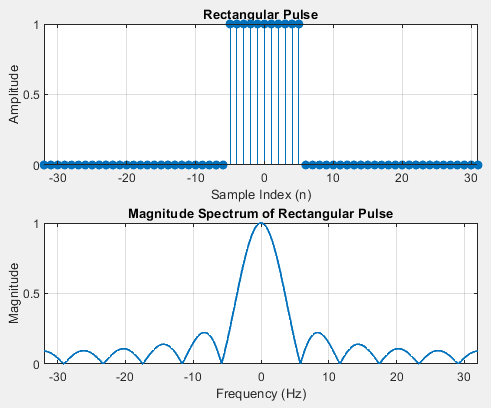

    <strong>Fig 11: DTFT of the Discrete-Time Finite-Length Rectangular Pulse</strong>
  </li>
</ul>

<h2>Applications</h2>

  Fourier transform is used in circuit analysis, signal analysis, cell phones, image analysis, signal processing, and LTI systems. The Fourier transform is most probably the best tool to find the frequency in an entire field. This makes it a useful tool for LTI systems and signal processing. Partial differential equations reduce to ordinary differential equations in Fourier Transform.

</body>
</html>

