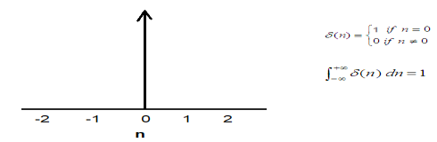

<html lang="en">
<head>
  <meta charset="UTF-8">
  <meta name="viewport" content="width=device-width, initial-scale=1.0">
  <link href="https://cdn.jsdelivr.net/npm/tailwindcss@2.2.19/dist/tailwind.min.css" rel="stylesheet">
  <link rel="stylesheet" href="./css/imgstyles.css">
</head>
<body>
			<ol>
				<li>
					<h2>Basics of Fourier Transform</h2>
				</li>
			</ol>
			

				Fourier transform is a process to convert a spatial domain signal (i.e., time domain signal) into a frequency domain signal. Oppositely, the inverse Fourier transform is a process to convert the frequency domain signal to the primary time domain signal.
			

			

				&#xa0;
			

			<h3>
		    Fourier transform
			</h3>
			

				The Fourier transform of a time-domain signal is defined as follows
			

			

				X(ω) = ωt) dt
			

			

				<em>&#xa0;</em>
			

			

				<em>**x(t) denotes the signal in the time domain, </em><em> denotes the signal in the frequency domain and </em><em> </em>is the angular frequency.
			

			

				&#xa0;
			

			<h3>
		    Inverse Fourier transform
			</h3>
			

				x(t) = ωt) dt
			

			

				&#xa0;
			

			<h3>
		     Discrete Fourier Transform (DFT)
			</h3>
			

				For digital systems, the Fourier transform is realized by
			

			

				For complex numbers x0, x1, x2, x3, … , xn-1
			

			

				X[k] =  <em>W</em><em>N</em><em>kn</em> ,&#xa0; where k=1,2,3,..,N-1
			

			

				Where <em>W</em><em>N</em><em> </em>&#xa0;is the nth root of unity given by
			

			

				<em>W</em><em>N </em>= exp(-j(2 )
			

			

				&#xa0;
			

			

				**DFT Algorithms are at the end of this article
			

			

				&#xa0;
			

			<h3>
		     Fast Fourier Transform (FFT)
			</h3>
			

				The basic idea of a fast Fourier transform is to break up a transform of length N into two transforms of length N/2. 
			

			

				For complex numbers x[n] where, n = 1, 2, 3, …, n-1
			

			

				X[k] = <em> W</em><em>N</em><em>kn</em><em> </em>= e-j2πk(2r)/N + e-j2πk(2r+1)/N
			

			

				<em>**In the above transform of length N is broken into two transforms of length N/2 and on the other hand, they pick up even and odd samples of x[n] separately</em>
			

			

				= e-j2πk(2r)/N + e-j2πk/N e-j2πk(2r)/N
			

			

				= e-j2πkr/(N/2) + e-j2πk/N e-j2πkr/(N/2)
			

			

				
			

			

				In the above diagram {<strong>X[0], X[1], X[2], X[3], X[4], X[5], X[6], X[7]</strong>} is the Fourier transform of {x[0], x[1], x[2], x[3], x[4], x[5], x[6], x[7]} 
			

			

				&#xa0;
			

			

				**FFT algorithms are at the end of this article
			

			

				&#xa0;
			

					<h3>Advantages of FFT over DFT</h3>
			

				To compute the DFT of an N-point sequence it take O(N2) multiplies and adds. The FFT algorithm computes the DFT using O(N log N) multiplies and adds. 
			

			

				The fast Fourier transform (FFT) is a discrete Fourier transform algorithm which reduces the number of computations needed for N points from 2N2 to 2Nlog2N.
			

			

				&#xa0;
			

			 
		    <h2>Properties of Fourier Transform</h2>
			<ol>
				<li>
					<h3>Linearity</h3>
				</li>
			</ol>
			

				The Fourier Transform satisfies linearity &amp; principle of superposition
			

			

				Consider two functions x1(t) &amp; x2(t)
			

			

				If F(x1(t)) = X1(ω),&#xa0; F(x2(t)) = X2(ω)
			

			

				Then F[a1x1(t) + a2x2(t)] = a1X1(ω) + a2X2(ω)&#xa0;
			

			

				&#xa0;
			

			

				&#xa0;
			

				<li>
					<h3>Scaling</h3>
				</li>
			

				F(x(t)) = X(ω)
			

			

				If ‘a’ is real constant then 
			

			

				&#xa0;F(x(at)) = X(ω),&#xa0; 
			

			

				&#xa0;
			

				<li>
					<h3>Symmetry</h3>
				</li>
			

				When x(t) is real and even then X(ω) = X*(-ω)
			

			

				When x(t) is real and odd then X(ω) = X(-ω)
			

			

				&#xa0;
			

				<li>
					<h3>Convolution</h3>
				</li>
			

				Fourier transform makes the convolution of 2 signals into the product of their Fourier Transform. There are two types of convolutions, one for time domain and other for frequency domain.
			

				<li>
					<h4>Time domain convolution</h4>
				</li>
			

				F(x1(t)) = X1(ω),&#xa0; F(x2(t)) = X2(ω)
			

			

				Then F(x1(t)* x2(t)) = X1(ω) . X2(ω),&#xa0;&#xa0;&#xa0; [‘*’ – convolution sign)]
			

			

				&#xa0;
			

				<li>
					<h4>Frequency domain convolution</h4>
				</li>
			

				F(x1(t) . x2(t)) = 1/2.X1(ω) * X2(ω)&#xa0;&#xa0;&#xa0;&#xa0;&#xa0; [‘*’ – convolution sign)]
			

			

				&#xa0;
			

				<li>
					<h3>Shifting Property</h3>
				</li>
			

				F(x(t – t0)) = e-jωt0 X(ω)
			

			

				As a consequence, transforms leave the Fourier spectrum | X(ω)|2 unchanged.
			

			

				&#xa0;
			

				<li>
					<h3>Duality</h3>
				</li>
			

				F(x(t) =&#xa0; X(t) = 2 x(-ω)
			

			

				&#xa0;
			

				<li>
					<h3>Differentiation</h3>
				</li>
			

				F( ) = jωX(ω)
			

			

				&#xa0;
			

				<li>
					<h3>Integration</h3>
				</li>
			

				F<em>(t) dt</em>) = X(ω)/jω 
			

			

				When a function (i.e., x(t)) is not an energy function and hence the Fourier transform of <em>(t) dt</em>] includes an impulse function. 
			

			

				F<em>(t) dt</em>) = X(ω)/jω + X
			

			

				&#xa0;
			

				<li>
					<h3>Modulation Property</h3>
				</li>
			

				F{x(t)<em>cosat</em>} = ½ {X(ω + a) + X(ω - a)}
			

			

				F{x(t)<em>sinat</em>} = ½ {X(ω + a) - X(ω - a)}
			

			

				&#xa0;
			

				<li>
					If the Fourier transform of f(x) is F(k), then f*(x) &lt;=&gt;&#xa0; F*(-k)
				</li>
			

				As a consequence Fourier transform of a real function must satisfy the symmetry relation. 
			

			

				F(k) = F*(-k), meaning that the Fourier transform is symmetric about the origin in k-space. |F(k)|2 = |F(-k)|2
			

			

				<strong>&#xa0;</strong>
			

				<li>
				<h3>Parseval’s theorem</h3>
				</li>
			

				Energy = <strong><em>(t)|</em></strong><strong><em>2</em></strong><strong><em>dt = 1/2</em></strong> <strong><em>(</em></strong><strong>ω</strong><strong><em>)|</em></strong><strong><em>2</em></strong><strong><em>d</em></strong><strong>ω</strong>
			

			

				The total energy in the time domain signal, x(t) [i.e., the left integral] can be easily calculated from the frequency domain signal, <em>X(</em><em>ω) </em>[i.e., from the right integral]
			

			

				&#xa0;
			

				<li>
					<h3>Time reversal</h3>
				</li>
			

				F(x(-t)) = X(-ω)
			

			

				<strong>&#xa0;</strong>
			

		     <h2>Fourier Transform of some common signals</h2>
						<li>
	                     <h3>Fourier Transform of a delta function</h3>
						</li>
					</ol>
				</li>
			</ol>
			

				
			

			

				If x(t) = 𝛅(t), then Fourier transform,
			

			

				X(ω) = <em>(t)e</em><em>-j</em>ωt<em> dt</em>
			

			

				<em>= </em><em>(t)e</em><em>-j</em>ωt<em> dt</em>
			

			

				<em>= </em><em>e</em><em>-j</em>ω0<em> dt</em>
			

			

				<em>= 1</em>
			

			

				Thus Fourier transform of a delta/impulse is a constant equal to 1, independent of frequency. Remember that derivation is used the shifting property of the impulse to eliminate the integral.
			

			

				&#xa0;
			

				<li>
					<h3>Fourier transform of a unit step function</h3>
				</li>
			

				<strong>&#xa0;</strong>
			

			

				
			

			

				γ (t) = 0 for t&lt;0
			

			

				&#xa0;&#xa0;&#xa0;&#xa0;&#xa0;&#xa0;&#xa0;&#xa0;&#xa0;&#xa0;&#xa0;&#xa0;&#xa0;&#xa0;&#xa0;&#xa0;&#xa0;&#xa0;&#xa0;&#xa0;&#xa0;&#xa0;&#xa0;&#xa0;&#xa0;&#xa0;&#xa0;&#xa0;&#xa0;&#xa0;&#xa0;&#xa0;&#xa0;&#xa0;&#xa0;&#xa0;&#xa0;&#xa0;&#xa0;&#xa0;&#xa0;&#xa0;&#xa0;&#xa0;&#xa0;&#xa0;&#xa0;&#xa0;&#xa0;&#xa0;&#xa0;&#xa0;&#xa0;&#xa0;&#xa0;&#xa0;&#xa0;&#xa0;&#xa0; = 1 for t ≥1
			

			

				We know that a unit-step function is an integration of a delta function. So for a unit step function,
			

			

				γ (t) = <em>&#xa0;</em><em>(t) dt</em>
			

			

				So, X(ω) =  F() + F()&#xa0; 
			

			

				<em>[See the property of integration above]</em>
			

			

				&#xa0;&#xa0;&#xa0;&#xa0;&#xa0;&#xa0;&#xa0;&#xa0;&#xa0;&#xa0; =  + &#xa0;&#xa0;&#xa0;&#xa0;&#xa0; [as F()= F()=1]
			

			

				When a function (i.e., x(t)) is not an energy function and hence the Fourier transform of <em>(t) dt</em>] includes an impulse function. 
			

			

				&#xa0;
			

				<li>
					<h3> Fourier Transform of a unit pulse function</h3>
				</li>
			

				A pulse function can be represented as,
			

			

				x(t)=Π(t) = γ (t + ½) - γ(t - ½)
			

			

				
			

			

				For a function rect(t) = Π(t) = 1 for |t| ≤ ½
			

			

				&#xa0;&#xa0;&#xa0;&#xa0;&#xa0;&#xa0;&#xa0;&#xa0;&#xa0;&#xa0;&#xa0;&#xa0;&#xa0;&#xa0;&#xa0;&#xa0;&#xa0;&#xa0;&#xa0;&#xa0;&#xa0;&#xa0;&#xa0;&#xa0;&#xa0;&#xa0;&#xa0;&#xa0;&#xa0;&#xa0;&#xa0;&#xa0;&#xa0;&#xa0;&#xa0;&#xa0;&#xa0;&#xa0;&#xa0;&#xa0;&#xa0;&#xa0;&#xa0;&#xa0; = 0 otherwise
			

			

				Given that 
			

			

				x(t) = Π(t)
			

			

				Hence from the definition of the Fourier transform we have
			

			

				F (Π(t)) = X() = e -jωt dt
			

			

				&#xa0;&#xa0;&#xa0;&#xa0;&#xa0;&#xa0;&#xa0;&#xa0;&#xa0;&#xa0;&#xa0;&#xa0;&#xa0;&#xa0;&#xa0;&#xa0;&#xa0;&#xa0;&#xa0;&#xa0;&#xa0;&#xa0;&#xa0;&#xa0;&#xa0;&#xa0; =&#xa0; e -jωt dt&#xa0;&#xa0;&#xa0;&#xa0; [as Π(t) = 1 for |t| ≤ ½]
			

			

				&#xa0;&#xa0;&#xa0;&#xa0;&#xa0;&#xa0;&#xa0;&#xa0;&#xa0;&#xa0;&#xa0;&#xa0;&#xa0;&#xa0;&#xa0;&#xa0;&#xa0;&#xa0;&#xa0;&#xa0;&#xa0;&#xa0;&#xa0;&#xa0;&#xa0;&#xa0;&#xa0; =&#xa0; [(e –jωt)/-jω]-1/21/2
			

			

				&#xa0;&#xa0;&#xa0;&#xa0;&#xa0;&#xa0;&#xa0;&#xa0;&#xa0;&#xa0;&#xa0;&#xa0;&#xa0;&#xa0;&#xa0;&#xa0;&#xa0;&#xa0;&#xa0;&#xa0;&#xa0;&#xa0;&#xa0;&#xa0;&#xa0;&#xa0;&#xa0;&#xa0;&#xa0;&#xa0;&#xa0;&#xa0;&#xa0;&#xa0;&#xa0;&#xa0;&#xa0;&#xa0;&#xa0;&#xa0;&#xa0; &#xa0;= [e –jω/2 - e jω/2] / -jω
			

			

				&#xa0;&#xa0;&#xa0;&#xa0;&#xa0;&#xa0;&#xa0;&#xa0;&#xa0;&#xa0;&#xa0;&#xa0;&#xa0;&#xa0;&#xa0;&#xa0;&#xa0;&#xa0;&#xa0;&#xa0;&#xa0;&#xa0;&#xa0;&#xa0;&#xa0;&#xa0;&#xa0; = [e jω/2 - e -jω/2] / jω
			

			

				&#xa0;&#xa0;&#xa0;&#xa0;&#xa0;&#xa0;&#xa0;&#xa0;&#xa0;&#xa0;&#xa0;&#xa0;&#xa0;&#xa0;&#xa0;&#xa0;&#xa0;&#xa0;&#xa0;&#xa0;&#xa0;&#xa0;&#xa0;&#xa0;&#xa0;&#xa0;&#xa0; = 2/ω . {[e jω/2 - e -jω/2] / 2j}
			

			

				&#xa0;&#xa0;&#xa0;&#xa0;&#xa0;&#xa0;&#xa0;&#xa0;&#xa0;&#xa0;&#xa0;&#xa0;&#xa0;&#xa0;&#xa0;&#xa0;&#xa0;&#xa0;&#xa0;&#xa0;&#xa0;&#xa0;&#xa0;&#xa0;&#xa0;&#xa0;&#xa0; = 2/ω . sin(ω/2)
			

			

				&#xa0;&#xa0;&#xa0;&#xa0;&#xa0;&#xa0;&#xa0;&#xa0;&#xa0;&#xa0;&#xa0;&#xa0;&#xa0;&#xa0;&#xa0;&#xa0;&#xa0;&#xa0;&#xa0;&#xa0;&#xa0;&#xa0;&#xa0;&#xa0;&#xa0;&#xa0;&#xa0; = {sin(ω/2) / (ω/2)}
			

			

				&#xa0;&#xa0;&#xa0;&#xa0;&#xa0;&#xa0;&#xa0;&#xa0;&#xa0;&#xa0;&#xa0;&#xa0;&#xa0;&#xa0;&#xa0;&#xa0;&#xa0;&#xa0;&#xa0;&#xa0;&#xa0;&#xa0;&#xa0;&#xa0;&#xa0;&#xa0; = {sin((ω/2)) / ((ω/2))}
			

			

				&#xa0;&#xa0;&#xa0;&#xa0;&#xa0;&#xa0;&#xa0;&#xa0;&#xa0;&#xa0;&#xa0;&#xa0;&#xa0;&#xa0;&#xa0;&#xa0;&#xa0;&#xa0;&#xa0;&#xa0;&#xa0;&#xa0;&#xa0;&#xa0;&#xa0;&#xa0;&#xa0; = sinc(ω/2)
			

			

				&#xa0;
			

			

				For the above case, the rectangular function has a pulse width value of 1 over the interval of [-½, ½]; 0 otherwise.
			

			

				Now we’ll discuss a rectangular pulse that has a width of T
			

			

				Then,&#xa0;&#xa0;&#xa0; rect(t/T) = Π(t/T) = 1 for |t| ≤ T/2
			

			

				&#xa0;&#xa0;&#xa0;&#xa0;&#xa0;&#xa0;&#xa0;&#xa0;&#xa0;&#xa0;&#xa0;&#xa0;&#xa0;&#xa0;&#xa0;&#xa0;&#xa0;&#xa0;&#xa0;&#xa0;&#xa0;&#xa0;&#xa0;&#xa0;&#xa0;&#xa0;&#xa0;&#xa0;&#xa0;&#xa0;&#xa0;&#xa0;&#xa0;&#xa0;&#xa0;&#xa0;&#xa0;&#xa0;&#xa0;&#xa0;&#xa0;&#xa0;&#xa0;&#xa0; = 0 otherwise
			

			

				Given that 
			

			

				x(t/T) = Π(t/T)
			

			

				Hence from the definition of the Fourier transform we have
			

			

				F (Π(t/T)) = e -jωt dt
			

			

				&#xa0;&#xa0;&#xa0;&#xa0;&#xa0;&#xa0;&#xa0;&#xa0;&#xa0;&#xa0;&#xa0;&#xa0;&#xa0;&#xa0;&#xa0;&#xa0;&#xa0;&#xa0;&#xa0;&#xa0;&#xa0;&#xa0;&#xa0;&#xa0;&#xa0;&#xa0; =&#xa0; e -jωt dt&#xa0;&#xa0;&#xa0;&#xa0; [as Π(t/T) = 1 for |t| ≤ T/2]
			

			

				&#xa0;&#xa0;&#xa0;&#xa0;&#xa0;&#xa0;&#xa0;&#xa0;&#xa0;&#xa0;&#xa0;&#xa0;&#xa0;&#xa0;&#xa0;&#xa0;&#xa0;&#xa0;&#xa0;&#xa0;&#xa0;&#xa0;&#xa0;&#xa0;&#xa0;&#xa0;&#xa0; =&#xa0; [(e –jωt)/-jω]-T/2T/2
			

			

				&#xa0;&#xa0;&#xa0;&#xa0;&#xa0;&#xa0;&#xa0;&#xa0;&#xa0;&#xa0;&#xa0;&#xa0;&#xa0;&#xa0;&#xa0;&#xa0;&#xa0;&#xa0;&#xa0;&#xa0;&#xa0;&#xa0;&#xa0;&#xa0;&#xa0;&#xa0;&#xa0;&#xa0;&#xa0;&#xa0;&#xa0;&#xa0;&#xa0;&#xa0;&#xa0;&#xa0;&#xa0;&#xa0;&#xa0;&#xa0;&#xa0; &#xa0;= [e –jωT/2 - e jωT/2] / -jω
			

			

				&#xa0;&#xa0;&#xa0;&#xa0;&#xa0;&#xa0;&#xa0;&#xa0;&#xa0;&#xa0;&#xa0;&#xa0;&#xa0;&#xa0;&#xa0;&#xa0;&#xa0;&#xa0;&#xa0;&#xa0;&#xa0;&#xa0;&#xa0;&#xa0;&#xa0;&#xa0;&#xa0; = [e jωT/2 - e -jωT/2] / jω
			

			

				&#xa0;&#xa0;&#xa0;&#xa0;&#xa0;&#xa0;&#xa0;&#xa0;&#xa0;&#xa0;&#xa0;&#xa0;&#xa0;&#xa0;&#xa0;&#xa0;&#xa0;&#xa0;&#xa0;&#xa0;&#xa0;&#xa0;&#xa0;&#xa0;&#xa0;&#xa0;&#xa0; = 2/ω . {[e jωT/2 - e -jωT/2] / 2j}
			

			

				&#xa0;&#xa0;&#xa0;&#xa0;&#xa0;&#xa0;&#xa0;&#xa0;&#xa0;&#xa0;&#xa0;&#xa0;&#xa0;&#xa0;&#xa0;&#xa0;&#xa0;&#xa0;&#xa0;&#xa0;&#xa0;&#xa0;&#xa0;&#xa0;&#xa0;&#xa0;&#xa0; = 2/ω . sin(ω(T/2))
			

			

				&#xa0;&#xa0;&#xa0;&#xa0;&#xa0;&#xa0;&#xa0;&#xa0;&#xa0;&#xa0;&#xa0;&#xa0;&#xa0;&#xa0;&#xa0;&#xa0;&#xa0;&#xa0;&#xa0;&#xa0;&#xa0;&#xa0;&#xa0;&#xa0;&#xa0;&#xa0;&#xa0; = {sin(ω(T/2)) / (ω/2)}
			

			

				&#xa0;&#xa0;&#xa0;&#xa0;&#xa0;&#xa0;&#xa0;&#xa0;&#xa0;&#xa0;&#xa0;&#xa0;&#xa0;&#xa0;&#xa0;&#xa0;&#xa0;&#xa0;&#xa0;&#xa0;&#xa0;&#xa0;&#xa0;&#xa0;&#xa0;&#xa0;&#xa0; = {sin(ωT/2)) / (ω/2))}
			

			

				&#xa0;&#xa0;&#xa0;&#xa0;&#xa0;&#xa0;&#xa0;&#xa0;&#xa0;&#xa0;&#xa0;&#xa0;&#xa0;&#xa0;&#xa0;&#xa0;&#xa0;&#xa0;&#xa0;&#xa0;&#xa0;&#xa0;&#xa0;&#xa0;&#xa0;&#xa0;&#xa0; = {sin(ωT/2)) / (ωT/2))}.T
			

			

				&#xa0;&#xa0;&#xa0;&#xa0;&#xa0;&#xa0;&#xa0;&#xa0;&#xa0;&#xa0;&#xa0;&#xa0;&#xa0;&#xa0;&#xa0;&#xa0;&#xa0;&#xa0;&#xa0;&#xa0;&#xa0;&#xa0;&#xa0;&#xa0;&#xa0;&#xa0;&#xa0; = T. sinc(ωT/2)
			

			

				&#xa0;
			

			

				&#xa0;
			

				<li>
					<h3> Fourier Transform of a unit triangle pulse</h3>
				</li>
			

				
			

			

				A unit triangle pulse is simply the convolution of a unit pulse function with itself.
			

			

				Here, Λ(t) = Π(t) * Π(t)&#xa0;&#xa0;&#xa0;&#xa0;&#xa0;&#xa0;&#xa0;&#xa0;&#xa0;&#xa0;&#xa0;&#xa0;&#xa0;&#xa0;&#xa0; 
			

			

				<em>[Π(t) is a unit pulse function &amp; ‘*’ denotes convolution]</em>
			

			

				So, Λ(ω) = sinc(ω/2) . sinc(ω/2 = sinc2(ω/2
			

			

				&#xa0;
			

				<li>
					<h3> Fourier Transform of a Sawtooth function</h3>
				</li>
			

				
			

			

				s(t) = 0, for t &lt; 0 and t &gt; 1
			

			

				&#xa0;&#xa0;&#xa0;&#xa0;&#xa0;&#xa0;&#xa0;&#xa0;&#xa0;&#xa0;&#xa0;&#xa0;&#xa0;&#xa0;&#xa0;&#xa0;&#xa0;&#xa0;&#xa0;&#xa0;&#xa0;&#xa0;&#xa0;&#xa0;&#xa0;&#xa0;&#xa0;&#xa0;&#xa0;&#xa0;&#xa0;&#xa0;&#xa0;&#xa0;&#xa0;&#xa0;&#xa0;&#xa0;&#xa0;&#xa0;&#xa0;&#xa0;&#xa0;&#xa0;&#xa0;&#xa0;&#xa0;&#xa0;&#xa0; = 1, for 0 ≤ t ≤ 1
			

			

				We can represent sawtooth as the integral of shifted unit pulse function (to give the ramp) and a negative impulse (delayed by one second) to give the discontinuity at the end of the ramp
			

			

				
			

			

				&#xa0;
			

			

				s(t) = dt - dt =
			

			

				y(t) =  - 
			

			

				Now, we’ve to find the Fourier transform of y(t),
			

			

				Y(ω) = sinc(ω/2)e-jω/2 - e-jω
			

			

				We can now apply integral property with Y(0) = 0, to find S(ω)
			

			

				S(ω) = F() = Y(ω)/jω - Y(0)(0) = Y(ω)/jω
			

			

				= {(sinc(ω/2)e-jω/2 - e-jω) / jω}
			

			

				= {((sin(π . ω/2) / (π . ω/2))e-jω/2 - e-jω) / jω}
			

			

				=&#xa0; (((sin(π . ω/2) / (π . ω/2))e-jω/2) / jω) – (e-jω / jω)
			

			

				= (2(sin(ω/2)e-jω/2) / jω2) – (je-jω / j2ω)
			

			

				= (2((ejω/2 - e-jω/2) / 2j)e-jω/2) / jω2) + (je-jω / ω)&#xa0;&#xa0;&#xa0;&#xa0; [as j2 = -1]
			

			

				= (((ejω/2 - e-jω/2)e-jω/2) / j2ω2) + (je-jω / ω)
			

			

				= (((e-jω/2 - ejω/2)e-jω/2) / ω2) + (je-jω / ω)
			

			

				= (((e-jω/2 - ejω/2)e-jω/2) / ω2) + (je-jω / ω)
			

			

				= ((((e-jω/2 - ejω/2)e-jω/2) + jωe-jω) / ω2)
			

			

				= ((e-jω - 1 + jωe-jω) / ω2)
			

			

				= ((e-jω(1+jω) - 1) / ω2)
			

			

				&#xa0;
			

			

				<strong>&#xa0;</strong>
			

				<li>
					<h2> Algorithms</h2>
				</li>
			<h3>For DFT &amp; FFT</h3>
			

				Look at the aforementioned formula for DFT. The term <strong><em>W</em></strong><em>k</em><strong><em>N</em></strong><em>&#xa0; </em><em>(</em>= exp(-j(2 .k) ) can be represented as follows
			

			

				
			

			

				&#xa0;
			

			

				In the above figure the values for N = 2, 4, and 8 are shown in the complex plain. Where ‘N’ denotes N point DFT.
			

			

				&#xa0;
			

			

				For example,
			

<h3>For a 2 point DFT</h3>
			

				<strong>W</strong><strong>2</strong><strong> = e</strong><strong>-2jπ/N</strong><strong> = e</strong><strong>-2jπ/2</strong><strong> = e</strong><strong>-jπ </strong><strong>= -1</strong>
			

			

				Now, discrete Fourier transform for complex numbers a1 and a2 is
			

			

				<strong>A</strong><strong>K</strong> = n <em>W</em><em>2</em><em>kn</em>
			

			

				&#xa0;&#xa0;&#xa0;&#xa0;&#xa0; = n <em>(-1)</em><em>kn</em>
			

			

				&#xa0;&#xa0;&#xa0;&#xa0;&#xa0; = a0 <em>(-1)</em><em>k</em><em>&#xa0; </em><em>.0</em><em>&#xa0; </em><em>+ </em>a1 <em>(-1)</em><em>k</em><em>&#xa0; </em><em>.1</em>
			

			

				As <strong>K = </strong>0 and 1 (for 2 point DFT)
			

			

				So, <strong>A</strong><strong>0 </strong>= a0<em>&#xa0; </em><em>+ </em>a1
			

			

				And <strong>A</strong><strong>1 </strong><strong>= </strong>a0<em>&#xa0; </em><em>-</em><em>&#xa0; </em>a1
			

			

				&#xa0;
			

			<h3>Similarly for a 4-point DFT</h3>
			

				<strong>W</strong><strong>4</strong><strong> = e</strong><strong>-2jπ/4</strong><strong> = e</strong><strong>-2jπ/4</strong><strong> = e</strong><strong>-jπ/2 </strong><strong>= -j</strong>
			

			

				Now, discrete Fourier transform for complex numbers a1, a2, a3, and a4 is
			

			

				<strong>A</strong><strong>K</strong> = n <em>W</em><em>4</em><em>kn</em>
			

			

				&#xa0;&#xa0;&#xa0;&#xa0; = n <em>(-j)</em><em>kn</em>
			

			

				&#xa0;&#xa0;&#xa0;&#xa0; = a0 <em>(-j)</em><em>k</em><em>&#xa0; </em><em>.0</em><em>&#xa0; </em><em>+ </em>a1 <em>(-j)</em><em>k</em><em>&#xa0; </em><em>.1</em><em> + </em>a2 <em>(-j)</em><em>k</em><em>&#xa0; </em><em>.2</em><em> + </em>a3 <em>(-j)</em><em>k</em><em>&#xa0; </em><em>.3</em>
			

			

				So, <strong>A</strong><strong>0 </strong>= a0<em>&#xa0; </em><em>+ </em>a1 + a2<em>&#xa0; </em><em>+ </em>a3
			

			

				&#xa0;&#xa0;&#xa0;&#xa0;&#xa0; <strong>A</strong><strong>1 </strong><strong>= </strong>a0<em>&#xa0; </em><em>- j</em>a1 - a2<em>&#xa0; </em><em>+ j</em>a3
			

			

				&#xa0;&#xa0;&#xa0;&#xa0;&#xa0; <strong>A</strong><strong>2 </strong><strong>= </strong>a0<em>&#xa0; </em><em>- </em>a1 + a2<em>&#xa0; </em><em>- </em>a3
			

			

				&#xa0;&#xa0;&#xa0;&#xa0;&#xa0; <strong>A</strong><strong>3 </strong><strong>= </strong>a0<em>&#xa0; </em><em>+ j</em>a1 - a2<em>&#xa0; </em><em>- j</em>a3
			

			

				&#xa0;
			

			

				To compute <strong>A</strong> quickly, we can pre-compute common sub-expressions:
			

			

				&#xa0;&#xa0;&#xa0;&#xa0;&#xa0; <strong>A</strong><strong>0 </strong>= (a0<em> </em><em>+ </em>a2) + (a1<em>&#xa0; </em><em>+ </em>a3)
			

			

				&#xa0;&#xa0;&#xa0;&#xa0;&#xa0; <strong>A</strong><strong>1 </strong><strong>=</strong><strong>&#xa0; </strong><strong>(</strong>a0<em> </em>- a2) <em>– j(</em>a1<em>&#xa0; </em><em>- </em>a3)
			

			

				&#xa0;&#xa0;&#xa0;&#xa0;&#xa0; <strong>A</strong><strong>2 </strong><strong>= (</strong>a0<em>&#xa0; </em><em>+ </em>a2) - (a1<em>&#xa0; </em><em>+ </em>a3)
			

			

				&#xa0;&#xa0;&#xa0;&#xa0;&#xa0; <strong>A</strong><strong>3 </strong><strong>= (</strong>a0<em>&#xa0; </em>- a2)<em>&#xa0; </em><em>+ j(</em>a1 - a3)
			

			

				&#xa0;
			

			

				Then we can diagram the 4-point like so,
			

			

				
			

			

				Fig: Three stages in the computation of an N=8-point DFT
			

			

				&#xa0;
			

			

				
			

			

				Fig: Three stages in the computation of an N=8-point DFT
			

			

				&#xa0;
			

		<h3>Matrix Relations in DFT</h3>
			

				The DFT samples defined by
			

			

				
			

			

				<strong>&#xa0;</strong>
			

			

				<em>W</em><em>N</em><em>kn </em>&#xa0;can be expanded as&#xa0; NXN <strong>DFT matrix</strong>
			

			

				
			

			

				In the matrix the elements in first row and first column all are <em>W</em><em>N</em><em>.k.0</em><em> or W</em><em>N</em><em>.0</em><em>=1. </em>In the third row powers are multiplied by 2 and in the fourth row powers are multiplied by 3 and so on.
			

			

				So,
			

			

				
			

			

				&#xa0;
			

			

				Oppositely, to find <strong>inverse DFT</strong> we replace the ‘j’ with ‘-j’ in the matrix or we take complex conjugates of the matrix elements.
			

			

				So, 
			

			

				
			

			

				The effective determinant of above is 1/4
			

			

				<strong>&#xa0;</strong>
			

<h3>For a 8-point FFT</h3>
			

				The FFT is a fast algorithm for computing the DFT. If we take the 2-point DFT and 4-point DFT and generalize them to 8-point, 16-point, ..., 2r-point, we get the FFT algorithm.
			

			

				&#xa0;
			

<h4>>N=8-point radix-4 DIT-FFT</h4>
			

				
			

			

				Where, -W4 = W0=1; -W5= W1&#xa0; = a&#xa0; = (1-j)/2;&#xa0; -W2 = W6=j and -W3 = W7 = b&#xa0; =&#xa0; (1+j)/2
			

			

				The above diagram is same as illustrated in section ‘Fast Fourier Transform’ under ‘Basics of Fourier Transform’
			

			

				<strong>&#xa0;</strong>
			

<h4>N=8-point radix-2 DIT-FFT</h4>
			

				&#xa0;
			

			

				
			

			

				<strong>** </strong><em>W</em><em>x</em><em> = W</em><em>8</em><em>x</em>
			

			

				<strong>&#xa0;</strong>
			

<h2>
			Applications 
</h2>
			

				Fourier transform is used in circuit analysis, signal analysis, cell phones, image analysis, signal processing, and LTI systems. The Fourier transform is most probably the best tool to find the frequency in an entire field. This makes it a useful tool for LTI systems and signal processing. Partial differential equations reduce to ordinary differential equations in Fourier Transform.
			

</body>
</html>
