<html xmlns:v="urn:schemas-microsoft-com:vml"
xmlns:o="urn:schemas-microsoft-com:office:office"
xmlns:w="urn:schemas-microsoft-com:office:word"
xmlns:dt="uuid:C2F41010-65B3-11d1-A29F-00AA00C14882"
xmlns:m="http://schemas.microsoft.com/office/2004/12/omml"
xmlns="http://www.w3.org/TR/REC-html40">

<head>
<meta http-equiv=Content-Type content="text/html; charset=windows-1252">
<meta name=ProgId content=Word.Document>
<meta name=Generator content="Microsoft Word 15">
<meta name=Originator content="Microsoft Word 15">
<link rel=File-List href="Fourier_Transform_files/filelist.xml">
<link rel=Edit-Time-Data href="Fourier_Transform_files/editdata.mso">
<link rel=OLE-Object-Data href="Fourier_Transform_files/oledata.mso">
<!--[if !mso]>

<![endif]--><!--[if gte mso 9]><xml>
 <o:DocumentProperties>
  <o:Author>Microsoft account</o:Author>
  <o:LastAuthor>Salim</o:LastAuthor>
  <o:Revision>2</o:Revision>
  <o:TotalTime>1774</o:TotalTime>
  <o:Created>2024-11-20T10:56:00Z</o:Created>
  <o:LastSaved>2024-11-20T10:56:00Z</o:LastSaved>
  <o:Pages>16</o:Pages>
  <o:Words>1627</o:Words>
  <o:Characters>9280</o:Characters>
  <o:Lines>77</o:Lines>
  <o:Paragraphs>21</o:Paragraphs>
  <o:CharactersWithSpaces>10886</o:CharactersWithSpaces>
  <o:Version>15.00</o:Version>
 </o:DocumentProperties>
 <o:CustomDocumentProperties>
  <o:GrammarlyDocumentId dt:dt="string">60805a3ec7aa8c33e56fc09b5cba709f6e45088cef26611c83149559fb9fe738</o:GrammarlyDocumentId>
 </o:CustomDocumentProperties>
 <o:OfficeDocumentSettings>
  <o:AllowPNG/>
 </o:OfficeDocumentSettings>
</xml><![endif]-->
<link rel=themeData href="Fourier_Transform_files/themedata.thmx">
<link rel=colorSchemeMapping
href="Fourier_Transform_files/colorschememapping.xml">
<!--[if gte mso 9]><xml>
 <w:WordDocument>
  <w:SpellingState>Clean</w:SpellingState>
  <w:GrammarState>Clean</w:GrammarState>
  <w:TrackMoves>false</w:TrackMoves>
  <w:TrackFormatting/>
  <w:PunctuationKerning/>
  <w:ValidateAgainstSchemas/>
  <w:SaveIfXMLInvalid>false</w:SaveIfXMLInvalid>
  <w:IgnoreMixedContent>false</w:IgnoreMixedContent>
  <w:AlwaysShowPlaceholderText>false</w:AlwaysShowPlaceholderText>
  <w:DoNotPromoteQF/>
  <w:LidThemeOther>EN-IN</w:LidThemeOther>
  <w:LidThemeAsian>X-NONE</w:LidThemeAsian>
  <w:LidThemeComplexScript>X-NONE</w:LidThemeComplexScript>
  <w:Compatibility>
   <w:BreakWrappedTables/>
   <w:SnapToGridInCell/>
   <w:WrapTextWithPunct/>
   <w:UseAsianBreakRules/>
   <w:DontGrowAutofit/>
   <w:SplitPgBreakAndParaMark/>
   <w:EnableOpenTypeKerning/>
   <w:DontFlipMirrorIndents/>
   <w:OverrideTableStyleHps/>
  </w:Compatibility>
  <w:DocumentVariables>
   <w:__Grammarly_42____i>H4sIAAAAAAAEAKtWckksSQxILCpxzi/NK1GyMqwFAAEhoTITAAAA</w:__Grammarly_42____i>
   <w:__Grammarly_42___1>H4sIAAAAAAAEAKtWcslP9kxRslIyNDY2NjIwNzIwMDGyNDEwNrNU0lEKTi0uzszPAykwrAUAWrP/fCwAAAA=</w:__Grammarly_42___1>
  </w:DocumentVariables>
  <m:mathPr>
   <m:mathFont m:val="Cambria Math"/>
   <m:brkBin m:val="before"/>
   <m:brkBinSub m:val="&#45;-"/>
   <m:smallFrac m:val="off"/>
   <m:dispDef/>
   <m:lMargin m:val="0"/>
   <m:rMargin m:val="0"/>
   <m:defJc m:val="centerGroup"/>
   <m:wrapIndent m:val="1440"/>
   <m:intLim m:val="subSup"/>
   <m:naryLim m:val="undOvr"/>
  </m:mathPr></w:WordDocument>
</xml><![endif]--><!--[if gte mso 9]><xml>
 <w:LatentStyles DefLockedState="false" DefUnhideWhenUsed="false"
  DefSemiHidden="false" DefQFormat="false" DefPriority="99"
  LatentStyleCount="371">
  <w:LsdException Locked="false" Priority="0" QFormat="true" Name="Normal"/>
  <w:LsdException Locked="false" Priority="9" QFormat="true" Name="heading 1"/>
  <w:LsdException Locked="false" Priority="9" SemiHidden="true"
   UnhideWhenUsed="true" QFormat="true" Name="heading 2"/>
  <w:LsdException Locked="false" Priority="9" SemiHidden="true"
   UnhideWhenUsed="true" QFormat="true" Name="heading 3"/>
  <w:LsdException Locked="false" Priority="9" SemiHidden="true"
   UnhideWhenUsed="true" QFormat="true" Name="heading 4"/>
  <w:LsdException Locked="false" Priority="9" SemiHidden="true"
   UnhideWhenUsed="true" QFormat="true" Name="heading 5"/>
  <w:LsdException Locked="false" Priority="9" SemiHidden="true"
   UnhideWhenUsed="true" QFormat="true" Name="heading 6"/>
  <w:LsdException Locked="false" Priority="9" SemiHidden="true"
   UnhideWhenUsed="true" QFormat="true" Name="heading 7"/>
  <w:LsdException Locked="false" Priority="9" SemiHidden="true"
   UnhideWhenUsed="true" QFormat="true" Name="heading 8"/>
  <w:LsdException Locked="false" Priority="9" SemiHidden="true"
   UnhideWhenUsed="true" QFormat="true" Name="heading 9"/>
  <w:LsdException Locked="false" SemiHidden="true" UnhideWhenUsed="true"
   Name="index 1"/>
  <w:LsdException Locked="false" SemiHidden="true" UnhideWhenUsed="true"
   Name="index 2"/>
  <w:LsdException Locked="false" SemiHidden="true" UnhideWhenUsed="true"
   Name="index 3"/>
  <w:LsdException Locked="false" SemiHidden="true" UnhideWhenUsed="true"
   Name="index 4"/>
  <w:LsdException Locked="false" SemiHidden="true" UnhideWhenUsed="true"
   Name="index 5"/>
  <w:LsdException Locked="false" SemiHidden="true" UnhideWhenUsed="true"
   Name="index 6"/>
  <w:LsdException Locked="false" SemiHidden="true" UnhideWhenUsed="true"
   Name="index 7"/>
  <w:LsdException Locked="false" SemiHidden="true" UnhideWhenUsed="true"
   Name="index 8"/>
  <w:LsdException Locked="false" SemiHidden="true" UnhideWhenUsed="true"
   Name="index 9"/>
  <w:LsdException Locked="false" Priority="39" SemiHidden="true"
   UnhideWhenUsed="true" Name="toc 1"/>
  <w:LsdException Locked="false" Priority="39" SemiHidden="true"
   UnhideWhenUsed="true" Name="toc 2"/>
  <w:LsdException Locked="false" Priority="39" SemiHidden="true"
   UnhideWhenUsed="true" Name="toc 3"/>
  <w:LsdException Locked="false" Priority="39" SemiHidden="true"
   UnhideWhenUsed="true" Name="toc 4"/>
  <w:LsdException Locked="false" Priority="39" SemiHidden="true"
   UnhideWhenUsed="true" Name="toc 5"/>
  <w:LsdException Locked="false" Priority="39" SemiHidden="true"
   UnhideWhenUsed="true" Name="toc 6"/>
  <w:LsdException Locked="false" Priority="39" SemiHidden="true"
   UnhideWhenUsed="true" Name="toc 7"/>
  <w:LsdException Locked="false" Priority="39" SemiHidden="true"
   UnhideWhenUsed="true" Name="toc 8"/>
  <w:LsdException Locked="false" Priority="39" SemiHidden="true"
   UnhideWhenUsed="true" Name="toc 9"/>
  <w:LsdException Locked="false" SemiHidden="true" UnhideWhenUsed="true"
   Name="Normal Indent"/>
  <w:LsdException Locked="false" SemiHidden="true" UnhideWhenUsed="true"
   Name="footnote text"/>
  <w:LsdException Locked="false" SemiHidden="true" UnhideWhenUsed="true"
   Name="annotation text"/>
  <w:LsdException Locked="false" SemiHidden="true" UnhideWhenUsed="true"
   Name="header"/>
  <w:LsdException Locked="false" SemiHidden="true" UnhideWhenUsed="true"
   Name="footer"/>
  <w:LsdException Locked="false" SemiHidden="true" UnhideWhenUsed="true"
   Name="index heading"/>
  <w:LsdException Locked="false" Priority="35" SemiHidden="true"
   UnhideWhenUsed="true" QFormat="true" Name="caption"/>
  <w:LsdException Locked="false" SemiHidden="true" UnhideWhenUsed="true"
   Name="table of figures"/>
  <w:LsdException Locked="false" SemiHidden="true" UnhideWhenUsed="true"
   Name="envelope address"/>
  <w:LsdException Locked="false" SemiHidden="true" UnhideWhenUsed="true"
   Name="envelope return"/>
  <w:LsdException Locked="false" SemiHidden="true" UnhideWhenUsed="true"
   Name="footnote reference"/>
  <w:LsdException Locked="false" SemiHidden="true" UnhideWhenUsed="true"
   Name="annotation reference"/>
  <w:LsdException Locked="false" SemiHidden="true" UnhideWhenUsed="true"
   Name="line number"/>
  <w:LsdException Locked="false" SemiHidden="true" UnhideWhenUsed="true"
   Name="page number"/>
  <w:LsdException Locked="false" SemiHidden="true" UnhideWhenUsed="true"
   Name="endnote reference"/>
  <w:LsdException Locked="false" SemiHidden="true" UnhideWhenUsed="true"
   Name="endnote text"/>
  <w:LsdException Locked="false" SemiHidden="true" UnhideWhenUsed="true"
   Name="table of authorities"/>
  <w:LsdException Locked="false" SemiHidden="true" UnhideWhenUsed="true"
   Name="macro"/>
  <w:LsdException Locked="false" SemiHidden="true" UnhideWhenUsed="true"
   Name="toa heading"/>
  <w:LsdException Locked="false" SemiHidden="true" UnhideWhenUsed="true"
   Name="List"/>
  <w:LsdException Locked="false" SemiHidden="true" UnhideWhenUsed="true"
   Name="List Bullet"/>
  <w:LsdException Locked="false" SemiHidden="true" UnhideWhenUsed="true"
   Name="List Number"/>
  <w:LsdException Locked="false" SemiHidden="true" UnhideWhenUsed="true"
   Name="List 2"/>
  <w:LsdException Locked="false" SemiHidden="true" UnhideWhenUsed="true"
   Name="List 3"/>
  <w:LsdException Locked="false" SemiHidden="true" UnhideWhenUsed="true"
   Name="List 4"/>
  <w:LsdException Locked="false" SemiHidden="true" UnhideWhenUsed="true"
   Name="List 5"/>
  <w:LsdException Locked="false" SemiHidden="true" UnhideWhenUsed="true"
   Name="List Bullet 2"/>
  <w:LsdException Locked="false" SemiHidden="true" UnhideWhenUsed="true"
   Name="List Bullet 3"/>
  <w:LsdException Locked="false" SemiHidden="true" UnhideWhenUsed="true"
   Name="List Bullet 4"/>
  <w:LsdException Locked="false" SemiHidden="true" UnhideWhenUsed="true"
   Name="List Bullet 5"/>
  <w:LsdException Locked="false" SemiHidden="true" UnhideWhenUsed="true"
   Name="List Number 2"/>
  <w:LsdException Locked="false" SemiHidden="true" UnhideWhenUsed="true"
   Name="List Number 3"/>
  <w:LsdException Locked="false" SemiHidden="true" UnhideWhenUsed="true"
   Name="List Number 4"/>
  <w:LsdException Locked="false" SemiHidden="true" UnhideWhenUsed="true"
   Name="List Number 5"/>
  <w:LsdException Locked="false" Priority="10" QFormat="true" Name="Title"/>
  <w:LsdException Locked="false" SemiHidden="true" UnhideWhenUsed="true"
   Name="Closing"/>
  <w:LsdException Locked="false" SemiHidden="true" UnhideWhenUsed="true"
   Name="Signature"/>
  <w:LsdException Locked="false" Priority="1" SemiHidden="true"
   UnhideWhenUsed="true" Name="Default Paragraph Font"/>
  <w:LsdException Locked="false" SemiHidden="true" UnhideWhenUsed="true"
   Name="Body Text"/>
  <w:LsdException Locked="false" SemiHidden="true" UnhideWhenUsed="true"
   Name="Body Text Indent"/>
  <w:LsdException Locked="false" SemiHidden="true" UnhideWhenUsed="true"
   Name="List Continue"/>
  <w:LsdException Locked="false" SemiHidden="true" UnhideWhenUsed="true"
   Name="List Continue 2"/>
  <w:LsdException Locked="false" SemiHidden="true" UnhideWhenUsed="true"
   Name="List Continue 3"/>
  <w:LsdException Locked="false" SemiHidden="true" UnhideWhenUsed="true"
   Name="List Continue 4"/>
  <w:LsdException Locked="false" SemiHidden="true" UnhideWhenUsed="true"
   Name="List Continue 5"/>
  <w:LsdException Locked="false" SemiHidden="true" UnhideWhenUsed="true"
   Name="Message Header"/>
  <w:LsdException Locked="false" Priority="11" QFormat="true" Name="Subtitle"/>
  <w:LsdException Locked="false" SemiHidden="true" UnhideWhenUsed="true"
   Name="Salutation"/>
  <w:LsdException Locked="false" SemiHidden="true" UnhideWhenUsed="true"
   Name="Date"/>
  <w:LsdException Locked="false" SemiHidden="true" UnhideWhenUsed="true"
   Name="Body Text First Indent"/>
  <w:LsdException Locked="false" SemiHidden="true" UnhideWhenUsed="true"
   Name="Body Text First Indent 2"/>
  <w:LsdException Locked="false" SemiHidden="true" UnhideWhenUsed="true"
   Name="Note Heading"/>
  <w:LsdException Locked="false" SemiHidden="true" UnhideWhenUsed="true"
   Name="Body Text 2"/>
  <w:LsdException Locked="false" SemiHidden="true" UnhideWhenUsed="true"
   Name="Body Text 3"/>
  <w:LsdException Locked="false" SemiHidden="true" UnhideWhenUsed="true"
   Name="Body Text Indent 2"/>
  <w:LsdException Locked="false" SemiHidden="true" UnhideWhenUsed="true"
   Name="Body Text Indent 3"/>
  <w:LsdException Locked="false" SemiHidden="true" UnhideWhenUsed="true"
   Name="Block Text"/>
  <w:LsdException Locked="false" SemiHidden="true" UnhideWhenUsed="true"
   Name="Hyperlink"/>
  <w:LsdException Locked="false" SemiHidden="true" UnhideWhenUsed="true"
   Name="FollowedHyperlink"/>
  <w:LsdException Locked="false" Priority="22" QFormat="true" Name="Strong"/>
  <w:LsdException Locked="false" Priority="20" QFormat="true" Name="Emphasis"/>
  <w:LsdException Locked="false" SemiHidden="true" UnhideWhenUsed="true"
   Name="Document Map"/>
  <w:LsdException Locked="false" SemiHidden="true" UnhideWhenUsed="true"
   Name="Plain Text"/>
  <w:LsdException Locked="false" SemiHidden="true" UnhideWhenUsed="true"
   Name="E-mail Signature"/>
  <w:LsdException Locked="false" SemiHidden="true" UnhideWhenUsed="true"
   Name="HTML Top of Form"/>
  <w:LsdException Locked="false" SemiHidden="true" UnhideWhenUsed="true"
   Name="HTML Bottom of Form"/>
  <w:LsdException Locked="false" SemiHidden="true" UnhideWhenUsed="true"
   Name="Normal (Web)"/>
  <w:LsdException Locked="false" SemiHidden="true" UnhideWhenUsed="true"
   Name="HTML Acronym"/>
  <w:LsdException Locked="false" SemiHidden="true" UnhideWhenUsed="true"
   Name="HTML Address"/>
  <w:LsdException Locked="false" SemiHidden="true" UnhideWhenUsed="true"
   Name="HTML Cite"/>
  <w:LsdException Locked="false" SemiHidden="true" UnhideWhenUsed="true"
   Name="HTML Code"/>
  <w:LsdException Locked="false" SemiHidden="true" UnhideWhenUsed="true"
   Name="HTML Definition"/>
  <w:LsdException Locked="false" SemiHidden="true" UnhideWhenUsed="true"
   Name="HTML Keyboard"/>
  <w:LsdException Locked="false" SemiHidden="true" UnhideWhenUsed="true"
   Name="HTML Preformatted"/>
  <w:LsdException Locked="false" SemiHidden="true" UnhideWhenUsed="true"
   Name="HTML Sample"/>
  <w:LsdException Locked="false" SemiHidden="true" UnhideWhenUsed="true"
   Name="HTML Typewriter"/>
  <w:LsdException Locked="false" SemiHidden="true" UnhideWhenUsed="true"
   Name="HTML Variable"/>
  <w:LsdException Locked="false" SemiHidden="true" UnhideWhenUsed="true"
   Name="Normal Table"/>
  <w:LsdException Locked="false" SemiHidden="true" UnhideWhenUsed="true"
   Name="annotation subject"/>
  <w:LsdException Locked="false" SemiHidden="true" UnhideWhenUsed="true"
   Name="No List"/>
  <w:LsdException Locked="false" SemiHidden="true" UnhideWhenUsed="true"
   Name="Outline List 1"/>
  <w:LsdException Locked="false" SemiHidden="true" UnhideWhenUsed="true"
   Name="Outline List 2"/>
  <w:LsdException Locked="false" SemiHidden="true" UnhideWhenUsed="true"
   Name="Outline List 3"/>
  <w:LsdException Locked="false" SemiHidden="true" UnhideWhenUsed="true"
   Name="Table Simple 1"/>
  <w:LsdException Locked="false" SemiHidden="true" UnhideWhenUsed="true"
   Name="Table Simple 2"/>
  <w:LsdException Locked="false" SemiHidden="true" UnhideWhenUsed="true"
   Name="Table Simple 3"/>
  <w:LsdException Locked="false" SemiHidden="true" UnhideWhenUsed="true"
   Name="Table Classic 1"/>
  <w:LsdException Locked="false" SemiHidden="true" UnhideWhenUsed="true"
   Name="Table Classic 2"/>
  <w:LsdException Locked="false" SemiHidden="true" UnhideWhenUsed="true"
   Name="Table Classic 3"/>
  <w:LsdException Locked="false" SemiHidden="true" UnhideWhenUsed="true"
   Name="Table Classic 4"/>
  <w:LsdException Locked="false" SemiHidden="true" UnhideWhenUsed="true"
   Name="Table Colorful 1"/>
  <w:LsdException Locked="false" SemiHidden="true" UnhideWhenUsed="true"
   Name="Table Colorful 2"/>
  <w:LsdException Locked="false" SemiHidden="true" UnhideWhenUsed="true"
   Name="Table Colorful 3"/>
  <w:LsdException Locked="false" SemiHidden="true" UnhideWhenUsed="true"
   Name="Table Columns 1"/>
  <w:LsdException Locked="false" SemiHidden="true" UnhideWhenUsed="true"
   Name="Table Columns 2"/>
  <w:LsdException Locked="false" SemiHidden="true" UnhideWhenUsed="true"
   Name="Table Columns 3"/>
  <w:LsdException Locked="false" SemiHidden="true" UnhideWhenUsed="true"
   Name="Table Columns 4"/>
  <w:LsdException Locked="false" SemiHidden="true" UnhideWhenUsed="true"
   Name="Table Columns 5"/>
  <w:LsdException Locked="false" SemiHidden="true" UnhideWhenUsed="true"
   Name="Table Grid 1"/>
  <w:LsdException Locked="false" SemiHidden="true" UnhideWhenUsed="true"
   Name="Table Grid 2"/>
  <w:LsdException Locked="false" SemiHidden="true" UnhideWhenUsed="true"
   Name="Table Grid 3"/>
  <w:LsdException Locked="false" SemiHidden="true" UnhideWhenUsed="true"
   Name="Table Grid 4"/>
  <w:LsdException Locked="false" SemiHidden="true" UnhideWhenUsed="true"
   Name="Table Grid 5"/>
  <w:LsdException Locked="false" SemiHidden="true" UnhideWhenUsed="true"
   Name="Table Grid 6"/>
  <w:LsdException Locked="false" SemiHidden="true" UnhideWhenUsed="true"
   Name="Table Grid 7"/>
  <w:LsdException Locked="false" SemiHidden="true" UnhideWhenUsed="true"
   Name="Table Grid 8"/>
  <w:LsdException Locked="false" SemiHidden="true" UnhideWhenUsed="true"
   Name="Table List 1"/>
  <w:LsdException Locked="false" SemiHidden="true" UnhideWhenUsed="true"
   Name="Table List 2"/>
  <w:LsdException Locked="false" SemiHidden="true" UnhideWhenUsed="true"
   Name="Table List 3"/>
  <w:LsdException Locked="false" SemiHidden="true" UnhideWhenUsed="true"
   Name="Table List 4"/>
  <w:LsdException Locked="false" SemiHidden="true" UnhideWhenUsed="true"
   Name="Table List 5"/>
  <w:LsdException Locked="false" SemiHidden="true" UnhideWhenUsed="true"
   Name="Table List 6"/>
  <w:LsdException Locked="false" SemiHidden="true" UnhideWhenUsed="true"
   Name="Table List 7"/>
  <w:LsdException Locked="false" SemiHidden="true" UnhideWhenUsed="true"
   Name="Table List 8"/>
  <w:LsdException Locked="false" SemiHidden="true" UnhideWhenUsed="true"
   Name="Table 3D effects 1"/>
  <w:LsdException Locked="false" SemiHidden="true" UnhideWhenUsed="true"
   Name="Table 3D effects 2"/>
  <w:LsdException Locked="false" SemiHidden="true" UnhideWhenUsed="true"
   Name="Table 3D effects 3"/>
  <w:LsdException Locked="false" SemiHidden="true" UnhideWhenUsed="true"
   Name="Table Contemporary"/>
  <w:LsdException Locked="false" SemiHidden="true" UnhideWhenUsed="true"
   Name="Table Elegant"/>
  <w:LsdException Locked="false" SemiHidden="true" UnhideWhenUsed="true"
   Name="Table Professional"/>
  <w:LsdException Locked="false" SemiHidden="true" UnhideWhenUsed="true"
   Name="Table Subtle 1"/>
  <w:LsdException Locked="false" SemiHidden="true" UnhideWhenUsed="true"
   Name="Table Subtle 2"/>
  <w:LsdException Locked="false" SemiHidden="true" UnhideWhenUsed="true"
   Name="Table Web 1"/>
  <w:LsdException Locked="false" SemiHidden="true" UnhideWhenUsed="true"
   Name="Table Web 2"/>
  <w:LsdException Locked="false" SemiHidden="true" UnhideWhenUsed="true"
   Name="Table Web 3"/>
  <w:LsdException Locked="false" SemiHidden="true" UnhideWhenUsed="true"
   Name="Balloon Text"/>
  <w:LsdException Locked="false" Priority="39" Name="Table Grid"/>
  <w:LsdException Locked="false" SemiHidden="true" UnhideWhenUsed="true"
   Name="Table Theme"/>
  <w:LsdException Locked="false" SemiHidden="true" Name="Placeholder Text"/>
  <w:LsdException Locked="false" Priority="1" QFormat="true" Name="No Spacing"/>
  <w:LsdException Locked="false" Priority="60" Name="Light Shading"/>
  <w:LsdException Locked="false" Priority="61" Name="Light List"/>
  <w:LsdException Locked="false" Priority="62" Name="Light Grid"/>
  <w:LsdException Locked="false" Priority="63" Name="Medium Shading 1"/>
  <w:LsdException Locked="false" Priority="64" Name="Medium Shading 2"/>
  <w:LsdException Locked="false" Priority="65" Name="Medium List 1"/>
  <w:LsdException Locked="false" Priority="66" Name="Medium List 2"/>
  <w:LsdException Locked="false" Priority="67" Name="Medium Grid 1"/>
  <w:LsdException Locked="false" Priority="68" Name="Medium Grid 2"/>
  <w:LsdException Locked="false" Priority="69" Name="Medium Grid 3"/>
  <w:LsdException Locked="false" Priority="70" Name="Dark List"/>
  <w:LsdException Locked="false" Priority="71" Name="Colorful Shading"/>
  <w:LsdException Locked="false" Priority="72" Name="Colorful List"/>
  <w:LsdException Locked="false" Priority="73" Name="Colorful Grid"/>
  <w:LsdException Locked="false" Priority="60" Name="Light Shading Accent 1"/>
  <w:LsdException Locked="false" Priority="61" Name="Light List Accent 1"/>
  <w:LsdException Locked="false" Priority="62" Name="Light Grid Accent 1"/>
  <w:LsdException Locked="false" Priority="63" Name="Medium Shading 1 Accent 1"/>
  <w:LsdException Locked="false" Priority="64" Name="Medium Shading 2 Accent 1"/>
  <w:LsdException Locked="false" Priority="65" Name="Medium List 1 Accent 1"/>
  <w:LsdException Locked="false" SemiHidden="true" Name="Revision"/>
  <w:LsdException Locked="false" Priority="34" QFormat="true"
   Name="List Paragraph"/>
  <w:LsdException Locked="false" Priority="29" QFormat="true" Name="Quote"/>
  <w:LsdException Locked="false" Priority="30" QFormat="true"
   Name="Intense Quote"/>
  <w:LsdException Locked="false" Priority="66" Name="Medium List 2 Accent 1"/>
  <w:LsdException Locked="false" Priority="67" Name="Medium Grid 1 Accent 1"/>
  <w:LsdException Locked="false" Priority="68" Name="Medium Grid 2 Accent 1"/>
  <w:LsdException Locked="false" Priority="69" Name="Medium Grid 3 Accent 1"/>
  <w:LsdException Locked="false" Priority="70" Name="Dark List Accent 1"/>
  <w:LsdException Locked="false" Priority="71" Name="Colorful Shading Accent 1"/>
  <w:LsdException Locked="false" Priority="72" Name="Colorful List Accent 1"/>
  <w:LsdException Locked="false" Priority="73" Name="Colorful Grid Accent 1"/>
  <w:LsdException Locked="false" Priority="60" Name="Light Shading Accent 2"/>
  <w:LsdException Locked="false" Priority="61" Name="Light List Accent 2"/>
  <w:LsdException Locked="false" Priority="62" Name="Light Grid Accent 2"/>
  <w:LsdException Locked="false" Priority="63" Name="Medium Shading 1 Accent 2"/>
  <w:LsdException Locked="false" Priority="64" Name="Medium Shading 2 Accent 2"/>
  <w:LsdException Locked="false" Priority="65" Name="Medium List 1 Accent 2"/>
  <w:LsdException Locked="false" Priority="66" Name="Medium List 2 Accent 2"/>
  <w:LsdException Locked="false" Priority="67" Name="Medium Grid 1 Accent 2"/>
  <w:LsdException Locked="false" Priority="68" Name="Medium Grid 2 Accent 2"/>
  <w:LsdException Locked="false" Priority="69" Name="Medium Grid 3 Accent 2"/>
  <w:LsdException Locked="false" Priority="70" Name="Dark List Accent 2"/>
  <w:LsdException Locked="false" Priority="71" Name="Colorful Shading Accent 2"/>
  <w:LsdException Locked="false" Priority="72" Name="Colorful List Accent 2"/>
  <w:LsdException Locked="false" Priority="73" Name="Colorful Grid Accent 2"/>
  <w:LsdException Locked="false" Priority="60" Name="Light Shading Accent 3"/>
  <w:LsdException Locked="false" Priority="61" Name="Light List Accent 3"/>
  <w:LsdException Locked="false" Priority="62" Name="Light Grid Accent 3"/>
  <w:LsdException Locked="false" Priority="63" Name="Medium Shading 1 Accent 3"/>
  <w:LsdException Locked="false" Priority="64" Name="Medium Shading 2 Accent 3"/>
  <w:LsdException Locked="false" Priority="65" Name="Medium List 1 Accent 3"/>
  <w:LsdException Locked="false" Priority="66" Name="Medium List 2 Accent 3"/>
  <w:LsdException Locked="false" Priority="67" Name="Medium Grid 1 Accent 3"/>
  <w:LsdException Locked="false" Priority="68" Name="Medium Grid 2 Accent 3"/>
  <w:LsdException Locked="false" Priority="69" Name="Medium Grid 3 Accent 3"/>
  <w:LsdException Locked="false" Priority="70" Name="Dark List Accent 3"/>
  <w:LsdException Locked="false" Priority="71" Name="Colorful Shading Accent 3"/>
  <w:LsdException Locked="false" Priority="72" Name="Colorful List Accent 3"/>
  <w:LsdException Locked="false" Priority="73" Name="Colorful Grid Accent 3"/>
  <w:LsdException Locked="false" Priority="60" Name="Light Shading Accent 4"/>
  <w:LsdException Locked="false" Priority="61" Name="Light List Accent 4"/>
  <w:LsdException Locked="false" Priority="62" Name="Light Grid Accent 4"/>
  <w:LsdException Locked="false" Priority="63" Name="Medium Shading 1 Accent 4"/>
  <w:LsdException Locked="false" Priority="64" Name="Medium Shading 2 Accent 4"/>
  <w:LsdException Locked="false" Priority="65" Name="Medium List 1 Accent 4"/>
  <w:LsdException Locked="false" Priority="66" Name="Medium List 2 Accent 4"/>
  <w:LsdException Locked="false" Priority="67" Name="Medium Grid 1 Accent 4"/>
  <w:LsdException Locked="false" Priority="68" Name="Medium Grid 2 Accent 4"/>
  <w:LsdException Locked="false" Priority="69" Name="Medium Grid 3 Accent 4"/>
  <w:LsdException Locked="false" Priority="70" Name="Dark List Accent 4"/>
  <w:LsdException Locked="false" Priority="71" Name="Colorful Shading Accent 4"/>
  <w:LsdException Locked="false" Priority="72" Name="Colorful List Accent 4"/>
  <w:LsdException Locked="false" Priority="73" Name="Colorful Grid Accent 4"/>
  <w:LsdException Locked="false" Priority="60" Name="Light Shading Accent 5"/>
  <w:LsdException Locked="false" Priority="61" Name="Light List Accent 5"/>
  <w:LsdException Locked="false" Priority="62" Name="Light Grid Accent 5"/>
  <w:LsdException Locked="false" Priority="63" Name="Medium Shading 1 Accent 5"/>
  <w:LsdException Locked="false" Priority="64" Name="Medium Shading 2 Accent 5"/>
  <w:LsdException Locked="false" Priority="65" Name="Medium List 1 Accent 5"/>
  <w:LsdException Locked="false" Priority="66" Name="Medium List 2 Accent 5"/>
  <w:LsdException Locked="false" Priority="67" Name="Medium Grid 1 Accent 5"/>
  <w:LsdException Locked="false" Priority="68" Name="Medium Grid 2 Accent 5"/>
  <w:LsdException Locked="false" Priority="69" Name="Medium Grid 3 Accent 5"/>
  <w:LsdException Locked="false" Priority="70" Name="Dark List Accent 5"/>
  <w:LsdException Locked="false" Priority="71" Name="Colorful Shading Accent 5"/>
  <w:LsdException Locked="false" Priority="72" Name="Colorful List Accent 5"/>
  <w:LsdException Locked="false" Priority="73" Name="Colorful Grid Accent 5"/>
  <w:LsdException Locked="false" Priority="60" Name="Light Shading Accent 6"/>
  <w:LsdException Locked="false" Priority="61" Name="Light List Accent 6"/>
  <w:LsdException Locked="false" Priority="62" Name="Light Grid Accent 6"/>
  <w:LsdException Locked="false" Priority="63" Name="Medium Shading 1 Accent 6"/>
  <w:LsdException Locked="false" Priority="64" Name="Medium Shading 2 Accent 6"/>
  <w:LsdException Locked="false" Priority="65" Name="Medium List 1 Accent 6"/>
  <w:LsdException Locked="false" Priority="66" Name="Medium List 2 Accent 6"/>
  <w:LsdException Locked="false" Priority="67" Name="Medium Grid 1 Accent 6"/>
  <w:LsdException Locked="false" Priority="68" Name="Medium Grid 2 Accent 6"/>
  <w:LsdException Locked="false" Priority="69" Name="Medium Grid 3 Accent 6"/>
  <w:LsdException Locked="false" Priority="70" Name="Dark List Accent 6"/>
  <w:LsdException Locked="false" Priority="71" Name="Colorful Shading Accent 6"/>
  <w:LsdException Locked="false" Priority="72" Name="Colorful List Accent 6"/>
  <w:LsdException Locked="false" Priority="73" Name="Colorful Grid Accent 6"/>
  <w:LsdException Locked="false" Priority="19" QFormat="true"
   Name="Subtle Emphasis"/>
  <w:LsdException Locked="false" Priority="21" QFormat="true"
   Name="Intense Emphasis"/>
  <w:LsdException Locked="false" Priority="31" QFormat="true"
   Name="Subtle Reference"/>
  <w:LsdException Locked="false" Priority="32" QFormat="true"
   Name="Intense Reference"/>
  <w:LsdException Locked="false" Priority="33" QFormat="true" Name="Book Title"/>
  <w:LsdException Locked="false" Priority="37" SemiHidden="true"
   UnhideWhenUsed="true" Name="Bibliography"/>
  <w:LsdException Locked="false" Priority="39" SemiHidden="true"
   UnhideWhenUsed="true" QFormat="true" Name="TOC Heading"/>
  <w:LsdException Locked="false" Priority="41" Name="Plain Table 1"/>
  <w:LsdException Locked="false" Priority="42" Name="Plain Table 2"/>
  <w:LsdException Locked="false" Priority="43" Name="Plain Table 3"/>
  <w:LsdException Locked="false" Priority="44" Name="Plain Table 4"/>
  <w:LsdException Locked="false" Priority="45" Name="Plain Table 5"/>
  <w:LsdException Locked="false" Priority="40" Name="Grid Table Light"/>
  <w:LsdException Locked="false" Priority="46" Name="Grid Table 1 Light"/>
  <w:LsdException Locked="false" Priority="47" Name="Grid Table 2"/>
  <w:LsdException Locked="false" Priority="48" Name="Grid Table 3"/>
  <w:LsdException Locked="false" Priority="49" Name="Grid Table 4"/>
  <w:LsdException Locked="false" Priority="50" Name="Grid Table 5 Dark"/>
  <w:LsdException Locked="false" Priority="51" Name="Grid Table 6 Colorful"/>
  <w:LsdException Locked="false" Priority="52" Name="Grid Table 7 Colorful"/>
  <w:LsdException Locked="false" Priority="46"
   Name="Grid Table 1 Light Accent 1"/>
  <w:LsdException Locked="false" Priority="47" Name="Grid Table 2 Accent 1"/>
  <w:LsdException Locked="false" Priority="48" Name="Grid Table 3 Accent 1"/>
  <w:LsdException Locked="false" Priority="49" Name="Grid Table 4 Accent 1"/>
  <w:LsdException Locked="false" Priority="50" Name="Grid Table 5 Dark Accent 1"/>
  <w:LsdException Locked="false" Priority="51"
   Name="Grid Table 6 Colorful Accent 1"/>
  <w:LsdException Locked="false" Priority="52"
   Name="Grid Table 7 Colorful Accent 1"/>
  <w:LsdException Locked="false" Priority="46"
   Name="Grid Table 1 Light Accent 2"/>
  <w:LsdException Locked="false" Priority="47" Name="Grid Table 2 Accent 2"/>
  <w:LsdException Locked="false" Priority="48" Name="Grid Table 3 Accent 2"/>
  <w:LsdException Locked="false" Priority="49" Name="Grid Table 4 Accent 2"/>
  <w:LsdException Locked="false" Priority="50" Name="Grid Table 5 Dark Accent 2"/>
  <w:LsdException Locked="false" Priority="51"
   Name="Grid Table 6 Colorful Accent 2"/>
  <w:LsdException Locked="false" Priority="52"
   Name="Grid Table 7 Colorful Accent 2"/>
  <w:LsdException Locked="false" Priority="46"
   Name="Grid Table 1 Light Accent 3"/>
  <w:LsdException Locked="false" Priority="47" Name="Grid Table 2 Accent 3"/>
  <w:LsdException Locked="false" Priority="48" Name="Grid Table 3 Accent 3"/>
  <w:LsdException Locked="false" Priority="49" Name="Grid Table 4 Accent 3"/>
  <w:LsdException Locked="false" Priority="50" Name="Grid Table 5 Dark Accent 3"/>
  <w:LsdException Locked="false" Priority="51"
   Name="Grid Table 6 Colorful Accent 3"/>
  <w:LsdException Locked="false" Priority="52"
   Name="Grid Table 7 Colorful Accent 3"/>
  <w:LsdException Locked="false" Priority="46"
   Name="Grid Table 1 Light Accent 4"/>
  <w:LsdException Locked="false" Priority="47" Name="Grid Table 2 Accent 4"/>
  <w:LsdException Locked="false" Priority="48" Name="Grid Table 3 Accent 4"/>
  <w:LsdException Locked="false" Priority="49" Name="Grid Table 4 Accent 4"/>
  <w:LsdException Locked="false" Priority="50" Name="Grid Table 5 Dark Accent 4"/>
  <w:LsdException Locked="false" Priority="51"
   Name="Grid Table 6 Colorful Accent 4"/>
  <w:LsdException Locked="false" Priority="52"
   Name="Grid Table 7 Colorful Accent 4"/>
  <w:LsdException Locked="false" Priority="46"
   Name="Grid Table 1 Light Accent 5"/>
  <w:LsdException Locked="false" Priority="47" Name="Grid Table 2 Accent 5"/>
  <w:LsdException Locked="false" Priority="48" Name="Grid Table 3 Accent 5"/>
  <w:LsdException Locked="false" Priority="49" Name="Grid Table 4 Accent 5"/>
  <w:LsdException Locked="false" Priority="50" Name="Grid Table 5 Dark Accent 5"/>
  <w:LsdException Locked="false" Priority="51"
   Name="Grid Table 6 Colorful Accent 5"/>
  <w:LsdException Locked="false" Priority="52"
   Name="Grid Table 7 Colorful Accent 5"/>
  <w:LsdException Locked="false" Priority="46"
   Name="Grid Table 1 Light Accent 6"/>
  <w:LsdException Locked="false" Priority="47" Name="Grid Table 2 Accent 6"/>
  <w:LsdException Locked="false" Priority="48" Name="Grid Table 3 Accent 6"/>
  <w:LsdException Locked="false" Priority="49" Name="Grid Table 4 Accent 6"/>
  <w:LsdException Locked="false" Priority="50" Name="Grid Table 5 Dark Accent 6"/>
  <w:LsdException Locked="false" Priority="51"
   Name="Grid Table 6 Colorful Accent 6"/>
  <w:LsdException Locked="false" Priority="52"
   Name="Grid Table 7 Colorful Accent 6"/>
  <w:LsdException Locked="false" Priority="46" Name="List Table 1 Light"/>
  <w:LsdException Locked="false" Priority="47" Name="List Table 2"/>
  <w:LsdException Locked="false" Priority="48" Name="List Table 3"/>
  <w:LsdException Locked="false" Priority="49" Name="List Table 4"/>
  <w:LsdException Locked="false" Priority="50" Name="List Table 5 Dark"/>
  <w:LsdException Locked="false" Priority="51" Name="List Table 6 Colorful"/>
  <w:LsdException Locked="false" Priority="52" Name="List Table 7 Colorful"/>
  <w:LsdException Locked="false" Priority="46"
   Name="List Table 1 Light Accent 1"/>
  <w:LsdException Locked="false" Priority="47" Name="List Table 2 Accent 1"/>
  <w:LsdException Locked="false" Priority="48" Name="List Table 3 Accent 1"/>
  <w:LsdException Locked="false" Priority="49" Name="List Table 4 Accent 1"/>
  <w:LsdException Locked="false" Priority="50" Name="List Table 5 Dark Accent 1"/>
  <w:LsdException Locked="false" Priority="51"
   Name="List Table 6 Colorful Accent 1"/>
  <w:LsdException Locked="false" Priority="52"
   Name="List Table 7 Colorful Accent 1"/>
  <w:LsdException Locked="false" Priority="46"
   Name="List Table 1 Light Accent 2"/>
  <w:LsdException Locked="false" Priority="47" Name="List Table 2 Accent 2"/>
  <w:LsdException Locked="false" Priority="48" Name="List Table 3 Accent 2"/>
  <w:LsdException Locked="false" Priority="49" Name="List Table 4 Accent 2"/>
  <w:LsdException Locked="false" Priority="50" Name="List Table 5 Dark Accent 2"/>
  <w:LsdException Locked="false" Priority="51"
   Name="List Table 6 Colorful Accent 2"/>
  <w:LsdException Locked="false" Priority="52"
   Name="List Table 7 Colorful Accent 2"/>
  <w:LsdException Locked="false" Priority="46"
   Name="List Table 1 Light Accent 3"/>
  <w:LsdException Locked="false" Priority="47" Name="List Table 2 Accent 3"/>
  <w:LsdException Locked="false" Priority="48" Name="List Table 3 Accent 3"/>
  <w:LsdException Locked="false" Priority="49" Name="List Table 4 Accent 3"/>
  <w:LsdException Locked="false" Priority="50" Name="List Table 5 Dark Accent 3"/>
  <w:LsdException Locked="false" Priority="51"
   Name="List Table 6 Colorful Accent 3"/>
  <w:LsdException Locked="false" Priority="52"
   Name="List Table 7 Colorful Accent 3"/>
  <w:LsdException Locked="false" Priority="46"
   Name="List Table 1 Light Accent 4"/>
  <w:LsdException Locked="false" Priority="47" Name="List Table 2 Accent 4"/>
  <w:LsdException Locked="false" Priority="48" Name="List Table 3 Accent 4"/>
  <w:LsdException Locked="false" Priority="49" Name="List Table 4 Accent 4"/>
  <w:LsdException Locked="false" Priority="50" Name="List Table 5 Dark Accent 4"/>
  <w:LsdException Locked="false" Priority="51"
   Name="List Table 6 Colorful Accent 4"/>
  <w:LsdException Locked="false" Priority="52"
   Name="List Table 7 Colorful Accent 4"/>
  <w:LsdException Locked="false" Priority="46"
   Name="List Table 1 Light Accent 5"/>
  <w:LsdException Locked="false" Priority="47" Name="List Table 2 Accent 5"/>
  <w:LsdException Locked="false" Priority="48" Name="List Table 3 Accent 5"/>
  <w:LsdException Locked="false" Priority="49" Name="List Table 4 Accent 5"/>
  <w:LsdException Locked="false" Priority="50" Name="List Table 5 Dark Accent 5"/>
  <w:LsdException Locked="false" Priority="51"
   Name="List Table 6 Colorful Accent 5"/>
  <w:LsdException Locked="false" Priority="52"
   Name="List Table 7 Colorful Accent 5"/>
  <w:LsdException Locked="false" Priority="46"
   Name="List Table 1 Light Accent 6"/>
  <w:LsdException Locked="false" Priority="47" Name="List Table 2 Accent 6"/>
  <w:LsdException Locked="false" Priority="48" Name="List Table 3 Accent 6"/>
  <w:LsdException Locked="false" Priority="49" Name="List Table 4 Accent 6"/>
  <w:LsdException Locked="false" Priority="50" Name="List Table 5 Dark Accent 6"/>
  <w:LsdException Locked="false" Priority="51"
   Name="List Table 6 Colorful Accent 6"/>
  <w:LsdException Locked="false" Priority="52"
   Name="List Table 7 Colorful Accent 6"/>
 </w:LatentStyles>
</xml><![endif]-->

<!--[if gte mso 10]>

<![endif]--><!--[if gte mso 9]><xml>
 <o:shapedefaults v:ext="edit" spidmax="1026"/>
</xml><![endif]--><!--[if gte mso 9]><xml>
 <o:shapelayout v:ext="edit">
  <o:idmap v:ext="edit" data="1"/>
 </o:shapelayout></xml><![endif]-->
</head>

<body lang=EN-IN style='tab-interval:36.0pt'>

<![if !supportLists]><b style='mso-bidi-font-weight:
normal'>1.&nbsp;&nbsp; </b><![endif]><b
style='mso-bidi-font-weight:normal'>Basics of Fourier Transform<o:p></o:p></b>

Fourier transform is a
process to convert a spatial domain signal (i.e., time domain signal) into a
frequency domain signal. Oppositely, the inverse Fourier transform is a process
to convert the frequency domain signal to the primary time domain signal.<o:p></o:p>

<o:p>&nbsp;</o:p>

<b style='mso-bidi-font-weight:
normal'>Fourier transform</b><o:p></o:p>

The Fourier transform
of a time-domain signal is defined as follows<o:p></o:p>

X(&#969;) = <!--[if gte msEquation 12]><m:oMath><m:nary><m:naryPr><m:limLoc
    m:val="subSup"/><m:ctrlPr></m:ctrlPr></m:naryPr><m:sub><i
   style='mso-bidi-font-style:normal'><m:r>-&#8734;</m:r></i></m:sub><m:sup><i
   style='mso-bidi-font-style:normal'><m:r>&#8734;</m:r></i></m:sup><m:e><i
   style='mso-bidi-font-style:normal'><m:r>x</m:r></i><m:d><m:dPr><m:ctrlPr></m:ctrlPr></m:dPr><m:e><i
     style='mso-bidi-font-style:normal'><m:r>t</m:r></i></m:e></m:d><i
   style='mso-bidi-font-style:normal'><m:r>. </m:r></i><m:r><m:rPr><m:scr m:val="roman"/><m:sty
      m:val="p"/></m:rPr>exp&#8289;</m:r><m:r><i style='mso-bidi-font-style:
    normal'>(-</i></m:r><m:r><i style='mso-bidi-font-style:normal'>j</i></m:r></m:e></m:nary></m:oMath><![endif]--><![if !msEquation]><!--[if gte vml 1]><v:shapetype
 id="_x0000_t75" coordsize="21600,21600" o:spt="75" o:preferrelative="t"
 path="m@4@5l@4@11@9@11@9@5xe" filled="f" stroked="f">
 <v:stroke joinstyle="miter"/>
 <v:formulas>
  <v:f eqn="if lineDrawn pixelLineWidth 0"/>
  <v:f eqn="sum @0 1 0"/>
  <v:f eqn="sum 0 0 @1"/>
  <v:f eqn="prod @2 1 2"/>
  <v:f eqn="prod @3 21600 pixelWidth"/>
  <v:f eqn="prod @3 21600 pixelHeight"/>
  <v:f eqn="sum @0 0 1"/>
  <v:f eqn="prod @6 1 2"/>
  <v:f eqn="prod @7 21600 pixelWidth"/>
  <v:f eqn="sum @8 21600 0"/>
  <v:f eqn="prod @7 21600 pixelHeight"/>
  <v:f eqn="sum @10 21600 0"/>
 </v:formulas>
 <v:path o:extrusionok="f" gradientshapeok="t" o:connecttype="rect"/>
 <o:lock v:ext="edit" aspectratio="t"/>
</v:shapetype><v:shape id="_x0000_i1025" type="#_x0000_t75" style='width:100.5pt;
 height:22.5pt'>
 <v:imagedata src="Fourier_Transform_files/image001.png" o:title=""
  chromakey="white"/>
</v:shape><![endif]--><![if !vml]><![endif]><![endif]>&#969;t) dt<o:p></o:p>

<i style='mso-bidi-font-style:
normal'><o:p>&nbsp;</o:p></i>

<i style='mso-bidi-font-style:
normal'>**x(t) denotes the signal in the time domain and </i><!--[if gte msEquation 12]><m:oMath><i
 style='mso-bidi-font-style:normal'><m:r>X</m:r><m:r>(</m:r><m:r>&#969;</m:r><m:r>)</m:r></i></m:oMath><![endif]--><![if !msEquation]><!--[if gte vml 1]><v:shape
 id="_x0000_i1025" type="#_x0000_t75" style='width:31.5pt;height:18pt'>
 <v:imagedata src="Fourier_Transform_files/image003.png" o:title=""
  chromakey="white"/>
</v:shape><![endif]--><![if !vml]><![endif]><![endif]><i
style='mso-bidi-font-style:normal'> denotes the signal in the frequency domain.</i><i
style='mso-bidi-font-style:normal'><o:p></o:p></i>

<o:p>&nbsp;</o:p>

<b style='mso-bidi-font-weight:
normal'>Inverse Fourier transform<o:p></o:p></b>

x(t) = <!--[if gte msEquation 12]><m:oMath><m:f><m:fPr><m:ctrlPr></m:ctrlPr></m:fPr><m:num><i
   style='mso-bidi-font-style:normal'><m:r>1</m:r></i></m:num><m:den><i style='mso-bidi-font-style:
   normal'><m:r>2</m:r></i><em><b
   style='mso-bidi-font-weight:normal'><m:r><m:rPr><m:scr
      m:val="roman"/><m:sty m:val="b"/></m:rPr>&#960;</m:r></b></em></m:den></m:f><m:nary><m:naryPr><m:limLoc
    m:val="subSup"/><m:ctrlPr></m:ctrlPr></m:naryPr><m:sub><i
   style='mso-bidi-font-style:normal'><m:r>-&#8734;</m:r></i></m:sub><m:sup><i
   style='mso-bidi-font-style:normal'><m:r>&#8734;</m:r></i></m:sup><m:e><m:r><m:rPr><m:scr m:val="roman"/><m:sty
      m:val="p"/></m:rPr>X(</m:r><m:r><m:rPr><m:scr m:val="roman"/><m:sty m:val="p"/></m:rPr>&#969;) </m:r><m:r><i style='mso-bidi-font-style:
    normal'>. </i></m:r><m:r><m:rPr><m:scr
      m:val="roman"/><m:sty m:val="p"/></m:rPr>exp&#8289;</m:r><m:r><i
    style='mso-bidi-font-style:normal'>(</i></m:r><m:r><i
    style='mso-bidi-font-style:normal'>j</i></m:r></m:e></m:nary></m:oMath><![endif]--><![if !msEquation]><!--[if gte vml 1]><v:shape
 id="_x0000_i1025" type="#_x0000_t75" style='width:111pt;height:24.75pt'>
 <v:imagedata src="Fourier_Transform_files/image005.png" o:title=""
  chromakey="white"/>
</v:shape><![endif]--><![if !vml]><![endif]><![endif]>&#969;t) dt<o:p></o:p>

<o:p>&nbsp;</o:p>

<b style='mso-bidi-font-weight:
normal'>Discrete
Fourier Transform (DFT)<o:p></o:p></b>

For digital systems, the
Fourier transform is realized by<o:p></o:p>

For complex numbers x0,
x1, x2, x3, … , xn-1<o:p></o:p>

X[k] = <!--[if gte msEquation 12]><m:oMath><m:nary><m:naryPr><m:chr
    m:val="&#8721;"/><m:limLoc m:val="subSup"/><m:ctrlPr></m:ctrlPr></m:naryPr><m:sub><i style='mso-bidi-font-style:
   normal'><m:r>n</m:r><m:r>=0</m:r></i></m:sub><m:sup><i
   style='mso-bidi-font-style:normal'><m:r>N</m:r><m:r>-</m:r><m:r>1</m:r></i></m:sup><m:e><i
   style='mso-bidi-font-style:normal'><m:r>x</m:r></i><m:d><m:dPr><m:begChr
      m:val="["/><m:endChr m:val="]"/><m:ctrlPr></m:ctrlPr></m:dPr><m:e><i style='mso-bidi-font-style:
     normal'><m:r>n</m:r></i></m:e></m:d></m:e></m:nary></m:oMath><![endif]--><![if !msEquation]><!--[if gte vml 1]><v:shape
 id="_x0000_i1025" type="#_x0000_t75" style='width:59.25pt;height:18pt'>
 <v:imagedata src="Fourier_Transform_files/image007.png" o:title=""
  chromakey="white"/>
</v:shape><![endif]--><![if !vml]><![endif]><![endif]> <i
style='mso-bidi-font-style:normal'>WNkn</i> ,  where k=1,2,3,..,N-1<o:p></o:p>

Where <i style='mso-bidi-font-style:normal'>WN </i> is the nth
root of unity given by<o:p></o:p>

<i style='mso-bidi-font-style:
normal'>WN
</i>= exp(-j(2<!--[if gte msEquation 12]><m:oMath><m:f><m:fPr><m:ctrlPr></m:ctrlPr></m:fPr><m:num><em><b
   style='mso-bidi-font-weight:normal'><m:r><m:rPr><m:scr m:val="roman"/><m:sty
      m:val="b"/></m:rPr>&#960;</m:r></b></em></m:num><m:den><em><b
   style='mso-bidi-font-weight:normal'><m:r><m:rPr><m:scr m:val="roman"/><m:sty
      m:val="b"/></m:rPr>N</m:r></b></em></m:den></m:f></m:oMath><![endif]--><![if !msEquation]><!--[if gte vml 1]><v:shape
 id="_x0000_i1025" type="#_x0000_t75" style='width:6.75pt;height:23.25pt'>
 <v:imagedata src="Fourier_Transform_files/image009.png" o:title=""
  chromakey="white"/>
</v:shape><![endif]--><![if !vml]><![endif]><![endif]><em><b> </b></em><em><b>)<o:p></o:p></b></em>

<em><o:p>&nbsp;</o:p></em>

<em>**DFT Algorithms are at the end of this
article<o:p></o:p></em>

<em><b><o:p>&nbsp;</o:p></b></em>

<b style='mso-bidi-font-weight:
normal'>Fast
Fourier Transform (FFT)<o:p></o:p></b>

The basic idea of a fast
Fourier transform is to break up a transform of length N into two transforms of
length N/2. <o:p></o:p>

For complex numbers
x[n] where, n = 1, 2, 3, …, n-1<o:p></o:p>

X[k] = <!--[if gte msEquation 12]><m:oMath><m:nary><m:naryPr><m:chr
    m:val="&#8721;"/><m:limLoc m:val="subSup"/><m:ctrlPr></m:ctrlPr></m:naryPr><m:sub><i style='mso-bidi-font-style:
   normal'><m:r>n</m:r><m:r>=0</m:r></i></m:sub><m:sup><i
   style='mso-bidi-font-style:normal'><m:r>N</m:r><m:r>-</m:r><m:r>1</m:r></i></m:sup><m:e><i
   style='mso-bidi-font-style:normal'><m:r>x</m:r></i><m:d><m:dPr><m:begChr
      m:val="["/><m:endChr m:val="]"/><m:ctrlPr></m:ctrlPr></m:dPr><m:e><i style='mso-bidi-font-style:
     normal'><m:r>n</m:r></i></m:e></m:d></m:e></m:nary></m:oMath><![endif]--><![if !msEquation]><!--[if gte vml 1]><v:shape
 id="_x0000_i1025" type="#_x0000_t75" style='width:59.25pt;height:18pt'>
 <v:imagedata src="Fourier_Transform_files/image007.png" o:title=""
  chromakey="white"/>
</v:shape><![endif]--><![if !vml]><![endif]><![endif]><i
style='mso-bidi-font-style:normal'> WNkn </i>=
<!--[if gte msEquation 12]><m:oMath><m:nary><m:naryPr><m:chr m:val="&#8721;"/><m:limLoc
    m:val="subSup"/><m:ctrlPr></m:ctrlPr></m:naryPr><m:sub><i
   style='mso-bidi-font-style:normal'><m:r>r</m:r><m:r>=0</m:r></i></m:sub><m:sup><i
   style='mso-bidi-font-style:normal'><m:r>(</m:r></i><m:f><m:fPr><m:ctrlPr></m:ctrlPr></m:fPr><m:num><i
     style='mso-bidi-font-style:normal'><m:r>N</m:r></i></m:num><m:den><i
     style='mso-bidi-font-style:normal'><m:r>2</m:r></i></m:den></m:f><i
   style='mso-bidi-font-style:normal'><m:r>)-1</m:r></i></m:sup><m:e><i
   style='mso-bidi-font-style:normal'><m:r>x</m:r></i><m:d><m:dPr><m:begChr
      m:val="["/><m:endChr m:val="]"/><m:ctrlPr></m:ctrlPr></m:dPr><m:e><i style='mso-bidi-font-style:
     normal'><m:r>2</m:r><m:r>r</m:r></i></m:e></m:d></m:e></m:nary></m:oMath><![endif]--><![if !msEquation]><!--[if gte vml 1]><v:shape
 id="_x0000_i1025" type="#_x0000_t75" style='width:72.75pt;height:30pt'>
 <v:imagedata src="Fourier_Transform_files/image011.png" o:title=""
  chromakey="white"/>
</v:shape><![endif]--><![if !vml]><![endif]><![endif]>e-j2&#960;k(2r)/N + <!--[if gte msEquation 12]><m:oMath><m:nary><m:naryPr><m:chr
    m:val="&#8721;"/><m:limLoc m:val="subSup"/><m:ctrlPr></m:ctrlPr></m:naryPr><m:sub><i style='mso-bidi-font-style:
   normal'><m:r>r</m:r><m:r>=0</m:r></i></m:sub><m:sup><i
   style='mso-bidi-font-style:normal'><m:r>(</m:r></i><m:f><m:fPr><m:ctrlPr></m:ctrlPr></m:fPr><m:num><i
     style='mso-bidi-font-style:normal'><m:r>N</m:r></i></m:num><m:den><i
     style='mso-bidi-font-style:normal'><m:r>2</m:r></i></m:den></m:f><i
   style='mso-bidi-font-style:normal'><m:r>)-1</m:r></i></m:sup><m:e><i
   style='mso-bidi-font-style:normal'><m:r>x</m:r></i><m:d><m:dPr><m:begChr
      m:val="["/><m:endChr m:val="]"/><m:ctrlPr></m:ctrlPr></m:dPr><m:e><i style='mso-bidi-font-style:
     normal'><m:r>2</m:r><m:r>r</m:r><m:r>+1</m:r></i></m:e></m:d></m:e></m:nary></m:oMath><![endif]--><![if !msEquation]><!--[if gte vml 1]><v:shape
 id="_x0000_i1025" type="#_x0000_t75" style='width:97.5pt;height:30pt'>
 <v:imagedata src="Fourier_Transform_files/image013.png" o:title=""
  chromakey="white"/>
</v:shape><![endif]--><![if !vml]><![endif]><![endif]>e-j2&#960;k(2r+1)/N<o:p></o:p>

<i style='mso-bidi-font-style:
normal'>**In
the above transform of length N is broken into two transforms of length N/2 and
on the other hand, they pick up even and odd samples of x[n] separately<o:p></o:p></i>

= <!--[if gte msEquation 12]><m:oMath><m:nary><m:naryPr><m:chr
    m:val="&#8721;"/><m:limLoc m:val="subSup"/><m:ctrlPr></m:ctrlPr></m:naryPr><m:sub><i style='mso-bidi-font-style:
   normal'><m:r>r</m:r><m:r>=0</m:r></i></m:sub><m:sup><i
   style='mso-bidi-font-style:normal'><m:r>(</m:r></i><m:f><m:fPr><m:ctrlPr></m:ctrlPr></m:fPr><m:num><i
     style='mso-bidi-font-style:normal'><m:r>N</m:r></i></m:num><m:den><i
     style='mso-bidi-font-style:normal'><m:r>2</m:r></i></m:den></m:f><i
   style='mso-bidi-font-style:normal'><m:r>)-1</m:r></i></m:sup><m:e><i
   style='mso-bidi-font-style:normal'><m:r>x</m:r></i><m:d><m:dPr><m:begChr
      m:val="["/><m:endChr m:val="]"/><m:ctrlPr></m:ctrlPr></m:dPr><m:e><i style='mso-bidi-font-style:
     normal'><m:r>2</m:r><m:r>r</m:r></i></m:e></m:d></m:e></m:nary></m:oMath><![endif]--><![if !msEquation]><!--[if gte vml 1]><v:shape
 id="_x0000_i1025" type="#_x0000_t75" style='width:72.75pt;height:30pt'>
 <v:imagedata src="Fourier_Transform_files/image011.png" o:title=""
  chromakey="white"/>
</v:shape><![endif]--><![if !vml]><![endif]><![endif]>e-j2&#960;k(2r)/N + e-j2&#960;k/N <!--[if gte msEquation 12]><m:oMath><m:nary><m:naryPr><m:chr
    m:val="&#8721;"/><m:limLoc m:val="subSup"/><m:ctrlPr></m:ctrlPr></m:naryPr><m:sub><i style='mso-bidi-font-style:
   normal'><m:r>r</m:r><m:r>=0</m:r></i></m:sub><m:sup><i
   style='mso-bidi-font-style:normal'><m:r>(</m:r></i><m:f><m:fPr><m:ctrlPr></m:ctrlPr></m:fPr><m:num><i
     style='mso-bidi-font-style:normal'><m:r>N</m:r></i></m:num><m:den><i
     style='mso-bidi-font-style:normal'><m:r>2</m:r></i></m:den></m:f><i
   style='mso-bidi-font-style:normal'><m:r>)-1</m:r></i></m:sup><m:e><i
   style='mso-bidi-font-style:normal'><m:r>x</m:r></i><m:d><m:dPr><m:begChr
      m:val="["/><m:endChr m:val="]"/><m:ctrlPr></m:ctrlPr></m:dPr><m:e><i style='mso-bidi-font-style:
     normal'><m:r>2</m:r><m:r>r</m:r><m:r>+1</m:r></i></m:e></m:d></m:e></m:nary></m:oMath><![endif]--><![if !msEquation]><!--[if gte vml 1]><v:shape
 id="_x0000_i1025" type="#_x0000_t75" style='width:97.5pt;height:30pt'>
 <v:imagedata src="Fourier_Transform_files/image013.png" o:title=""
  chromakey="white"/>
</v:shape><![endif]--><![if !vml]><![endif]><![endif]>e-j2&#960;k(2r)/N<o:p></o:p>

= <!--[if gte msEquation 12]><m:oMath><m:nary><m:naryPr><m:chr
    m:val="&#8721;"/><m:limLoc m:val="subSup"/><m:ctrlPr></m:ctrlPr></m:naryPr><m:sub><i style='mso-bidi-font-style:
   normal'><m:r>r</m:r><m:r>=0</m:r></i></m:sub><m:sup><i
   style='mso-bidi-font-style:normal'><m:r>(</m:r></i><m:f><m:fPr><m:ctrlPr></m:ctrlPr></m:fPr><m:num><i
     style='mso-bidi-font-style:normal'><m:r>N</m:r></i></m:num><m:den><i
     style='mso-bidi-font-style:normal'><m:r>2</m:r></i></m:den></m:f><i
   style='mso-bidi-font-style:normal'><m:r>)-1</m:r></i></m:sup><m:e><i
   style='mso-bidi-font-style:normal'><m:r>x</m:r></i><m:d><m:dPr><m:begChr
      m:val="["/><m:endChr m:val="]"/><m:ctrlPr></m:ctrlPr></m:dPr><m:e><i style='mso-bidi-font-style:
     normal'><m:r>2</m:r><m:r>r</m:r></i></m:e></m:d></m:e></m:nary></m:oMath><![endif]--><![if !msEquation]><!--[if gte vml 1]><v:shape
 id="_x0000_i1025" type="#_x0000_t75" style='width:72.75pt;height:30pt'>
 <v:imagedata src="Fourier_Transform_files/image011.png" o:title=""
  chromakey="white"/>
</v:shape><![endif]--><![if !vml]><![endif]><![endif]>e-j2&#960;kr/(N/2) + e-j2&#960;k/N
<!--[if gte msEquation 12]><m:oMath><m:nary><m:naryPr><m:chr m:val="&#8721;"/><m:limLoc
    m:val="subSup"/><m:ctrlPr></m:ctrlPr></m:naryPr><m:sub><i
   style='mso-bidi-font-style:normal'><m:r>r</m:r><m:r>=0</m:r></i></m:sub><m:sup><i
   style='mso-bidi-font-style:normal'><m:r>(</m:r></i><m:f><m:fPr><m:ctrlPr></m:ctrlPr></m:fPr><m:num><i
     style='mso-bidi-font-style:normal'><m:r>N</m:r></i></m:num><m:den><i
     style='mso-bidi-font-style:normal'><m:r>2</m:r></i></m:den></m:f><i
   style='mso-bidi-font-style:normal'><m:r>)-1</m:r></i></m:sup><m:e><i
   style='mso-bidi-font-style:normal'><m:r>x</m:r></i><m:d><m:dPr><m:begChr
      m:val="["/><m:endChr m:val="]"/><m:ctrlPr></m:ctrlPr></m:dPr><m:e><i style='mso-bidi-font-style:
     normal'><m:r>2</m:r><m:r>r</m:r><m:r>+1</m:r></i></m:e></m:d></m:e></m:nary></m:oMath><![endif]--><![if !msEquation]><!--[if gte vml 1]><v:shape
 id="_x0000_i1025" type="#_x0000_t75" style='width:97.5pt;height:30pt'>
 <v:imagedata src="Fourier_Transform_files/image013.png" o:title=""
  chromakey="white"/>
</v:shape><![endif]--><![if !vml]><![endif]><![endif]>e-j2&#960;kr/(N/2)<o:p></o:p>

<!--[if gte vml 1]><v:shape
 id="Picture_x0020_1" o:spid="_x0000_i1040" type="#_x0000_t75" style='width:472.5pt;
 height:269.25pt;visibility:visible;mso-wrap-style:square'>
 <v:imagedata src="Fourier_Transform_files/image015.png" o:title=""/>
</v:shape><![endif]--><![if !vml]><![endif]><o:p></o:p>

In the above diagram {<b style='mso-bidi-font-weight:normal'>X[0],
X[1], X[2], X[3], X[4], X[5], X[6], X[7]</b>} is the Fourier transform of
{x[0], x[1], x[2], x[3], x[4], x[5], x[6], x[7]} <o:p></o:p>

<em><o:p>&nbsp;</o:p></em>

<em>**FFT algorithms are at the end of this article<o:p></o:p></em>

<o:p>&nbsp;</o:p>

<![if !supportLists]><b
style='mso-bidi-font-weight:normal'>2.&nbsp;&nbsp;
</b><![endif]><b style='mso-bidi-font-weight:normal'>Advantages
of FFT over DFT<o:p></o:p></b>

To compute the DFT of an N-point sequence it take O(N2)
multiplies and adds. The FFT algorithm computes the DFT using O(N
log N) multiplies and adds. <o:p></o:p>

The fast Fourier transform (FFT) is a discrete Fourier transform
algorithm which reduces the number of computations needed for N points from 2N2
to 2Nlog2N.<o:p></o:p>

<o:p>&nbsp;</o:p>

<![if !supportLists]><b
style='mso-bidi-font-weight:normal'>3.&nbsp;&nbsp;
</b><![endif]><b style='mso-bidi-font-weight:normal'>Properties
of Fourier Transform<o:p></o:p></b>

<![if !supportLists]><b
style='mso-bidi-font-weight:normal'>1.&nbsp;&nbsp;&nbsp;&nbsp;
</b><![endif]><b style='mso-bidi-font-weight:normal'>Linearity<o:p></o:p></b>

The Fourier Transform satisfies linearity &amp;
principle of superposition<o:p></o:p>

Consider two functions x1(t) &amp; x2(t)<o:p></o:p>

If F(x1(t)) = X1(&#969;),  F(x2(t))
= X2(&#969;)<o:p></o:p>

Then F[a1x1(t) + a2x2(t)] = a1X1(&#969;) + a2X2(&#969;)    <o:p></o:p>

<o:p>&nbsp;</o:p>

<o:p>&nbsp;</o:p>

<![if !supportLists]><b
style='mso-bidi-font-weight:normal'>2.&nbsp;&nbsp;&nbsp;&nbsp;
</b><![endif]><b style='mso-bidi-font-weight:normal'>Scaling<o:p></o:p></b>

F(x(t)) = X(&#969;)<o:p></o:p>

If ‘a’ is real constant then <o:p></o:p>

 F(x(at))
= <!--[if gte msEquation 12]><m:oMath><m:f><m:fPr><m:ctrlPr></m:ctrlPr></m:fPr><m:num><i
   style='mso-bidi-font-style:normal'><m:r>1</m:r></i></m:num><m:den><m:d><m:dPr><m:begChr
      m:val="|"/><m:endChr m:val="|"/><m:ctrlPr></m:ctrlPr></m:dPr><m:e><i style='mso-bidi-font-style:
     normal'><m:r>a</m:r></i></m:e></m:d></m:den></m:f></m:oMath><![endif]--><![if !msEquation]><!--[if gte vml 1]><v:shape id="_x0000_i1025" type="#_x0000_t75"
 style='width:12.75pt;height:26.25pt'>
 <v:imagedata src="Fourier_Transform_files/image017.png" o:title=""
  chromakey="white"/>
</v:shape><![endif]--><![if !vml]><![endif]><![endif]>X(&#969;),  <o:p></o:p>

<o:p>&nbsp;</o:p>

<![if !supportLists]><b
style='mso-bidi-font-weight:normal'>3.&nbsp;&nbsp;&nbsp;&nbsp;
</b><![endif]><b style='mso-bidi-font-weight:normal'>Symmetry<o:p></o:p></b>

When x(t) is real and even then X(&#969;) = X*(-&#969;)<o:p></o:p>

When x(t) is real and odd then X(&#969;) = X(-&#969;)<o:p></o:p>

<o:p>&nbsp;</o:p>

<![if !supportLists]><b
style='mso-bidi-font-weight:normal'>4.&nbsp;&nbsp;&nbsp;&nbsp;
</b><![endif]><b style='mso-bidi-font-weight:normal'>Convolution<o:p></o:p></b>

Fourier
transform makes the convolution of 2 signals into the product of their Fourier
Transform. There are two types of convolutions, one for time domain and other
for frequency domain.<o:p></o:p>

<![if !supportLists]><b
style='mso-bidi-font-weight:normal'>a.&nbsp;&nbsp;&nbsp;&nbsp;
</b><![endif]><b style='mso-bidi-font-weight:normal'>Time domain convolution<o:p></o:p></b>

F(x1(t)) = X1(&#969;),  F(x2(t))
= X2(&#969;)<o:p></o:p>

Then F(x1(t)* x2(t)) = X1(&#969;) . X2(&#969;),    [‘*’
– convolution sign)]<o:p></o:p>

<o:p>&nbsp;</o:p>

<![if !supportLists]><b
style='mso-bidi-font-weight:normal'>b.&nbsp;&nbsp;&nbsp;
</b><![endif]><b style='mso-bidi-font-weight:normal'>Frequency
domain convolution<o:p></o:p></b>

F(x1(t) . x2(t))
= 1/2<!--[if gte msEquation 12]><m:oMath><em><m:r><m:rPr><m:scr m:val="roman"/><m:sty
    m:val="p"/></m:rPr>&#960;</m:r></em></m:oMath><![endif]--><![if !msEquation]><!--[if gte vml 1]><v:shape
 id="_x0000_i1025" type="#_x0000_t75" style='width:8.25pt;height:18pt'>
 <v:imagedata src="Fourier_Transform_files/image019.png" o:title=""
  chromakey="white"/>
</v:shape><![endif]--><![if !vml]><![endif]><![endif]><em>.</em>X1(&#969;) * X2(&#969;)      [‘*’ – convolution sign)]<o:p></o:p>

<o:p>&nbsp;</o:p>

<![if !supportLists]><b
style='mso-bidi-font-weight:normal'>5.&nbsp;&nbsp;&nbsp;&nbsp;
</b><![endif]><b style='mso-bidi-font-weight:normal'>Shifting
Property<o:p></o:p></b>

F(x(t – t0)) = e-j&#969;t0 X(&#969;)<o:p></o:p>

As a consequence, transforms leave the Fourier
spectrum | X(&#969;)|2
unchanged.<o:p></o:p>

<o:p>&nbsp;</o:p>

<![if !supportLists]><b
style='mso-bidi-font-weight:normal'>6.&nbsp;&nbsp;&nbsp;&nbsp;
</b><![endif]><b style='mso-bidi-font-weight:normal'>Duality<o:p></o:p></b>

F(x(t) =  X(t) = 2<!--[if gte msEquation 12]><m:oMath><em><m:r><m:rPr><m:scr m:val="roman"/><m:sty
    m:val="p"/></m:rPr>&#960;</m:r></em></m:oMath><![endif]--><![if !msEquation]><!--[if gte vml 1]><v:shape
 id="_x0000_i1025" type="#_x0000_t75" style='width:8.25pt;height:18pt'>
 <v:imagedata src="Fourier_Transform_files/image019.png" o:title=""
  chromakey="white"/>
</v:shape><![endif]--><![if !vml]><![endif]><![endif]><em> x(-</em>&#969;)<o:p></o:p>

<o:p>&nbsp;</o:p>

<![if !supportLists]><b
style='mso-bidi-font-weight:normal'>7.&nbsp;&nbsp;&nbsp;&nbsp;
</b><![endif]><b style='mso-bidi-font-weight:normal'>Differentiation<o:p></o:p></b>

F(<!--[if gte msEquation 12]><m:oMath><m:f><m:fPr><m:ctrlPr></m:ctrlPr></m:fPr><m:num><i
   style='mso-bidi-font-style:normal'><m:r>dx</m:r></i><m:d><m:dPr><m:ctrlPr></m:ctrlPr></m:dPr><m:e><i
     style='mso-bidi-font-style:normal'><m:r>t</m:r></i></m:e></m:d></m:num><m:den><i
   style='mso-bidi-font-style:normal'><m:r>dt</m:r></i></m:den></m:f></m:oMath><![endif]--><![if !msEquation]><!--[if gte vml 1]><v:shape
 id="_x0000_i1025" type="#_x0000_t75" style='width:25.5pt;height:26.25pt'>
 <v:imagedata src="Fourier_Transform_files/image021.png" o:title=""
  chromakey="white"/>
</v:shape><![endif]--><![if !vml]><![endif]><![endif]> ) =
j&#969;X(&#969;)<o:p></o:p>

<o:p>&nbsp;</o:p>

<![if !supportLists]><b
style='mso-bidi-font-weight:normal'>8.&nbsp;&nbsp;&nbsp;&nbsp;
</b><![endif]><b style='mso-bidi-font-weight:normal'>Integration<o:p></o:p></b>

F<!--[if gte msEquation 12]><m:oMath><i
 style='mso-bidi-font-style:normal'><m:r>(</m:r></i><m:nary><m:naryPr><m:limLoc
    m:val="subSup"/><m:ctrlPr></m:ctrlPr></m:naryPr><m:sub><i
   style='mso-bidi-font-style:normal'><m:r>-&#8734;</m:r></i></m:sub><m:sup><i
   style='mso-bidi-font-style:normal'><m:r>&#8734;</m:r></i></m:sup><m:e><i
   style='mso-bidi-font-style:normal'><m:r>x</m:r></i></m:e></m:nary></m:oMath><![endif]--><![if !msEquation]><!--[if gte vml 1]><v:shape
 id="_x0000_i1025" type="#_x0000_t75" style='width:35.25pt;height:22.5pt'>
 <v:imagedata src="Fourier_Transform_files/image023.png" o:title=""
  chromakey="white"/>
</v:shape><![endif]--><![if !vml]>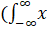<![endif]><![endif]><i
style='mso-bidi-font-style:normal'>(t) dt</i>)
= X(&#969;)/j&#969; <o:p></o:p>

When a function (i.e., x(t))
is not an energy function and hence the Fourier transform of <!--[if gte msEquation 12]><m:oMath><i
 style='mso-bidi-font-style:normal'><m:r>[</m:r></i><m:nary><m:naryPr><m:limLoc
    m:val="subSup"/><m:ctrlPr></m:ctrlPr></m:naryPr><m:sub><i
   style='mso-bidi-font-style:normal'><m:r>-&#8734;</m:r></i></m:sub><m:sup><i
   style='mso-bidi-font-style:normal'><m:r>&#8734;</m:r></i></m:sup><m:e><i
   style='mso-bidi-font-style:normal'><m:r>x</m:r></i></m:e></m:nary></m:oMath><![endif]--><![if !msEquation]><!--[if gte vml 1]><v:shape
 id="_x0000_i1025" type="#_x0000_t75" style='width:34.5pt;height:22.5pt'>
 <v:imagedata src="Fourier_Transform_files/image025.png" o:title=""
  chromakey="white"/>
</v:shape><![endif]--><![if !vml]>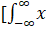<![endif]><![endif]><i
style='mso-bidi-font-style:normal'>(t) dt</i>] includes an impulse
function. <o:p></o:p>

F<!--[if gte msEquation 12]><m:oMath><i
 style='mso-bidi-font-style:normal'><m:r>(</m:r></i><m:nary><m:naryPr><m:limLoc
    m:val="subSup"/><m:ctrlPr></m:ctrlPr></m:naryPr><m:sub><i
   style='mso-bidi-font-style:normal'><m:r>-&#8734;</m:r></i></m:sub><m:sup><i
   style='mso-bidi-font-style:normal'><m:r>&#8734;</m:r></i></m:sup><m:e><i
   style='mso-bidi-font-style:normal'><m:r>x</m:r></i></m:e></m:nary></m:oMath><![endif]--><![if !msEquation]><!--[if gte vml 1]><v:shape
 id="_x0000_i1025" type="#_x0000_t75" style='width:35.25pt;height:22.5pt'>
 <v:imagedata src="Fourier_Transform_files/image023.png" o:title=""
  chromakey="white"/>
</v:shape><![endif]--><![if !vml]><![endif]><![endif]><i
style='mso-bidi-font-style:normal'>(t) dt</i>)
= X(&#969;)/j&#969; + <!--[if gte msEquation 12]><m:oMath><em><b
 style='mso-bidi-font-weight:normal'><m:r><m:rPr><m:scr m:val="roman"/><m:sty
    m:val="b"/></m:rPr>&#960;</m:r></b></em></m:oMath><![endif]--><![if !msEquation]><!--[if gte vml 1]><v:shape
 id="_x0000_i1025" type="#_x0000_t75" style='width:6.75pt;height:13.5pt'>
 <v:imagedata src="Fourier_Transform_files/image027.png" o:title=""
  chromakey="white"/>
</v:shape><![endif]--><![if !vml]><![endif]><![endif]>X<!--[if gte msEquation 12]><m:oMath><m:r><m:rPr><m:scr
    m:val="roman"/><m:sty m:val="p"/></m:rPr>(0)&#948;(</m:r><m:r><m:rPr><m:scr m:val="roman"/><m:sty
    m:val="p"/></m:rPr>&#969;</m:r><m:r><m:rPr><m:scr m:val="roman"/><m:sty
    m:val="p"/></m:rPr>)</m:r></m:oMath><![endif]--><![if !msEquation]><!--[if gte vml 1]><v:shape
 id="_x0000_i1025" type="#_x0000_t75" style='width:50.25pt;height:18pt'>
 <v:imagedata src="Fourier_Transform_files/image029.png" o:title=""
  chromakey="white"/>
</v:shape><![endif]--><![if !vml]>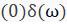<![endif]><![endif]><o:p></o:p>

<o:p>&nbsp;</o:p>

<![if !supportLists]><b
style='mso-bidi-font-weight:normal'>9.&nbsp;&nbsp;&nbsp;&nbsp;
</b><![endif]><b style='mso-bidi-font-weight:normal'>Modulation
Property<o:p></o:p></b>

F{x(t)<i
style='mso-bidi-font-style:normal'>cosat</i>} = ½ {X(&#969; + a) + X(&#969;
- a)}<o:p></o:p>

F{x(t)<i
style='mso-bidi-font-style:normal'>sinat</i>} = ½ {X(&#969; + a) - X(&#969;
- a)}<o:p></o:p>

<o:p>&nbsp;</o:p>

<![if !supportLists]>10.&nbsp;&nbsp;&nbsp;&nbsp;&nbsp;&nbsp;&nbsp;&nbsp;&nbsp;&nbsp;&nbsp;&nbsp;&nbsp;&nbsp;&nbsp;&nbsp;&nbsp;&nbsp;&nbsp;&nbsp;&nbsp;&nbsp;&nbsp;
<![endif]>If the Fourier transform of f(x) is F(k), then f*(x) &lt;=&gt;  F*(-k)<o:p></o:p>

As a consequence Fourier transform of a real
function must satisfy the symmetry relation. <o:p></o:p>

F(k)
= F*(-k), meaning that the Fourier transform is symmetric about the
origin in k-space. |F(k)|2 = |F(-k)|2<o:p></o:p>

<b style='mso-bidi-font-weight:normal'><o:p>&nbsp;</o:p></b>

<![if !supportLists]><b
style='mso-bidi-font-weight:normal'>11.&nbsp;&nbsp;&nbsp;&nbsp;&nbsp;&nbsp;&nbsp;&nbsp;&nbsp;&nbsp;&nbsp;&nbsp;&nbsp;&nbsp;&nbsp;&nbsp;&nbsp;&nbsp;&nbsp;&nbsp;&nbsp;&nbsp;&nbsp;
</b><![endif]><b style='mso-bidi-font-weight:normal'> Parseval’s theorem <o:p></o:p></b>

Energy = <!--[if gte msEquation 12]><m:oMath><m:nary><m:naryPr><m:limLoc
    m:val="subSup"/><m:ctrlPr></m:ctrlPr></m:naryPr><m:sub><b
   style='mso-bidi-font-weight:normal'><i style='mso-bidi-font-style:normal'><m:r><m:rPr><m:scr m:val="roman"/><m:sty
      m:val="bi"/></m:rPr>-&#8734;</m:r></i></b></m:sub><m:sup><b
   style='mso-bidi-font-weight:normal'><i style='mso-bidi-font-style:normal'><m:r><m:rPr><m:scr m:val="roman"/><m:sty
      m:val="bi"/></m:rPr>&#8734;</m:r></i></b></m:sup><m:e><b
   style='mso-bidi-font-weight:normal'><i style='mso-bidi-font-style:normal'><m:r><m:rPr><m:scr m:val="roman"/><m:sty
      m:val="bi"/></m:rPr>|</m:r><m:r><m:rPr><m:scr m:val="roman"/><m:sty m:val="bi"/></m:rPr>x</m:r></i></b></m:e></m:nary></m:oMath><![endif]--><![if !msEquation]><!--[if gte vml 1]><v:shape
 id="_x0000_i1025" type="#_x0000_t75" style='width:36.75pt;height:22.5pt'>
 <v:imagedata src="Fourier_Transform_files/image031.png" o:title=""
  chromakey="white"/>
</v:shape><![endif]--><![if !vml]><![endif]><![endif]><b
style='mso-bidi-font-weight:normal'><i style='mso-bidi-font-style:normal'>(t)|2dt = 1/2</i></b><!--[if gte msEquation 12]><m:oMath><em><b
 style='mso-bidi-font-weight:normal'><m:r><m:rPr><m:scr m:val="roman"/><m:sty
    m:val="b"/></m:rPr>&#960;</m:r></b></em></m:oMath><![endif]--><![if !msEquation]><!--[if gte vml 1]><v:shape
 id="_x0000_i1025" type="#_x0000_t75" style='width:6.75pt;height:13.5pt'>
 <v:imagedata src="Fourier_Transform_files/image027.png" o:title=""
  chromakey="white"/>
</v:shape><![endif]--><![if !vml]><![endif]><![endif]><em><b
style='mso-bidi-font-weight:normal'> </b></em><!--[if gte msEquation 12]><m:oMath><m:nary><m:naryPr><m:limLoc
    m:val="subSup"/><m:ctrlPr></m:ctrlPr></m:naryPr><m:sub><b
   style='mso-bidi-font-weight:normal'><i style='mso-bidi-font-style:normal'><m:r><m:rPr><m:scr m:val="roman"/><m:sty
      m:val="bi"/></m:rPr>-&#8734;</m:r></i></b></m:sub><m:sup><b
   style='mso-bidi-font-weight:normal'><i style='mso-bidi-font-style:normal'><m:r><m:rPr><m:scr m:val="roman"/><m:sty
      m:val="bi"/></m:rPr>&#8734;</m:r></i></b></m:sup><m:e><b
   style='mso-bidi-font-weight:normal'><i style='mso-bidi-font-style:normal'><m:r><m:rPr><m:scr m:val="roman"/><m:sty
      m:val="bi"/></m:rPr>|</m:r><m:r><m:rPr><m:scr m:val="roman"/><m:sty m:val="bi"/></m:rPr>X</m:r></i></b></m:e></m:nary></m:oMath><![endif]--><![if !msEquation]><!--[if gte vml 1]><v:shape
 id="_x0000_i1025" type="#_x0000_t75" style='width:38.25pt;height:22.5pt'>
 <v:imagedata src="Fourier_Transform_files/image033.png" o:title=""
  chromakey="white"/>
</v:shape><![endif]--><![if !vml]>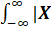<![endif]><![endif]><b
style='mso-bidi-font-weight:normal'><i style='mso-bidi-font-style:normal'>(</i></b><b
style='mso-bidi-font-weight:normal'>&#969;</b><b
style='mso-bidi-font-weight:normal'><i style='mso-bidi-font-style:normal'>)|2d</i></b><b
style='mso-bidi-font-weight:normal'>&#969;</b><o:p></o:p>

The total energy in the time domain signal, x(t) [i.e., the left integral] can be easily calculated from
the frequency domain signal, <i style='mso-bidi-font-style:normal'>X</i><i
style='mso-bidi-font-style:normal'>(</i><i style='mso-bidi-font-style:
normal'>&#969;) </i>[i.e., from the right
integral]<o:p></o:p>

<o:p>&nbsp;</o:p>

<![if !supportLists]><b
style='mso-bidi-font-weight:normal'>12.&nbsp;&nbsp;&nbsp;&nbsp;&nbsp;&nbsp;&nbsp;&nbsp;&nbsp;&nbsp;&nbsp;&nbsp;&nbsp;&nbsp;&nbsp;&nbsp;&nbsp;&nbsp;&nbsp;&nbsp;&nbsp;&nbsp;&nbsp;
</b><![endif]><b style='mso-bidi-font-weight:normal'>Time
reversal<o:p></o:p></b>

F(x(-t)) = X(-&#969;)<o:p></o:p>

<b style='mso-bidi-font-weight:normal'><o:p>&nbsp;</o:p></b>

<![if !supportLists]><b
style='mso-bidi-font-weight:normal'>4.&nbsp;&nbsp;
</b><![endif]><b style='mso-bidi-font-weight:normal'>Fourier
Transform of some common signals<o:p></o:p></b>

<![if !supportLists]><b
style='mso-bidi-font-weight:normal'>4.1.&nbsp;&nbsp;&nbsp;&nbsp;&nbsp;&nbsp;&nbsp;&nbsp;
</b><![endif]><b style='mso-bidi-font-weight:normal'>Fourier
Transform of a delta function</b><b style='mso-bidi-font-weight:normal'><o:p></o:p></b>

<!--[if gte vml 1]><v:shape
 id="Picture_x0020_2" o:spid="_x0000_i1039" type="#_x0000_t75" style='width:367.5pt;
 height:119.25pt;visibility:visible;mso-wrap-style:square'>
 <v:imagedata src="Fourier_Transform_files/image035.png" o:title=""/>
</v:shape><![endif]--><![if !vml]>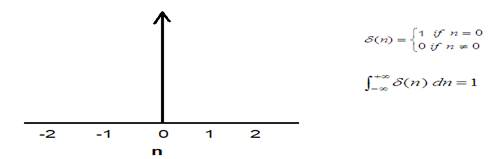<![endif]><o:p></o:p>

If x(t) = &#120517;(t),
then Fourier transform,<o:p></o:p>

X(&#969;) = <!--[if gte msEquation 12]><m:oMath><m:nary><m:naryPr><m:limLoc
    m:val="subSup"/><m:ctrlPr></m:ctrlPr></m:naryPr><m:sub><i
   style='mso-bidi-font-style:normal'><m:r>-&#8734;</m:r></i></m:sub><m:sup><i
   style='mso-bidi-font-style:normal'><m:r>&#8734;</m:r></i></m:sup><m:e><i
   style='mso-bidi-font-style:normal'><m:r>x</m:r></i></m:e></m:nary></m:oMath><![endif]--><![if !msEquation]><!--[if gte vml 1]><v:shape
 id="_x0000_i1025" type="#_x0000_t75" style='width:30pt;height:22.5pt'>
 <v:imagedata src="Fourier_Transform_files/image037.png" o:title=""
  chromakey="white"/>
</v:shape><![endif]--><![if !vml]><![endif]><![endif]><i
style='mso-bidi-font-style:normal'>(t)e-j&#969;t dt<o:p></o:p></i>

<i style='mso-bidi-font-style:normal'>=
</i><!--[if gte msEquation 12]><m:oMath><m:nary><m:naryPr><m:limLoc
    m:val="subSup"/><m:ctrlPr></m:ctrlPr></m:naryPr><m:sub><i
   style='mso-bidi-font-style:normal'><m:r>-&#8734;</m:r></i></m:sub><m:sup><i
   style='mso-bidi-font-style:normal'><m:r>&#8734;</m:r></i></m:sup><m:e><m:r><m:rPr><m:scr
      m:val="roman"/><m:sty m:val="p"/></m:rPr>&#948;</m:r></m:e></m:nary></m:oMath><![endif]--><![if !msEquation]><!--[if gte vml 1]><v:shape
 id="_x0000_i1025" type="#_x0000_t75" style='width:31.5pt;height:22.5pt'>
 <v:imagedata src="Fourier_Transform_files/image039.png" o:title=""
  chromakey="white"/>
</v:shape><![endif]--><![if !vml]><![endif]><![endif]><i
style='mso-bidi-font-style:normal'>(t)e-j&#969;t dt<o:p></o:p></i>

<i style='mso-bidi-font-style:normal'>=
</i><!--[if gte msEquation 12]><m:oMath><m:nary><m:naryPr><m:limLoc
    m:val="subSup"/><m:ctrlPr></m:ctrlPr></m:naryPr><m:sub><i
   style='mso-bidi-font-style:normal'><m:r>-&#8734;</m:r></i></m:sub><m:sup><i
   style='mso-bidi-font-style:normal'><m:r>&#8734;</m:r></i></m:sup><m:e><m:r><m:rPr><m:scr
      m:val="roman"/><m:sty m:val="p"/></m:rPr>1.</m:r></m:e></m:nary></m:oMath><![endif]--><![if !msEquation]><!--[if gte vml 1]><v:shape
 id="_x0000_i1025" type="#_x0000_t75" style='width:35.25pt;height:22.5pt'>
 <v:imagedata src="Fourier_Transform_files/image041.png" o:title=""
  chromakey="white"/>
</v:shape><![endif]--><![if !vml]>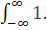<![endif]><![endif]><i
style='mso-bidi-font-style:normal'>e-j</i>&#969;0<i style='mso-bidi-font-style:normal'>
dt<o:p></o:p></i>

<i style='mso-bidi-font-style:normal'>=
1</i><o:p></o:p>

Thus Fourier transform of a delta/impulse is a
constant equal to 1, independent of frequency. Remember that derivation is used
the shifting property of the impulse to eliminate the integral.<o:p></o:p>

<o:p>&nbsp;</o:p>

<![if !supportLists]><b
style='mso-bidi-font-weight:normal'>4.2.&nbsp;&nbsp;&nbsp;&nbsp;&nbsp;&nbsp;&nbsp;&nbsp;
</b><![endif]><b style='mso-bidi-font-weight:normal'>Fourier
transform of a unit step function<o:p></o:p></b>

<b style='mso-bidi-font-weight:normal'><o:p>&nbsp;</o:p></b>

<b style='mso-bidi-font-weight:
normal'><!--[if gte vml 1]><v:shape id="Picture_x0020_4"
 o:spid="_x0000_i1038" type="#_x0000_t75" style='width:297.75pt;height:111.75pt;
 visibility:visible;mso-wrap-style:square'>
 <v:imagedata src="Fourier_Transform_files/image043.png" o:title=""/>
</v:shape><![endif]--><![if !vml]>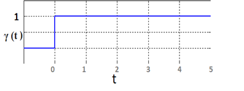<![endif]></b><b
style='mso-bidi-font-weight:normal'><o:p></o:p></b>

<strong>&#947;</strong><strong> (t) = 0 for t&lt;0<o:p></o:p></strong>

<strong>                                                           
= 1 for t &#8805;1</strong><b style='mso-bidi-font-weight:normal'><o:p></o:p></b>

We know that a unit-step function is an integration
of a delta function. So for a unit step function,<o:p></o:p>

<strong>&#947;</strong><strong>
(t)</strong> = <i style='mso-bidi-font-style:normal'> </i><!--[if gte msEquation 12]><m:oMath><m:nary><m:naryPr><m:limLoc
    m:val="subSup"/><m:ctrlPr></m:ctrlPr></m:naryPr><m:sub><i
   style='mso-bidi-font-style:normal'><m:r>-&#8734;</m:r></i></m:sub><m:sup><i
   style='mso-bidi-font-style:normal'><m:r>&#8734;</m:r></i></m:sup><m:e><m:r><m:rPr><m:scr
      m:val="roman"/><m:sty m:val="p"/></m:rPr>&#948;</m:r></m:e></m:nary></m:oMath><![endif]--><![if !msEquation]><!--[if gte vml 1]><v:shape
 id="_x0000_i1025" type="#_x0000_t75" style='width:31.5pt;height:22.5pt'>
 <v:imagedata src="Fourier_Transform_files/image039.png" o:title=""
  chromakey="white"/>
</v:shape><![endif]--><![if !vml]><![endif]><![endif]><i
style='mso-bidi-font-style:normal'>(t) dt<o:p></o:p></i>

So, X(&#969;)
= <!--[if gte msEquation 12]><m:oMath><m:f><m:fPr><m:ctrlPr></m:ctrlPr></m:fPr><m:num><m:r><m:rPr><m:scr m:val="roman"/><m:sty
      m:val="p"/></m:rPr>1</m:r></m:num><m:den><m:r><m:rPr><m:scr m:val="roman"/><m:sty m:val="p"/></m:rPr>j</m:r><m:r><m:rPr><m:scr
      m:val="roman"/><m:sty m:val="p"/></m:rPr>&#969;</m:r></m:den></m:f></m:oMath><![endif]--><![if !msEquation]><!--[if gte vml 1]><v:shape id="_x0000_i1025" type="#_x0000_t75"
 style='width:11.25pt;height:27pt'>
 <v:imagedata src="Fourier_Transform_files/image045.png" o:title=""
  chromakey="white"/>
</v:shape><![endif]--><![if !vml]><![endif]><![endif]> F(<!--[if gte msEquation 12]><m:oMath><m:r><m:rPr><m:scr
    m:val="roman"/><m:sty m:val="p"/></m:rPr>&#948;(t)</m:r></m:oMath><![endif]--><![if !msEquation]><!--[if gte vml 1]><v:shape
 id="_x0000_i1025" type="#_x0000_t75" style='width:24.75pt;height:18pt'>
 <v:imagedata src="Fourier_Transform_files/image047.png" o:title=""
  chromakey="white"/>
</v:shape><![endif]--><![if !vml]><![endif]><![endif]>) + <!--[if gte msEquation 12]><m:oMath><em><b
 style='mso-bidi-font-weight:normal'><m:r><m:rPr><m:scr m:val="roman"/><m:sty
    m:val="b"/></m:rPr>&#960;</m:r></b></em></m:oMath><![endif]--><![if !msEquation]><!--[if gte vml 1]><v:shape
 id="_x0000_i1025" type="#_x0000_t75" style='width:6.75pt;height:13.5pt'>
 <v:imagedata src="Fourier_Transform_files/image027.png" o:title=""
  chromakey="white"/>
</v:shape><![endif]--><![if !vml]><![endif]><![endif]>F(<!--[if gte msEquation 12]><m:oMath><m:r><m:rPr><m:scr
    m:val="roman"/><m:sty m:val="p"/></m:rPr>&#948;(0)</m:r></m:oMath><![endif]--><![if !msEquation]><!--[if gte vml 1]><v:shape
 id="_x0000_i1025" type="#_x0000_t75" style='width:27.75pt;height:18pt'>
 <v:imagedata src="Fourier_Transform_files/image049.png" o:title=""
  chromakey="white"/>
</v:shape><![endif]--><![if !vml]>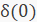<![endif]><![endif]>)<!--[if gte msEquation 12]><m:oMath><m:r><m:rPr><m:scr
    m:val="roman"/><m:sty m:val="p"/></m:rPr>&#948;(</m:r><m:r><m:rPr><m:scr m:val="roman"/><m:sty
    m:val="p"/></m:rPr>&#969;</m:r><m:r><m:rPr><m:scr m:val="roman"/><m:sty
    m:val="p"/></m:rPr>)</m:r></m:oMath><![endif]--><![if !msEquation]><!--[if gte vml 1]><v:shape
 id="_x0000_i1025" type="#_x0000_t75" style='width:30pt;height:18pt'>
 <v:imagedata src="Fourier_Transform_files/image051.png" o:title=""
  chromakey="white"/>
</v:shape><![endif]--><![if !vml]><![endif]><![endif]>  <o:p></o:p>

<i style='mso-bidi-font-style:normal'>[See the property of integration above]<o:p></o:p></i>

           = <!--[if gte msEquation 12]><m:oMath><m:f><m:fPr><m:ctrlPr></m:ctrlPr></m:fPr><m:num><m:r><m:rPr><m:scr m:val="roman"/><m:sty
      m:val="p"/></m:rPr>1</m:r></m:num><m:den><m:r><m:rPr><m:scr m:val="roman"/><m:sty m:val="p"/></m:rPr>j</m:r><m:r><m:rPr><m:scr
      m:val="roman"/><m:sty m:val="p"/></m:rPr>&#969;</m:r></m:den></m:f></m:oMath><![endif]--><![if !msEquation]><!--[if gte vml 1]><v:shape id="_x0000_i1025" type="#_x0000_t75"
 style='width:11.25pt;height:27pt'>
 <v:imagedata src="Fourier_Transform_files/image045.png" o:title=""
  chromakey="white"/>
</v:shape><![endif]--><![if !vml]><![endif]><![endif]> +
<!--[if gte msEquation 12]><m:oMath><em><b style='mso-bidi-font-weight:
 normal'><m:r><m:rPr><m:scr
    m:val="roman"/><m:sty m:val="b"/></m:rPr>&#960;</m:r></b></em><m:r><m:rPr><m:scr
    m:val="roman"/><m:sty m:val="p"/></m:rPr>&#948;(</m:r><m:r><m:rPr><m:scr m:val="roman"/><m:sty
    m:val="p"/></m:rPr>&#969;</m:r><m:r><m:rPr><m:scr m:val="roman"/><m:sty
    m:val="p"/></m:rPr>)</m:r></m:oMath><![endif]--><![if !msEquation]><!--[if gte vml 1]><v:shape
 id="_x0000_i1025" type="#_x0000_t75" style='width:36.75pt;height:15.75pt'>
 <v:imagedata src="Fourier_Transform_files/image053.png" o:title=""
  chromakey="white"/>
</v:shape><![endif]--><![if !vml]><![endif]><![endif]>     
[as F(<!--[if gte msEquation 12]><m:oMath><m:r><m:rPr><m:scr
    m:val="roman"/><m:sty m:val="p"/></m:rPr>&#948;(t)</m:r></m:oMath><![endif]--><![if !msEquation]><!--[if gte vml 1]><v:shape
 id="_x0000_i1025" type="#_x0000_t75" style='width:24.75pt;height:18pt'>
 <v:imagedata src="Fourier_Transform_files/image047.png" o:title=""
  chromakey="white"/>
</v:shape><![endif]--><![if !vml]><![endif]><![endif]>)= F(<!--[if gte msEquation 12]><m:oMath><m:r><m:rPr><m:scr
    m:val="roman"/><m:sty m:val="p"/></m:rPr>&#948;(0)</m:r></m:oMath><![endif]--><![if !msEquation]><!--[if gte vml 1]><v:shape
 id="_x0000_i1025" type="#_x0000_t75" style='width:27.75pt;height:18pt'>
 <v:imagedata src="Fourier_Transform_files/image049.png" o:title=""
  chromakey="white"/>
</v:shape><![endif]--><![if !vml]><![endif]><![endif]>)=1]<o:p></o:p>

When a function (i.e., x(t))
is not an energy function and hence the Fourier transform of <!--[if gte msEquation 12]><m:oMath><i
 style='mso-bidi-font-style:normal'><m:r>[</m:r></i><m:nary><m:naryPr><m:limLoc
    m:val="subSup"/><m:ctrlPr></m:ctrlPr></m:naryPr><m:sub><i
   style='mso-bidi-font-style:normal'><m:r>-&#8734;</m:r></i></m:sub><m:sup><i
   style='mso-bidi-font-style:normal'><m:r>&#8734;</m:r></i></m:sup><m:e><i
   style='mso-bidi-font-style:normal'><m:r>x</m:r></i></m:e></m:nary></m:oMath><![endif]--><![if !msEquation]><!--[if gte vml 1]><v:shape
 id="_x0000_i1025" type="#_x0000_t75" style='width:34.5pt;height:22.5pt'>
 <v:imagedata src="Fourier_Transform_files/image025.png" o:title=""
  chromakey="white"/>
</v:shape><![endif]--><![if !vml]><![endif]><![endif]><i
style='mso-bidi-font-style:normal'>(t) dt</i>] includes an impulse
function. <o:p></o:p>

<o:p>&nbsp;</o:p>

<![if !supportLists]><b
style='mso-bidi-font-weight:normal'>4.3.&nbsp;&nbsp;&nbsp;&nbsp;&nbsp;&nbsp;&nbsp;&nbsp;
</b><![endif]><b style='mso-bidi-font-weight:normal'>Fourier
Transform of a unit pulse function<o:p></o:p></b>

A pulse function can be represented as,<o:p></o:p>

x(t)=&#928;(t) = <strong>&#947;
(t + ½) - &#947;(t - ½)</strong><o:p></o:p>

<!--[if gte vml 1]><v:shape
 id="Picture_x0020_3" o:spid="_x0000_i1037" type="#_x0000_t75" style='width:323.25pt;
 height:208.5pt;visibility:visible;mso-wrap-style:square'>
 <v:imagedata src="Fourier_Transform_files/image055.png" o:title=""/>
</v:shape><![endif]--><![if !vml]>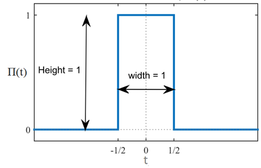<![endif]><o:p></o:p>

For a function rect(t) = &#928;(t) = 1 for |t| &#8804; ½<o:p></o:p>

                                             =
0 otherwise<o:p></o:p>

Given that <o:p></o:p>

x(t) = &#928;(t)<o:p></o:p>

Hence from the
definition of the Fourier transform we have<o:p></o:p>

F (&#928;(t)) = X(<!--[if gte msEquation 12]><m:oMath><m:r><m:rPr><m:scr m:val="roman"/><m:sty
    m:val="p"/></m:rPr>&#969;</m:r></m:oMath><![endif]--><![if !msEquation]><!--[if gte vml 1]><v:shape
 id="_x0000_i1025" type="#_x0000_t75" style='width:10.5pt;height:18pt'>
 <v:imagedata src="Fourier_Transform_files/image057.png" o:title=""
  chromakey="white"/>
</v:shape><![endif]--><![if !vml]><![endif]><![endif]>) = <!--[if gte msEquation 12]><m:oMath><m:nary><m:naryPr><m:limLoc
    m:val="subSup"/><m:ctrlPr></m:ctrlPr></m:naryPr><m:sub><i
   style='mso-bidi-font-style:normal'><m:r>-&#8734;</m:r></i></m:sub><m:sup><i
   style='mso-bidi-font-style:normal'><m:r>&#8734;</m:r></i></m:sup><m:e><m:r><m:rPr><m:scr
      m:val="roman"/><m:sty m:val="p"/></m:rPr>x(t)</m:r></m:e></m:nary></m:oMath><![endif]--><![if !msEquation]><!--[if gte vml 1]><v:shape
 id="_x0000_i1025" type="#_x0000_t75" style='width:48pt;height:22.5pt'>
 <v:imagedata src="Fourier_Transform_files/image059.png" o:title=""
  chromakey="white"/>
</v:shape><![endif]--><![if !vml]>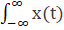<![endif]><![endif]>e
-j&#969;t
dt<o:p></o:p>

                          
=  <!--[if gte msEquation 12]><m:oMath><m:nary><m:naryPr><m:limLoc
    m:val="subSup"/><m:ctrlPr></m:ctrlPr></m:naryPr><m:sub><i
   style='mso-bidi-font-style:normal'><m:r>-</m:r><m:r>1/2</m:r></i></m:sub><m:sup><i
   style='mso-bidi-font-style:normal'><m:r>1/2</m:r></i></m:sup><m:e><m:r><m:rPr><m:scr
      m:val="roman"/><m:sty m:val="p"/></m:rPr>1.</m:r></m:e></m:nary></m:oMath><![endif]--><![if !msEquation]><!--[if gte vml 1]><v:shape id="_x0000_i1025" type="#_x0000_t75"
 style='width:42.75pt;height:27pt'>
 <v:imagedata src="Fourier_Transform_files/image061.png" o:title=""
  chromakey="white"/>
</v:shape><![endif]--><![if !vml]><![endif]><![endif]>e
-j&#969;t
dt     [as &#928;(t) = 1 for |t| &#8804; ½]<o:p></o:p>

                           
=  [(e –j&#969;t)/-j&#969;]-1/21/2<o:p></o:p>

                                           = [e –j&#969;/2 - e j&#969;/2] / -j&#969;<o:p></o:p>

                           
= [e j&#969;/2 - e -j&#969;/2] / j&#969;<o:p></o:p>

                           
= 2/&#969; . {[e j&#969;/2 - e -j&#969;/2] / 2j}<o:p></o:p>

                           
= 2/&#969; . sin(&#969;/2)<o:p></o:p>

                           
= {sin(&#969;/2)
/ (&#969;/2)}<o:p></o:p>

                          
= {sin(<!--[if gte msEquation 12]><m:oMath><i
 style='mso-bidi-font-style:normal'><m:r>(</m:r></i><em><m:r><m:rPr><m:scr m:val="roman"/><m:sty
    m:val="p"/></m:rPr>&#960;</m:r></em></m:oMath><![endif]--><![if !msEquation]><!--[if gte vml 1]><v:shape
 id="_x0000_i1025" type="#_x0000_t75" style='width:14.25pt;height:18pt'>
 <v:imagedata src="Fourier_Transform_files/image063.png" o:title=""
  chromakey="white"/>
</v:shape><![endif]--><![if !vml]><![endif]><![endif]>(&#969;/2<!--[if gte msEquation 12]><m:oMath><em><m:r><m:rPr><m:scr m:val="roman"/><m:sty
    m:val="p"/></m:rPr>&#960;</m:r></em></m:oMath><![endif]--><![if !msEquation]><!--[if gte vml 1]><v:shape
 id="_x0000_i1025" type="#_x0000_t75" style='width:8.25pt;height:18pt'>
 <v:imagedata src="Fourier_Transform_files/image019.png" o:title=""
  chromakey="white"/>
</v:shape><![endif]--><![if !vml]><![endif]><![endif]>))
/ (<!--[if gte msEquation 12]><m:oMath><em><m:r><m:rPr><m:scr m:val="roman"/><m:sty m:val="p"/></m:rPr>&#960;</m:r></em></m:oMath><![endif]--><![if !msEquation]><!--[if gte vml 1]><v:shape
 id="_x0000_i1025" type="#_x0000_t75" style='width:8.25pt;height:18pt'>
 <v:imagedata src="Fourier_Transform_files/image019.png" o:title=""
  chromakey="white"/>
</v:shape><![endif]--><![if !vml]><![endif]><![endif]>(&#969;/2<!--[if gte msEquation 12]><m:oMath><em><m:r><m:rPr><m:scr m:val="roman"/><m:sty
    m:val="p"/></m:rPr>&#960;</m:r></em></m:oMath><![endif]--><![if !msEquation]><!--[if gte vml 1]><v:shape
 id="_x0000_i1025" type="#_x0000_t75" style='width:8.25pt;height:18pt'>
 <v:imagedata src="Fourier_Transform_files/image019.png" o:title=""
  chromakey="white"/>
</v:shape><![endif]--><![if !vml]><![endif]><![endif]>))}<o:p></o:p>

                           
= sinc(&#969;/2<!--[if gte msEquation 12]><m:oMath><em><m:r><m:rPr><m:scr m:val="roman"/><m:sty
    m:val="p"/></m:rPr>&#960;</m:r></em></m:oMath><![endif]--><![if !msEquation]><!--[if gte vml 1]><v:shape
 id="_x0000_i1025" type="#_x0000_t75" style='width:8.25pt;height:18pt'>
 <v:imagedata src="Fourier_Transform_files/image019.png" o:title=""
  chromakey="white"/>
</v:shape><![endif]--><![if !vml]><![endif]><![endif]>)<o:p></o:p>

<o:p>&nbsp;</o:p>

For the above case, the rectangular function has a pulse width value
of 1 over the interval of [-½, ½]; 0 otherwise.<o:p></o:p>

Now we’ll discuss a rectangular pulse that has a width of T<o:p></o:p>

Then,    rect(t/T)
= &#928;(t/T) = 1 for
|t| &#8804; T/2<o:p></o:p>

                                             =
0 otherwise<o:p></o:p>

Given that <o:p></o:p>

x(t/T) = &#928;(t/T)<o:p></o:p>

Hence from the
definition of the Fourier transform we have<o:p></o:p>

F (&#928;(t/T)) = <!--[if gte msEquation 12]><m:oMath><m:nary><m:naryPr><m:limLoc
    m:val="subSup"/><m:ctrlPr></m:ctrlPr></m:naryPr><m:sub><i
   style='mso-bidi-font-style:normal'><m:r>-&#8734;</m:r></i></m:sub><m:sup><i
   style='mso-bidi-font-style:normal'><m:r>&#8734;</m:r></i></m:sup><m:e><m:r><m:rPr><m:scr
      m:val="roman"/><m:sty m:val="p"/></m:rPr>x(t/T)</m:r></m:e></m:nary></m:oMath><![endif]--><![if !msEquation]><!--[if gte vml 1]><v:shape
 id="_x0000_i1025" type="#_x0000_t75" style='width:63.75pt;height:22.5pt'>
 <v:imagedata src="Fourier_Transform_files/image065.png" o:title=""
  chromakey="white"/>
</v:shape><![endif]--><![if !vml]><![endif]><![endif]>e
-j&#969;t
dt<o:p></o:p>

                          
=  <!--[if gte msEquation 12]><m:oMath><m:nary><m:naryPr><m:limLoc
    m:val="subSup"/><m:ctrlPr></m:ctrlPr></m:naryPr><m:sub><i
   style='mso-bidi-font-style:normal'><m:r>-</m:r><m:r>T</m:r><m:r>/2</m:r></i></m:sub><m:sup><i
   style='mso-bidi-font-style:normal'><m:r>T</m:r><m:r>/2</m:r></i></m:sup><m:e><m:r><m:rPr><m:scr
      m:val="roman"/><m:sty m:val="p"/></m:rPr>1.</m:r></m:e></m:nary></m:oMath><![endif]--><![if !msEquation]><!--[if gte vml 1]><v:shape id="_x0000_i1025" type="#_x0000_t75"
 style='width:42.75pt;height:27pt'>
 <v:imagedata src="Fourier_Transform_files/image067.png" o:title=""
  chromakey="white"/>
</v:shape><![endif]--><![if !vml]>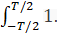<![endif]><![endif]>e
-j&#969;t
dt     [as &#928;(t/T) = 1 for |t| &#8804; T/2]<o:p></o:p>

                           
=  [(e –j&#969;t)/-j&#969;]-T/2T/2<o:p></o:p>

                                           = [e –j&#969;T/2 - e j&#969;T/2] / -j&#969;<o:p></o:p>

                           
= [e j&#969;T/2 - e -j&#969;T/2] / j&#969;<o:p></o:p>

                           
= 2/&#969; . {[e j&#969;T/2 - e -j&#969;T/2] / 2j}<o:p></o:p>

                           
= 2/&#969; . sin(&#969;(T/2))<o:p></o:p>

                           
= {sin(&#969;(T/2))
/ (&#969;/2)}<o:p></o:p>

                           
= {sin(<!--[if gte msEquation 12]><m:oMath><em><m:r><m:rPr><m:scr m:val="roman"/><m:sty
    m:val="p"/></m:rPr>&#960;(</m:r></em></m:oMath><![endif]--><![if !msEquation]><!--[if gte vml 1]><v:shape
 id="_x0000_i1025" type="#_x0000_t75" style='width:14.25pt;height:18pt'>
 <v:imagedata src="Fourier_Transform_files/image069.png" o:title=""
  chromakey="white"/>
</v:shape><![endif]--><![if !vml]><![endif]><![endif]>&#969;T/2<!--[if gte msEquation 12]><m:oMath><em><m:r><m:rPr><m:scr m:val="roman"/><m:sty
    m:val="p"/></m:rPr>&#960;</m:r></em></m:oMath><![endif]--><![if !msEquation]><!--[if gte vml 1]><v:shape
 id="_x0000_i1025" type="#_x0000_t75" style='width:8.25pt;height:18pt'>
 <v:imagedata src="Fourier_Transform_files/image019.png" o:title=""
  chromakey="white"/>
</v:shape><![endif]--><![if !vml]><![endif]><![endif]>))
/ (<!--[if gte msEquation 12]><m:oMath><em><m:r><m:rPr><m:scr m:val="roman"/><m:sty m:val="p"/></m:rPr>&#960;(</m:r></em></m:oMath><![endif]--><![if !msEquation]><!--[if gte vml 1]><v:shape
 id="_x0000_i1025" type="#_x0000_t75" style='width:14.25pt;height:18pt'>
 <v:imagedata src="Fourier_Transform_files/image069.png" o:title=""
  chromakey="white"/>
</v:shape><![endif]--><![if !vml]><![endif]><![endif]>&#969;/2<!--[if gte msEquation 12]><m:oMath><em><m:r><m:rPr><m:scr m:val="roman"/><m:sty
    m:val="p"/></m:rPr>&#960;</m:r></em></m:oMath><![endif]--><![if !msEquation]><!--[if gte vml 1]><v:shape
 id="_x0000_i1025" type="#_x0000_t75" style='width:8.25pt;height:18pt'>
 <v:imagedata src="Fourier_Transform_files/image019.png" o:title=""
  chromakey="white"/>
</v:shape><![endif]--><![if !vml]><![endif]><![endif]>))}<o:p></o:p>

                           
= {sin(<!--[if gte msEquation 12]><m:oMath><em><m:r><m:rPr><m:scr m:val="roman"/><m:sty
    m:val="p"/></m:rPr>&#960;(</m:r></em></m:oMath><![endif]--><![if !msEquation]><!--[if gte vml 1]><v:shape
 id="_x0000_i1025" type="#_x0000_t75" style='width:14.25pt;height:18pt'>
 <v:imagedata src="Fourier_Transform_files/image069.png" o:title=""
  chromakey="white"/>
</v:shape><![endif]--><![if !vml]><![endif]><![endif]>&#969;T/2<!--[if gte msEquation 12]><m:oMath><em><m:r><m:rPr><m:scr m:val="roman"/><m:sty
    m:val="p"/></m:rPr>&#960;</m:r></em></m:oMath><![endif]--><![if !msEquation]><!--[if gte vml 1]><v:shape
 id="_x0000_i1025" type="#_x0000_t75" style='width:8.25pt;height:18pt'>
 <v:imagedata src="Fourier_Transform_files/image019.png" o:title=""
  chromakey="white"/>
</v:shape><![endif]--><![if !vml]><![endif]><![endif]>))
/ (<!--[if gte msEquation 12]><m:oMath><em><m:r><m:rPr><m:scr m:val="roman"/><m:sty m:val="p"/></m:rPr>&#960;(</m:r></em></m:oMath><![endif]--><![if !msEquation]><!--[if gte vml 1]><v:shape
 id="_x0000_i1025" type="#_x0000_t75" style='width:14.25pt;height:18pt'>
 <v:imagedata src="Fourier_Transform_files/image069.png" o:title=""
  chromakey="white"/>
</v:shape><![endif]--><![if !vml]><![endif]><![endif]>&#969;T/2<!--[if gte msEquation 12]><m:oMath><em><m:r><m:rPr><m:scr m:val="roman"/><m:sty
    m:val="p"/></m:rPr>&#960;</m:r></em></m:oMath><![endif]--><![if !msEquation]><!--[if gte vml 1]><v:shape
 id="_x0000_i1025" type="#_x0000_t75" style='width:8.25pt;height:18pt'>
 <v:imagedata src="Fourier_Transform_files/image019.png" o:title=""
  chromakey="white"/>
</v:shape><![endif]--><![if !vml]><![endif]><![endif]>))}.T<o:p></o:p>

                           
= T. sinc(&#969;T/2<!--[if gte msEquation 12]><m:oMath><em><m:r><m:rPr><m:scr m:val="roman"/><m:sty
    m:val="p"/></m:rPr>&#960;</m:r></em></m:oMath><![endif]--><![if !msEquation]><!--[if gte vml 1]><v:shape
 id="_x0000_i1025" type="#_x0000_t75" style='width:8.25pt;height:18pt'>
 <v:imagedata src="Fourier_Transform_files/image019.png" o:title=""
  chromakey="white"/>
</v:shape><![endif]--><![if !vml]><![endif]><![endif]>)<o:p></o:p>

<o:p>&nbsp;</o:p>

<o:p>&nbsp;</o:p>

<![if !supportLists]><b
style='mso-bidi-font-weight:normal'>4.4.&nbsp;&nbsp;&nbsp;&nbsp;&nbsp;&nbsp;&nbsp;&nbsp;
</b><![endif]><b style='mso-bidi-font-weight:normal'>Fourier
Transform of a unit triangle pulse<o:p></o:p></b>

<b style='mso-bidi-font-weight:
normal'><!--[if gte vml 1]><v:shape id="Picture_x0020_5"
 o:spid="_x0000_i1036" type="#_x0000_t75" style='width:213.75pt;height:150pt;
 visibility:visible;mso-wrap-style:square'>
 <v:imagedata src="Fourier_Transform_files/image071.png" o:title=""/>
</v:shape><![endif]--><![if !vml]><![endif]></b><b
style='mso-bidi-font-weight:normal'><o:p></o:p></b>

A unit triangle pulse is simply the convolution of a unit pulse
function with itself.<o:p></o:p>

Here, &#923;(t) = &#928;(t) * &#928;(t)                <o:p></o:p>

<i style='mso-bidi-font-style:normal'>[&#928;(t) is a unit
pulse function &amp; ‘*’ denotes convolution]</i><i style='mso-bidi-font-style:
normal'><o:p></o:p></i>

So, &#923;(&#969;) = sinc(&#969;/2<!--[if gte msEquation 12]><m:oMath><em><m:r><m:rPr><m:scr m:val="roman"/><m:sty
    m:val="p"/></m:rPr>&#960;</m:r></em></m:oMath><![endif]--><![if !msEquation]><!--[if gte vml 1]><v:shape
 id="_x0000_i1025" type="#_x0000_t75" style='width:8.25pt;height:18pt'>
 <v:imagedata src="Fourier_Transform_files/image019.png" o:title=""
  chromakey="white"/>
</v:shape><![endif]--><![if !vml]><![endif]><![endif]><em>) . </em>sinc(&#969;/2<!--[if gte msEquation 12]><m:oMath><em><m:r><m:rPr><m:scr m:val="roman"/><m:sty
    m:val="p"/></m:rPr>&#960;)</m:r></em></m:oMath><![endif]--><![if !msEquation]><!--[if gte vml 1]><v:shape
 id="_x0000_i1025" type="#_x0000_t75" style='width:14.25pt;height:18pt'>
 <v:imagedata src="Fourier_Transform_files/image073.png" o:title=""
  chromakey="white"/>
</v:shape><![endif]--><![if !vml]><![endif]><![endif]><em> = </em>sinc2(&#969;/2<!--[if gte msEquation 12]><m:oMath><em><m:r><m:rPr><m:scr m:val="roman"/><m:sty
    m:val="p"/></m:rPr>&#960;)</m:r></em></m:oMath><![endif]--><![if !msEquation]><!--[if gte vml 1]><v:shape
 id="_x0000_i1025" type="#_x0000_t75" style='width:14.25pt;height:18pt'>
 <v:imagedata src="Fourier_Transform_files/image073.png" o:title=""
  chromakey="white"/>
</v:shape><![endif]--><![if !vml]><![endif]><![endif]><em><o:p></o:p></em>

<em><o:p>&nbsp;</o:p></em>

<![if !supportLists]><b
style='mso-bidi-font-weight:normal'>4.5.&nbsp;&nbsp;&nbsp;&nbsp;&nbsp;&nbsp;&nbsp;&nbsp;
</b><![endif]><b style='mso-bidi-font-weight:normal'>Fourier
Transform of a Sawtooth function<o:p></o:p></b>

<b style='mso-bidi-font-weight:
normal'><!--[if gte vml 1]><v:shape id="Picture_x0020_6"
 o:spid="_x0000_i1035" type="#_x0000_t75" style='width:233.25pt;height:165pt;
 visibility:visible;mso-wrap-style:square'>
 <v:imagedata src="Fourier_Transform_files/image075.png" o:title=""/>
</v:shape><![endif]--><![if !vml]><![endif]></b><b
style='mso-bidi-font-weight:normal'><o:p></o:p></b>

s(t)
= 0, for t &lt; 0 and t &gt; 1<o:p></o:p>

                                                 
= 1, for 0 &#8804; t &#8804; 1<b style='mso-bidi-font-weight:normal'><o:p></o:p></b>

We can represent sawtooth as the
integral of shifted unit pulse function (to give the ramp) and a negative
impulse (delayed by one second) to give the discontinuity at the end of the
ramp<o:p></o:p>

<!--[if gte vml 1]><v:shape id="Picture_x0020_8"
 o:spid="_x0000_i1034" type="#_x0000_t75" style='width:272.25pt;height:158.25pt;
 visibility:visible;mso-wrap-style:square'>
 <v:imagedata src="Fourier_Transform_files/image077.png" o:title=""/>
</v:shape><![endif]--><![if !vml]><![endif]><o:p></o:p>

<o:p>&nbsp;</o:p>

s(t) = <!--[if gte msEquation 12]><m:oMath><m:nary><m:naryPr><m:limLoc
    m:val="subSup"/><m:ctrlPr></m:ctrlPr></m:naryPr><m:sub><i
   style='mso-bidi-font-style:normal'><m:r>-&#8734;</m:r></i></m:sub><m:sup><i
   style='mso-bidi-font-style:normal'><m:r>t</m:r></i></m:sup><m:e><m:r><m:rPr><m:scr
      m:val="roman"/><m:sty m:val="p"/></m:rPr>&#928;(t-</m:r><m:f><m:fPr><m:ctrlPr></m:ctrlPr></m:fPr><m:num><m:r><m:rPr><m:scr
        m:val="roman"/><m:sty m:val="p"/></m:rPr>1</m:r></m:num><m:den><m:r><m:rPr><m:scr
        m:val="roman"/><m:sty m:val="p"/></m:rPr>2</m:r></m:den></m:f><m:r><m:rPr><m:scr
      m:val="roman"/><m:sty m:val="p"/></m:rPr>)</m:r></m:e></m:nary></m:oMath><![endif]--><![if !msEquation]><!--[if gte vml 1]><v:shape
 id="_x0000_i1025" type="#_x0000_t75" style='width:72.75pt;height:24.75pt'>
 <v:imagedata src="Fourier_Transform_files/image079.png" o:title=""
  chromakey="white"/>
</v:shape><![endif]--><![if !vml]>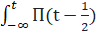<![endif]><![endif]>dt
- <!--[if gte msEquation 12]><m:oMath><m:nary><m:naryPr><m:limLoc m:val="subSup"/><m:ctrlPr></m:ctrlPr></m:naryPr><m:sub><i
   style='mso-bidi-font-style:normal'><m:r>-&#8734;</m:r></i></m:sub><m:sup><i
   style='mso-bidi-font-style:normal'><m:r>t</m:r></i></m:sup><m:e><m:r><m:rPr><m:scr
      m:val="roman"/><m:sty m:val="p"/></m:rPr>&#948;(t-1)</m:r></m:e></m:nary></m:oMath><![endif]--><![if !msEquation]><!--[if gte vml 1]><v:shape
 id="_x0000_i1025" type="#_x0000_t75" style='width:73.5pt;height:24pt'>
 <v:imagedata src="Fourier_Transform_files/image081.png" o:title=""
  chromakey="white"/>
</v:shape><![endif]--><![if !vml]><![endif]><![endif]>dt
=<!--[if gte msEquation 12]><m:oMath><m:nary><m:naryPr><m:limLoc m:val="subSup"/><m:ctrlPr></m:ctrlPr></m:naryPr><m:sub><i
   style='mso-bidi-font-style:normal'><m:r>-&#8734;</m:r></i></m:sub><m:sup><i
   style='mso-bidi-font-style:normal'><m:r>t</m:r></i></m:sup><m:e><i
   style='mso-bidi-font-style:normal'><m:r>y</m:r></i><m:d><m:dPr><m:ctrlPr></m:ctrlPr></m:dPr><m:e><i
     style='mso-bidi-font-style:normal'><m:r>t</m:r></i></m:e></m:d><i style='mso-bidi-font-style:
   normal'><m:r>dt</m:r></i></m:e></m:nary></m:oMath><![endif]--><![if !msEquation]><!--[if gte vml 1]><v:shape
 id="_x0000_i1025" type="#_x0000_t75" style='width:63.75pt;height:24pt'>
 <v:imagedata src="Fourier_Transform_files/image083.png" o:title=""
  chromakey="white"/>
</v:shape><![endif]--><![if !vml]><![endif]><![endif]><o:p></o:p>

y(t) = <!--[if gte msEquation 12]><m:oMath><m:r><m:rPr><m:scr
    m:val="roman"/><m:sty m:val="p"/></m:rPr>&#928;(t-</m:r><m:f><m:fPr><m:ctrlPr></m:ctrlPr></m:fPr><m:num><m:r><m:rPr><m:scr
      m:val="roman"/><m:sty m:val="p"/></m:rPr>1</m:r></m:num><m:den><m:r><m:rPr><m:scr
      m:val="roman"/><m:sty m:val="p"/></m:rPr>2</m:r></m:den></m:f><m:r><m:rPr><m:scr
    m:val="roman"/><m:sty m:val="p"/></m:rPr>)</m:r></m:oMath><![endif]--><![if !msEquation]><!--[if gte vml 1]><v:shape
 id="_x0000_i1025" type="#_x0000_t75" style='width:48pt;height:24.75pt'>
 <v:imagedata src="Fourier_Transform_files/image085.png" o:title=""
  chromakey="white"/>
</v:shape><![endif]--><![if !vml]>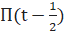<![endif]><![endif]> - <!--[if gte msEquation 12]><m:oMath><m:r><m:rPr><m:scr
    m:val="roman"/><m:sty m:val="p"/></m:rPr>&#948;(t-1)</m:r></m:oMath><![endif]--><![if !msEquation]><!--[if gte vml 1]><v:shape
 id="_x0000_i1025" type="#_x0000_t75" style='width:49.5pt;height:18pt'>
 <v:imagedata src="Fourier_Transform_files/image087.png" o:title=""
  chromakey="white"/>
</v:shape><![endif]--><![if !vml]><![endif]><![endif]><o:p></o:p>

Now, we’ve to find the Fourier
transform of y(t),<o:p></o:p>

Y(&#969;) = sinc(&#969;/2<!--[if gte msEquation 12]><m:oMath><em><m:r><m:rPr><m:scr m:val="roman"/><m:sty
    m:val="p"/></m:rPr>&#960;</m:r></em></m:oMath><![endif]--><![if !msEquation]><!--[if gte vml 1]><v:shape
 id="_x0000_i1025" type="#_x0000_t75" style='width:8.25pt;height:18pt'>
 <v:imagedata src="Fourier_Transform_files/image019.png" o:title=""
  chromakey="white"/>
</v:shape><![endif]--><![if !vml]><![endif]><![endif]>)e-j&#969;/2
-
e-j&#969;<o:p></o:p>

We can now apply integral property with Y(0)
= 0, to find S(&#969;)<o:p></o:p>

S(&#969;) = F(<!--[if gte msEquation 12]><m:oMath><m:nary><m:naryPr><m:limLoc
    m:val="subSup"/><m:ctrlPr></m:ctrlPr></m:naryPr><m:sub><i
   style='mso-bidi-font-style:normal'><m:r>-&#8734;</m:r></i></m:sub><m:sup><i
   style='mso-bidi-font-style:normal'><m:r>t</m:r></i></m:sup><m:e><i
   style='mso-bidi-font-style:normal'><m:r>y</m:r></i><m:d><m:dPr><m:ctrlPr></m:ctrlPr></m:dPr><m:e><i
     style='mso-bidi-font-style:normal'><m:r>t</m:r></i></m:e></m:d><i style='mso-bidi-font-style:
   normal'><m:r>dt</m:r></i></m:e></m:nary></m:oMath><![endif]--><![if !msEquation]><!--[if gte vml 1]><v:shape
 id="_x0000_i1025" type="#_x0000_t75" style='width:63.75pt;height:24pt'>
 <v:imagedata src="Fourier_Transform_files/image083.png" o:title=""
  chromakey="white"/>
</v:shape><![endif]--><![if !vml]><![endif]><![endif]>) = Y(&#969;)/j&#969;
- <!--[if gte msEquation 12]><m:oMath><em><m:r><m:rPr><m:scr m:val="roman"/><m:sty m:val="p"/></m:rPr>&#960;</m:r></em></m:oMath><![endif]--><![if !msEquation]><!--[if gte vml 1]><v:shape
 id="_x0000_i1025" type="#_x0000_t75" style='width:8.25pt;height:18pt'>
 <v:imagedata src="Fourier_Transform_files/image019.png" o:title=""
  chromakey="white"/>
</v:shape><![endif]--><![if !vml]><![endif]><![endif]><em>Y(0)</em><!--[if gte msEquation 12]><m:oMath><m:r><m:rPr><m:scr
    m:val="roman"/><m:sty m:val="p"/></m:rPr>&#948;</m:r></m:oMath><![endif]--><![if !msEquation]><!--[if gte vml 1]><v:shape
 id="_x0000_i1025" type="#_x0000_t75" style='width:7.5pt;height:18pt'>
 <v:imagedata src="Fourier_Transform_files/image089.png" o:title=""
  chromakey="white"/>
</v:shape><![endif]--><![if !vml]><![endif]><![endif]>(0) = Y(&#969;)/j&#969;<o:p></o:p>

= {(sinc(&#969;/2<!--[if gte msEquation 12]><m:oMath><em><m:r><m:rPr><m:scr m:val="roman"/><m:sty
    m:val="p"/></m:rPr>&#960;</m:r></em></m:oMath><![endif]--><![if !msEquation]><!--[if gte vml 1]><v:shape
 id="_x0000_i1025" type="#_x0000_t75" style='width:8.25pt;height:18pt'>
 <v:imagedata src="Fourier_Transform_files/image019.png" o:title=""
  chromakey="white"/>
</v:shape><![endif]--><![if !vml]><![endif]><![endif]>)e-j&#969;/2
-
e-j&#969;)
/ j&#969;}<o:p></o:p>

= {((sin(&#960; . &#969;/2<!--[if gte msEquation 12]><m:oMath><em><m:r><m:rPr><m:scr m:val="roman"/><m:sty
    m:val="p"/></m:rPr>&#960;</m:r></em></m:oMath><![endif]--><![if !msEquation]><!--[if gte vml 1]><v:shape
 id="_x0000_i1025" type="#_x0000_t75" style='width:8.25pt;height:18pt'>
 <v:imagedata src="Fourier_Transform_files/image019.png" o:title=""
  chromakey="white"/>
</v:shape><![endif]--><![if !vml]><![endif]><![endif]>) / (&#960; . &#969;/2<!--[if gte msEquation 12]><m:oMath><em><m:r><m:rPr><m:scr m:val="roman"/><m:sty
    m:val="p"/></m:rPr>&#960;</m:r></em></m:oMath><![endif]--><![if !msEquation]><!--[if gte vml 1]><v:shape
 id="_x0000_i1025" type="#_x0000_t75" style='width:8.25pt;height:18pt'>
 <v:imagedata src="Fourier_Transform_files/image019.png" o:title=""
  chromakey="white"/>
</v:shape><![endif]--><![if !vml]><![endif]><![endif]>))e-j&#969;/2
-
e-j&#969;)
/ j&#969;}<o:p></o:p>

=  (((sin(&#960; . &#969;/2<!--[if gte msEquation 12]><m:oMath><em><m:r><m:rPr><m:scr m:val="roman"/><m:sty
    m:val="p"/></m:rPr>&#960;</m:r></em></m:oMath><![endif]--><![if !msEquation]><!--[if gte vml 1]><v:shape
 id="_x0000_i1025" type="#_x0000_t75" style='width:8.25pt;height:18pt'>
 <v:imagedata src="Fourier_Transform_files/image019.png" o:title=""
  chromakey="white"/>
</v:shape><![endif]--><![if !vml]><![endif]><![endif]>) / (&#960; . &#969;/2<!--[if gte msEquation 12]><m:oMath><em><m:r><m:rPr><m:scr m:val="roman"/><m:sty
    m:val="p"/></m:rPr>&#960;</m:r></em></m:oMath><![endif]--><![if !msEquation]><!--[if gte vml 1]><v:shape
 id="_x0000_i1025" type="#_x0000_t75" style='width:8.25pt;height:18pt'>
 <v:imagedata src="Fourier_Transform_files/image019.png" o:title=""
  chromakey="white"/>
</v:shape><![endif]--><![if !vml]><![endif]><![endif]>))e-j&#969;/2)
/ j&#969;) – (e-j&#969;
/ j&#969;)<o:p></o:p>

= (2(sin(&#969;/2)e-j&#969;/2)
/ j&#969;2) – (je-j&#969;
/ j2&#969;)<o:p></o:p>

= (2((ej&#969;/2
- e-j&#969;/2) / 2j)e-j&#969;/2)
/ j&#969;2) + (je-j&#969;
/ &#969;)     [as j2 = -1]<o:p></o:p>

= (((ej&#969;/2
- e-j&#969;/2)e-j&#969;/2)
/ j2&#969;2) + (je-j&#969;
/ &#969;)<o:p></o:p>

= (((e-j&#969;/2
-
ej&#969;/2)e-j&#969;/2)
/ &#969;2) + (je-j&#969;
/ &#969;)<o:p></o:p>

= (((e-j&#969;/2
-
ej&#969;/2)e-j&#969;/2)
/ &#969;2) + (je-j&#969;
/ &#969;)<o:p></o:p>

= ((((e-j&#969;/2
-
ej&#969;/2)e-j&#969;/2)
+ j&#969;e-j&#969;)
/ &#969;2)<o:p></o:p>

= ((e-j&#969;
-
1 + j&#969;e-j&#969;)
/ &#969;2)<o:p></o:p>

= ((e-j&#969;(1+j&#969;)
- 1) / &#969;2)<o:p></o:p>

<o:p>&nbsp;</o:p>

<b style='mso-bidi-font-weight:normal'><o:p>&nbsp;</o:p></b>

<![if !supportLists]><b
style='mso-bidi-font-weight:normal'>5.&nbsp;&nbsp;
</b><![endif]><b style='mso-bidi-font-weight:normal'>Algorithms<o:p></o:p></b>

<b style='mso-bidi-font-weight:normal'>For
DFT &amp; FFT<o:p></o:p></b>

Look at the aforementioned formula for DFT. The term
<b style='mso-bidi-font-weight:
normal'><i style='mso-bidi-font-style:normal'>W</i></b><i
style='mso-bidi-font-style:normal'>k</i><b
style='mso-bidi-font-weight:normal'><i style='mso-bidi-font-style:normal'>N</i></b><i style='mso-bidi-font-style:normal'>  </i><i style='mso-bidi-font-style:
normal'>(</i>=
exp(-j(2<!--[if gte msEquation 12]><m:oMath><m:f><m:fPr><m:ctrlPr></m:ctrlPr></m:fPr><m:num><em><b
   style='mso-bidi-font-weight:normal'><m:r><m:rPr><m:scr m:val="roman"/><m:sty
      m:val="b"/></m:rPr>&#960;</m:r></b></em></m:num><m:den><em><b
   style='mso-bidi-font-weight:normal'><m:r><m:rPr><m:scr m:val="roman"/><m:sty
      m:val="b"/></m:rPr>N</m:r></b></em></m:den></m:f></m:oMath><![endif]--><![if !msEquation]><!--[if gte vml 1]><v:shape
 id="_x0000_i1025" type="#_x0000_t75" style='width:6.75pt;height:23.25pt'>
 <v:imagedata src="Fourier_Transform_files/image009.png" o:title=""
  chromakey="white"/>
</v:shape><![endif]--><![if !vml]><![endif]><![endif]><em><b> </b></em><em><b>.k) ) </b></em><em>can be represented as follows<o:p></o:p></em>

<!--[if gte vml 1]><v:shape
 id="Picture_x0020_7" o:spid="_x0000_i1033" type="#_x0000_t75" style='width:408pt;
 height:111.75pt;visibility:visible;mso-wrap-style:square'>
 <v:imagedata src="Fourier_Transform_files/image091.png" o:title=""/>
</v:shape><![endif]--><![if !vml]><![endif]><em><o:p></o:p></em>

<o:p>&nbsp;</o:p>

In the above figure the values for N = 2, 4, and 8
are shown in the complex plain. Where ‘N’ denotes N point DFT.<o:p></o:p>

<o:p>&nbsp;</o:p>

For example,<o:p></o:p>

<b style='mso-bidi-font-weight:normal'>For
a 2 point DFT<o:p></o:p></b>

<b style='mso-bidi-font-weight:normal'>W2
= e-2j&#960;/N = e-2j&#960;/2 = e-j&#960; = -1<o:p></o:p></b>

Now, discrete Fourier transform for complex numbers
a1 and a2 is<o:p></o:p>

<b style='mso-bidi-font-weight:normal'>AK</b>
=
<!--[if gte msEquation 12]><m:oMath><m:nary><m:naryPr><m:chr m:val="&#8721;"/><m:limLoc
    m:val="subSup"/><m:ctrlPr></m:ctrlPr></m:naryPr><m:sub><i
   style='mso-bidi-font-style:normal'><m:r>n</m:r><m:r>=0</m:r></i></m:sub><m:sup><i
   style='mso-bidi-font-style:normal'><m:r>1</m:r></i></m:sup><m:e><i
   style='mso-bidi-font-style:normal'><m:r>a</m:r></i></m:e></m:nary></m:oMath><![endif]--><![if !msEquation]><!--[if gte vml 1]><v:shape
 id="_x0000_i1025" type="#_x0000_t75" style='width:39.75pt;height:18pt'>
 <v:imagedata src="Fourier_Transform_files/image093.png" o:title=""
  chromakey="white"/>
</v:shape><![endif]--><![if !vml]>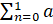<![endif]><![endif]>n
<i style='mso-bidi-font-style:normal'>W2kn<o:p></o:p></i>

      = <!--[if gte msEquation 12]><m:oMath><m:nary><m:naryPr><m:chr
    m:val="&#8721;"/><m:limLoc m:val="subSup"/><m:ctrlPr></m:ctrlPr></m:naryPr><m:sub><i style='mso-bidi-font-style:
   normal'><m:r>n</m:r><m:r>=0</m:r></i></m:sub><m:sup><i
   style='mso-bidi-font-style:normal'><m:r>1</m:r></i></m:sup><m:e><i
   style='mso-bidi-font-style:normal'><m:r>a</m:r></i></m:e></m:nary></m:oMath><![endif]--><![if !msEquation]><!--[if gte vml 1]><v:shape
 id="_x0000_i1025" type="#_x0000_t75" style='width:39.75pt;height:18pt'>
 <v:imagedata src="Fourier_Transform_files/image093.png" o:title=""
  chromakey="white"/>
</v:shape><![endif]--><![if !vml]><![endif]><![endif]>n
<i style='mso-bidi-font-style:normal'>(-1)kn</i><o:p></o:p>

      = a0 <i
style='mso-bidi-font-style:normal'>(-1)k  .0  +
</i>a1 <i style='mso-bidi-font-style:normal'>(-1)k  .1<o:p></o:p></i>

As <b style='mso-bidi-font-weight:normal'>K = </b>0 and 1 (for 2
point DFT)<o:p></o:p>

So, <b style='mso-bidi-font-weight:normal'>A0
</b>= a0<i style='mso-bidi-font-style:
normal'>  +</i><i
style='mso-bidi-font-style:normal'> </i>a1<o:p></o:p>

And <b style='mso-bidi-font-weight:normal'>A1 = </b>a0<i style='mso-bidi-font-style:normal'>  -</i><i style='mso-bidi-font-style:
normal'>  </i>a1<o:p></o:p>

<o:p>&nbsp;</o:p>

<b style='mso-bidi-font-weight:normal'>Similarly
for a 4-point DFT<o:p></o:p></b>

<b style='mso-bidi-font-weight:normal'>W4
= e-2j&#960;/4 = e-2j&#960;/4 = e-j&#960;/2 =
-j<o:p></o:p></b>

Now, discrete Fourier transform for complex numbers
a1, a2, a3, and a4 is<o:p></o:p>

<b style='mso-bidi-font-weight:normal'>AK</b>
=
<!--[if gte msEquation 12]><m:oMath><m:nary><m:naryPr><m:chr m:val="&#8721;"/><m:limLoc
    m:val="subSup"/><m:ctrlPr></m:ctrlPr></m:naryPr><m:sub><i
   style='mso-bidi-font-style:normal'><m:r>n</m:r><m:r>=0</m:r></i></m:sub><m:sup><i
   style='mso-bidi-font-style:normal'><m:r>3</m:r></i></m:sup><m:e><i
   style='mso-bidi-font-style:normal'><m:r>a</m:r></i></m:e></m:nary></m:oMath><![endif]--><![if !msEquation]><!--[if gte vml 1]><v:shape
 id="_x0000_i1025" type="#_x0000_t75" style='width:39.75pt;height:18pt'>
 <v:imagedata src="Fourier_Transform_files/image095.png" o:title=""
  chromakey="white"/>
</v:shape><![endif]--><![if !vml]><![endif]><![endif]>n
<i style='mso-bidi-font-style:normal'>W4kn<o:p></o:p></i>

     = <!--[if gte msEquation 12]><m:oMath><m:nary><m:naryPr><m:chr
    m:val="&#8721;"/><m:limLoc m:val="subSup"/><m:ctrlPr></m:ctrlPr></m:naryPr><m:sub><i style='mso-bidi-font-style:
   normal'><m:r>n</m:r><m:r>=0</m:r></i></m:sub><m:sup><i
   style='mso-bidi-font-style:normal'><m:r>3</m:r></i></m:sup><m:e><i
   style='mso-bidi-font-style:normal'><m:r>a</m:r></i></m:e></m:nary></m:oMath><![endif]--><![if !msEquation]><!--[if gte vml 1]><v:shape
 id="_x0000_i1025" type="#_x0000_t75" style='width:39.75pt;height:18pt'>
 <v:imagedata src="Fourier_Transform_files/image095.png" o:title=""
  chromakey="white"/>
</v:shape><![endif]--><![if !vml]><![endif]><![endif]>n
<i style='mso-bidi-font-style:normal'>(-j)kn</i><o:p></o:p>

     = a0
<i style='mso-bidi-font-style:normal'>(-j)k  .0  +
</i>a1 <i style='mso-bidi-font-style:normal'>(-j)k  .1 + </i>a2 <i
style='mso-bidi-font-style:normal'>(-j)k 
.2 + </i>a3 <i style='mso-bidi-font-style:normal'>(-j)k  .3</i><o:p></o:p>

So, <b style='mso-bidi-font-weight:normal'>A0
</b>= a0<i style='mso-bidi-font-style:
normal'>  +</i><i
style='mso-bidi-font-style:normal'> </i>a1 + a2<i
style='mso-bidi-font-style:normal'> 
+ </i>a3<o:p></o:p>

      <b style='mso-bidi-font-weight:
normal'>A1 = </b>a0<i style='mso-bidi-font-style:
normal'>  -</i><i
style='mso-bidi-font-style:normal'> j</i>a1 - a2<i
style='mso-bidi-font-style:normal'> 
+ j</i>a3<o:p></o:p>

      <b style='mso-bidi-font-weight:
normal'>A2 = </b>a0<i style='mso-bidi-font-style:
normal'>  -</i><i
style='mso-bidi-font-style:normal'> </i>a1 + a2<i
style='mso-bidi-font-style:normal'> 
- </i>a3<o:p></o:p>

      <b style='mso-bidi-font-weight:
normal'>A3 = </b>a0<i style='mso-bidi-font-style:
normal'>  +</i><i
style='mso-bidi-font-style:normal'> j</i>a1 - a2<i
style='mso-bidi-font-style:normal'> 
- j</i>a3<o:p></o:p>

<o:p>&nbsp;</o:p>

To compute <b style='mso-bidi-font-weight:normal'>A</b>
quickly, we can pre-compute common sub-expressions:<o:p></o:p>

      <b
style='mso-bidi-font-weight:normal'>A0 </b>=
(a0<i style='mso-bidi-font-style:normal'> + </i>a2)
+ (a1<i style='mso-bidi-font-style:normal'>  +</i><i style='mso-bidi-font-style:
normal'> </i>a3)<o:p></o:p>

      <b style='mso-bidi-font-weight:
normal'>A1 = 
(</b>a0<i style='mso-bidi-font-style:normal'> </i>-
a2) <i style='mso-bidi-font-style:normal'>– j(</i>a1<i
style='mso-bidi-font-style:normal'> 
- </i>a3)<o:p></o:p>

      <b style='mso-bidi-font-weight:
normal'>A2 = (</b>a0<i
style='mso-bidi-font-style:normal'> 
+</i><i style='mso-bidi-font-style:normal'> </i>a2)
- (a1<i style='mso-bidi-font-style:normal'>  + </i>a3)<o:p></o:p>

      <b style='mso-bidi-font-weight:
normal'>A3 = (</b>a0<i
style='mso-bidi-font-style:normal'> 
</i>- a2)<i style='mso-bidi-font-style:normal'>  + j(</i>a1 - a3)<o:p></o:p>

<o:p>&nbsp;</o:p>

Then we can diagram the 4-point like so,<o:p></o:p>

<!--[if gte vml 1]><v:shape
 id="Picture_x0020_9" o:spid="_x0000_i1032" type="#_x0000_t75" style='width:304.5pt;
 height:168.75pt;visibility:visible;mso-wrap-style:square'>
 <v:imagedata src="Fourier_Transform_files/image097.png" o:title=""/>
</v:shape><![endif]--><![if !vml]><![endif]><o:p></o:p>

Fig:
Three stages in the computation of an N=8-point DFT<o:p></o:p>

<o:p>&nbsp;</o:p>

<!--[if gte vml 1]><v:shape
 id="Picture_x0020_10" o:spid="_x0000_i1031" type="#_x0000_t75" style='width:390pt;
 height:179.25pt;visibility:visible;mso-wrap-style:square'>
 <v:imagedata src="Fourier_Transform_files/image099.png" o:title=""/>
</v:shape><![endif]--><![if !vml]>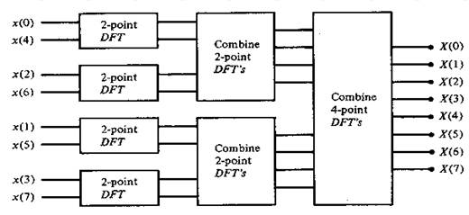<![endif]><o:p></o:p>

Fig:
Three stages in the computation of an N=8-point DFT<o:p></o:p>

<o:p>&nbsp;</o:p>

<b style='mso-bidi-font-weight:normal'>Matrix
Relations in DFT<o:p></o:p></b>

The DFT samples
defined by<o:p></o:p>

<b style='mso-bidi-font-weight:normal'><!--[if gte vml 1]><v:shape id="_x0000_i1025" type="#_x0000_t75"
 style='width:173.25pt;height:36pt' o:ole="">
 <v:imagedata src="Fourier_Transform_files/image101.wmz" o:title=""/>
</v:shape><![endif]--><![if !vml]>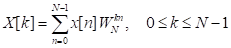<![endif]><!--[if gte mso 9]><xml>
 <o:OLEObject Type="Embed" ProgID="Equation.3" ShapeID="_x0000_i1025"
  DrawAspect="Content" ObjectID="_1793625159">
 </o:OLEObject>
</xml><![endif]--></b><b style='mso-bidi-font-weight:normal'><o:p></o:p></b>

<b style='mso-bidi-font-weight:normal'><o:p>&nbsp;</o:p></b>

<i style='mso-bidi-font-style:
normal'>WNkn</i><i style='mso-bidi-font-style:normal'> </i> can be expanded as 
NXN <b>DFT matrix</b><o:p></o:p>

<b style='mso-bidi-font-weight:normal'><!--[if gte vml 1]><v:shape id="_x0000_i1026" type="#_x0000_t75"
 style='width:3in;height:93.75pt' o:ole="">
 <v:imagedata src="Fourier_Transform_files/image103.wmz" o:title=""/>
</v:shape><![endif]--><![if !vml]><![endif]><!--[if gte mso 9]><xml>
 <o:OLEObject Type="Embed" ProgID="Equation.3" ShapeID="_x0000_i1026"
  DrawAspect="Content" ObjectID="_1793625160">
 </o:OLEObject>
</xml><![endif]--></b><b style='mso-bidi-font-weight:normal'><o:p></o:p></b>

In the matrix the elements in first row and first
column all are <i style='mso-bidi-font-style:normal'>WN.k.0
or WN.0=1. </i>In the third row powers
are multiplied by 2 and in the fourth row powers are multiplied by 3 and so on.<o:p></o:p>

So,<o:p></o:p>

<!--[if gte vml 1]><v:shape
 id="Picture_x0020_81" o:spid="_x0000_i1030" type="#_x0000_t75" style='width:374.25pt;
 height:108pt;visibility:visible;mso-wrap-style:square'>
 <v:imagedata src="Fourier_Transform_files/image105.png" o:title=""/>
</v:shape><![endif]--><![if !vml]>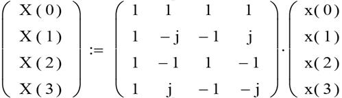<![endif]><o:p></o:p>

<o:p>&nbsp;</o:p>

Oppositely, to find <b style='mso-bidi-font-weight:
normal'>inverse DFT</b> we replace the ‘j’ with ‘-j’ in the matrix or we take
complex conjugates of the matrix elements.<o:p></o:p>

So, <o:p></o:p>

<!--[if gte vml 1]><v:shape
 id="Picture_x0020_82" o:spid="_x0000_i1029" type="#_x0000_t75" style='width:451.5pt;
 height:137.25pt;visibility:visible;mso-wrap-style:square'>
 <v:imagedata src="Fourier_Transform_files/image107.png" o:title=""/>
</v:shape><![endif]--><![if !vml]>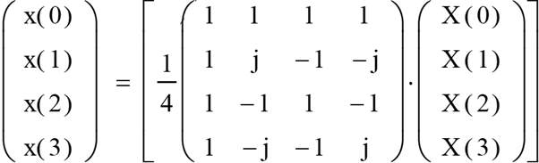<![endif]><o:p></o:p>

The effective determinant of above is 1/4<o:p></o:p>

<o:p>&nbsp;</o:p>

<b style='mso-bidi-font-weight:normal'><o:p>&nbsp;</o:p></b>

<b style='mso-bidi-font-weight:normal'><o:p>&nbsp;</o:p></b>

<b style='mso-bidi-font-weight:normal'><o:p>&nbsp;</o:p></b>

<b style='mso-bidi-font-weight:normal'>For
a 8-point FFT<o:p></o:p></b>

The FFT is a fast algorithm for computing the DFT.
If we take the 2-point DFT and 4-point DFT and generalize them to 8-point,
16-point, ..., 2r-point, we get the FFT
algorithm.<o:p></o:p>

<o:p>&nbsp;</o:p>

<o:p>&nbsp;</o:p>

<o:p>&nbsp;</o:p>

<b style='mso-bidi-font-weight:normal'>N=8-point
radix-4   DIT-FFT<o:p></o:p></b>

<!--[if gte vml 1]><v:shape
 id="Picture_x0020_78" o:spid="_x0000_i1028" type="#_x0000_t75" style='width:390pt;
 height:234pt;visibility:visible;mso-wrap-style:square'>
 <v:imagedata src="Fourier_Transform_files/image109.png" o:title=""/>
</v:shape><![endif]--><![if !vml]><![endif]><o:p></o:p>

Where,
-W4 = W0=1; -W5= W1  = a  = (1-j)/Ö2;  -W2 = W6=j and -W3 =
W7 = b  =  (1+j)/Ö2<o:p></o:p>

The
above diagram is same as illustrated in section ‘Fast Fourier Transform’ under
‘Basics of Fourier Transform’<o:p></o:p>

<o:p>&nbsp;</o:p>

<b style='mso-bidi-font-weight:normal'><o:p>&nbsp;</o:p></b>

<b style='mso-bidi-font-weight:normal'><o:p>&nbsp;</o:p></b>

<b style='mso-bidi-font-weight:normal'><o:p>&nbsp;</o:p></b>

<b style='mso-bidi-font-weight:normal'><o:p>&nbsp;</o:p></b>

<b style='mso-bidi-font-weight:normal'><o:p>&nbsp;</o:p></b>

<b style='mso-bidi-font-weight:normal'><o:p>&nbsp;</o:p></b>

<b style='mso-bidi-font-weight:normal'>N=8-point
radix-2   DIT-FFT<o:p></o:p></b>

<o:p>&nbsp;</o:p>

<!--[if gte vml 1]><v:shape
 id="Picture_x0020_79" o:spid="_x0000_i1027" type="#_x0000_t75" style='width:451.5pt;
 height:230.25pt;visibility:visible;mso-wrap-style:square'>
 <v:imagedata src="Fourier_Transform_files/image111.png" o:title=""/>
</v:shape><![endif]--><![if !vml]><![endif]><o:p></o:p>

<b style='mso-bidi-font-weight:normal'>**
</b><i style='mso-bidi-font-style:normal'>Wx</i><i
style='mso-bidi-font-style:normal'> = W8x<o:p></o:p></i>

<b style='mso-bidi-font-weight:normal'><o:p>&nbsp;</o:p></b>

<![if !supportLists]><b
style='mso-bidi-font-weight:normal'>6.&nbsp;&nbsp;
</b><![endif]><b style='mso-bidi-font-weight:normal'>Applications
<o:p></o:p></b>

Fourier transform is
used in circuit analysis, signal analysis, cell phones, image analysis, signal
processing, and LTI systems. The Fourier transform is most probably the best
tool to find the frequency in an entire field. This makes it a useful tool for LTI
systems and signal processing. Partial differential equations reduce to
ordinary differential equations in Fourier Transform.<o:p></o:p>

</body>

</html>
