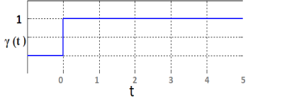
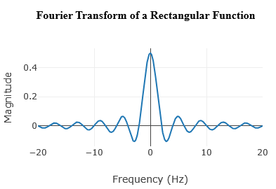
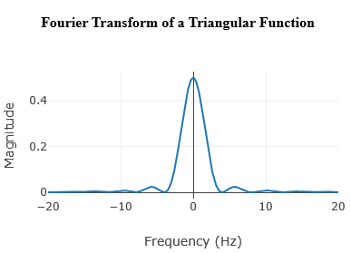
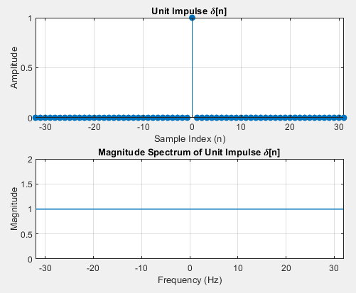
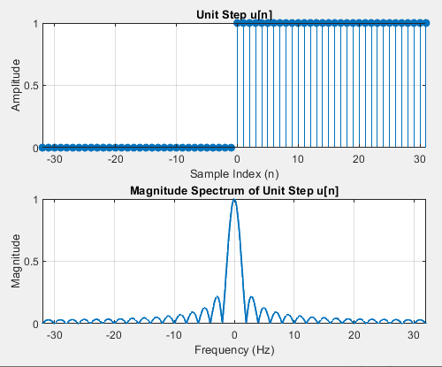
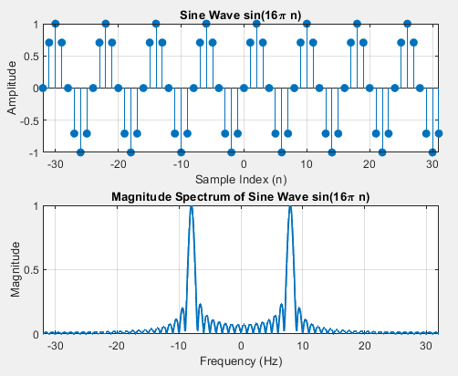
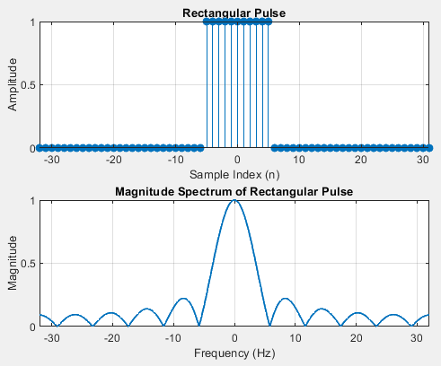

<head>
  <meta charset="UTF-8">
  <meta name="viewport" content="width=device-width, initial-scale=1.0">
  <link href="https://cdn.jsdelivr.net/npm/tailwindcss@2.2.19/dist/tailwind.min.css" rel="stylesheet">
  <link rel="stylesheet" href="./css/imgstyles.css">
  
  
</head>
<body>
					<h2>Continuous Time Fourier Transform (CTFT)</h2>
			

				Fourier transform is a process to convert a spatial domain signal (i.e., time domain signal) into a frequency domain signal. Oppositely, the inverse Fourier transform is a process to convert the frequency domain signal to the primary time domain signal.
			

			<h2>Notation of CTFT</h2>
			
Let <strong>x(t)</strong> be a continuous-time signal. Then the CTFT is defined as:

			

			\( X(j\omega) = \int_{-\infty}^{\infty} x(t) \cdot e^{-j\omega t} \, dt \)
			

			<h3>Where:</h3>
			<ul>
			<li>\( \omega \) is the angular frequency in radians/second.</li>
			<li>\( X(j\omega) \) is the frequency-domain representation of \( x(t) \).</li>
			<li>The transform assumes signals are absolutely integrable over time.</li>
			</ul>
			<h3>Inverse CTFT:</h3>
			
To reconstruct <strong>x(t)</strong> from its CTFT:

			

			\( x(t) = \frac{1}{2\pi} \int_{-\infty}^{\infty} X(j\omega) \cdot e^{j\omega t} \, d\omega \)
			

						

				&#xa0;
			

			<h2>Discrete Time Fourier Transform (DTFT)</h2>
			
The Discrete-Time Fourier Transform (DTFT) is used to analyze discrete-time signals, i.e., signals that are defined only at discrete intervals of time (like samples from an analog signal). These arise naturally in digital signal processing because all digital devices (computers, DSPs) process data in discrete form.

			<h2>Notation of DTFT</h2>
			
Let <strong>x[n]</strong> be a discrete-time signal. Then the DTFT is defined as:

			

			\( X(e^{j\omega}) = \sum_{n=-\infty}^{\infty} x[n] \cdot e^{-j\omega n} \)
			

			<h3>Where:</h3>
			<ul>
			<li>\( \omega \) is the angular frequency in radians/sample.</li>
			<li>\( e^{j\omega} \) represents the frequency-domain variable on the unit circle.</li>
			<li>\( X(e^{j\omega}) \) is periodic with period \( 2\pi \).</li>
			</ul>
			<h3>Inverse DTFT:</h3>
			
To reconstruct <strong>x[n]</strong> from its DTFT:

			

			\( x[n] = \frac{1}{2\pi} \int_{-\pi}^{\pi} X(e^{j\omega}) \cdot e^{j\omega n} d\omega \)
			

			 
		    <h2>Properties of Continuous Time Fourier Transform (CTFT)</h2>
				<li>
					<h3>Linearity</h3>
				</li>
				
The Fourier Transform satisfies the property of linearity (superposition).

				
Consider two signals \( x_1(t) \) and \( x_2(t) \) with Fourier Transforms:

				

				\( \mathcal{F}\{x_1(t)\} = X_1(j\omega), \quad \mathcal{F}\{x_2(t)\} = X_2(j\omega) \)
				

				
Then for any constants \( a_1 \) and \( a_2 \), we have:

				

				\( \mathcal{F}\{a_1 x_1(t) + a_2 x_2(t)\} = a_1 X_1(j\omega) + a_2 X_2(j\omega) \)
				

				<li>
					<h3>Scaling</h3>
				</li>

If \( \mathcal{F}\{x(t)\} = X(j\omega) \), and \( a \) is a real constant, then:

  \( \mathcal{F}\{x(at)\} = \frac{1}{|a|} X\left(\frac{j\omega}{a}\right) \)

				<li>
					<h3>Symmetry</h3>
				</li>

If \( x(t) \) is real and even, then the Fourier Transform satisfies:

  \( X(j\omega) = X^*(-j\omega) \)

If \( x(t) \) is real and odd, then:

  \( X(j\omega) = -X^*(-j\omega) \)

				<li>
					<h3>Convolution</h3>
				</li>

  Fourier Transform converts the convolution of two signals in time domain into the multiplication of their transforms in frequency domain.

  <li>
    <h4>Time Domain Convolution</h4>
  </li>

  If \( F(x_1(t)) = X_1(\omega) \) and \( F(x_2(t)) = X_2(\omega) \), then:

  \(
  F(x_1(t) * x_2(t)) = X_1(\omega) \cdot X_2(\omega)
  \quad \text{(‘*’ denotes convolution)}
  \)

  <li>
    <h4>Frequency Domain Convolution</h4>
  </li>

  If \( F(x_1(t)) = X_1(\omega) \), \( F(x_2(t)) = X_2(\omega) \), then:

  \(
  F(x_1(t) \cdot x_2(t)) = \frac{1}{2\pi} X_1(\omega) * X_2(\omega)
  \quad \text{(‘*’ denotes convolution)}
  \)

				<li>
					<h3>Shifting Property</h3>
				</li>

  \(
  \mathcal{F}\{x(t - t_0)\} = e^{-j\omega t_0} X(\omega)
  \)

  As a consequence, time shifting affects only the phase, leaving the magnitude spectrum \( |X(\omega)|^2 \) unchanged.

				<li>
					<h3>Duality</h3>
				</li>

  Duality states that if \( x(t) \leftrightarrow X(\omega) \), then the roles of time and frequency can be interchanged.

  \(
  \mathcal{F}\{X(t)\} = 2\pi x(-\omega)
  \)

<li>
  <h3>Differentiation</h3>
</li>

  The Fourier Transform of the derivative of a signal corresponds to multiplication by \( j\omega \) in the frequency domain:

  \( \mathcal{F} \left\{ \frac{d}{dt}x(t) \right\} = j\omega X(\omega) \)

<li>
  <h3>Integration</h3>
</li>

  The Fourier Transform of the integral of a signal corresponds to division by \( j\omega \):

  \( \mathcal{F} \left\{ \int_{-\infty}^{t} x(\tau) \, d\tau \right\} = \frac{X(\omega)}{j\omega} \)

  If \( x(t) \) is not an energy signal, the Fourier Transform of its integral includes a Dirac delta term:

  \( \mathcal{F} \left\{ \int_{-\infty}^{t} x(\tau) \, d\tau \right\} = \frac{X(\omega)}{j\omega} + \pi X(0) \delta(\omega) \)

<li>
  <h3>Modulation Property</h3>
</li>

  The Fourier Transform of a signal multiplied by a cosine is:

  \( \mathcal{F} \{ x(t) \cos(at) \} = \frac{1}{2} \left[ X(\omega + a) + X(\omega - a) \right] \)

  And the Fourier Transform of a signal multiplied by a sine is:

  \( \mathcal{F} \{ x(t) \sin(at) \} = \frac{1}{2j} \left[ X(\omega + a) - X(\omega - a) \right] \)

<li>
  <h3>Complex Conjugate Symmetry</h3>
</li>

  If the Fourier Transform of \( f(x) \) is \( F(k) \), then:

  \( f^*(x) \longleftrightarrow F^*(-k) \)

  As a consequence, the Fourier Transform of a real function satisfies the conjugate symmetry property:

  \( F(k) = F^*(-k) \)

  This implies:

  \( |F(k)|^2 = |F(-k)|^2 \)

<li>
  <h3>Parseval’s Theorem</h3>
</li>

  The total energy of a signal in the time domain equals the total energy in the frequency domain:

  \( \int_{-\infty}^{\infty} |x(t)|^2 \, dt = \frac{1}{2\pi} \int_{-\infty}^{\infty} |X(\omega)|^2 \, d\omega \)

<li>
  <h3>Time Reversal</h3>
</li>

  \(
    \mathcal{F}\{x(-t)\} = X(-\omega)
  \)

 
<h2>Properties of Discrete-Time Fourier Transform (DTFT)</h2>

<li>
  <h3>Linearity</h3>
</li>

The DTFT satisfies the property of linearity (superposition).

Consider two signals \( x_1[n] \) and \( x_2[n] \) with DTFTs:

  \( \mathcal{F}\{x_1[n]\} = X_1(e^{j\omega}), \quad \mathcal{F}\{x_2[n]\} = X_2(e^{j\omega}) \)

Then for any constants \( a_1 \) and \( a_2 \), we have:

  \( \mathcal{F}\{a_1 x_1[n] + a_2 x_2[n]\} = a_1 X_1(e^{j\omega}) + a_2 X_2(e^{j\omega}) \)

<li>
  <h3>Time Shifting</h3>
</li>

  \(
  \mathcal{F}\{x[n - n_0]\} = e^{-j\omega n_0} X(e^{j\omega})
  \)

  Shifting in time domain introduces a linear phase shift in the frequency domain.

<li>
  <h3>Frequency Shifting</h3>
</li>

  \(
  \mathcal{F}\{x[n] e^{j\omega_0 n}\} = X(e^{j(\omega - \omega_0)})
  \)

  Multiplying by a complex exponential shifts the spectrum.

<li>
  <h3>Convolution</h3>
</li>

  Time-domain convolution corresponds to multiplication in the frequency domain:

  \(
  \mathcal{F}\{x_1[n] * x_2[n]\} = X_1(e^{j\omega}) \cdot X_2(e^{j\omega})
  \)

<li>
  <h4>Frequency Domain Convolution</h4>
</li>

  \(
  \mathcal{F}\{x_1[n] \cdot x_2[n]\} = \frac{1}{2\pi} \int_{-\pi}^{\pi} X_1(e^{j\theta}) X_2(e^{j(\omega - \theta)}) d\theta
  \)

<li>
  <h3>Symmetry</h3>
</li>

If \( x[n] \) is real and even:

  \( X(e^{j\omega}) = X^*(e^{-j\omega}) \)

If \( x[n] \) is real and odd:

  \( X(e^{j\omega}) = -X^*(e^{-j\omega}) \)

<li>
  <h3>Differencing</h3>
</li>

  The DTFT of the first difference \( x[n] - x[n-1] \) is:

  \(
  \mathcal{F}\{x[n] - x[n - 1]\} = (1 - e^{-j\omega}) X(e^{j\omega})
  \)

<li>
  <h3>Accumulation (Discrete Integration)</h3>
</li>

  \(
  \mathcal{F} \left\{ \sum_{k=-\infty}^n x[k] \right\} = \frac{X(e^{j\omega})}{1 - e^{-j\omega}} + \pi X(1) \delta(\omega)
  \)

<li>
  <h3>Modulation Property</h3>
</li>

  \(
  \mathcal{F} \{ x[n] \cos(\omega_0 n) \} = \frac{1}{2} \left[ X(e^{j(\omega - \omega_0)}) + X(e^{j(\omega + \omega_0)}) \right]
  \)

  \(
  \mathcal{F} \{ x[n] \sin(\omega_0 n) \} = \frac{1}{2j} \left[ X(e^{j(\omega - \omega_0)}) - X(e^{j(\omega + \omega_0)}) \right]
  \)

<li>
  <h3>Conjugate Symmetry</h3>
</li>

  If \( x[n] \) is real, then:

  \( X(e^{j\omega}) = X^*(e^{-j\omega}) \)

  Therefore,
  \( |X(e^{j\omega})| = |X(e^{-j\omega})| \)

<li>
  <h3>Parseval’s Theorem</h3>
</li>

  The total energy in time domain equals the total energy in frequency domain:

  \(
  \sum_{n=-\infty}^{\infty} |x[n]|^2 = \frac{1}{2\pi} \int_{-\pi}^{\pi} |X(e^{j\omega})|^2 d\omega
  \)

<li>
  <h3>Time Reversal</h3>
</li>

  \(
  \mathcal{F}\{x[-n]\} = X(e^{-j\omega})
  \)

<li>
  <h3>Periodicity</h3>
</li>

  DTFT is always periodic in \( \omega \) with period \( 2\pi \):

  \(
  X(e^{j\omega}) = X(e^{j(\omega + 2\pi)})
  \)

 
		     <h2>Fourier Transform of some common signals</h2>
						<li>
	                     <h3>Fourier Transform of a delta function</h3>
						</li>
					</ol>
				</li>
			</ol>
			

				
			

			

				Thus Fourier transform of a delta/impulse is a constant equal to 1, independent of frequency. 
			

			

				&#xa0;
			

						

				
			

						

				&#xa0;
			

				<li>
					<h3>Fourier transform of a unit step function</h3>
				</li>
			

				<strong>&#xa0;</strong>
			

			

				
			

			

				γ (t) = 0 for t&lt;0
			

			

				&#xa0;&#xa0;&#xa0;&#xa0;&#xa0;&#xa0; = 1 for t ≥1
			

        

            Its Fourier transform is given by the following expression:
        

        <!-- This is the MathJax-compatible formula -->
        

            \(
            \mathcal{F}\{γ(t)\} = \pi\delta(\omega) + \frac{1}{j\omega}
            \)
        

		 
											

				
			

						

				&#xa0;
			

				<li>
					<h3> Fourier Transform of a unit pulse function</h3>
				</li>
			

				A pulse function can be represented as,
			

			

				x(t)=Π(t) = γ (t + ½) - γ(t - ½)
			

			

				
			

			

				For a function rect(t) = Π(t) = 1 for |t| ≤ ½
			

			

				&#xa0;&#xa0;&#xa0;&#xa0;&#xa0;&#xa0;&#xa0;&#xa0;&#xa0;&#xa0;&#xa0;&#xa0;&#xa0;&#xa0;&#xa0;&#xa0;&#xa0;&#xa0;&#xa0;&#xa0;&#xa0;&#xa0;&#xa0;&#xa0;&#xa0;&#xa0;&#xa0;&#xa0;&#xa0;&#xa0;&#xa0;&#xa0;&#xa0;&#xa0;&#xa0;&#xa0;&#xa0;&#xa0;&#xa0;&#xa0;&#xa0;&#xa0;&#xa0;&#xa0; = 0 otherwise
			

        

            The general Fourier transform of a rectangular pulse \( \text{Π}(t/\tau) \) expressed in terms of angular frequency \( \omega \) is:
        

        

            \(
            \mathcal{F}\{\text{rect}(\frac{t}{\tau})\} = \tau \frac{\sin(\omega\tau/2)}{\omega\tau/2}
            \)
        

        

            For our specific signal, the pulse width is \( \tau = 1 \). Substituting this value into the formula:
        

        

            \(
            X(\text{Π}) = (1) \frac{\sin(\omega(1)/2)}{\omega(1)/2}
            \)
        

        

            Simplifying the expression gives us the final Fourier transform:
        

        

            \(
            X(\text{Π}) = \frac{\sin(\omega/2)}{\omega/2}
            \)
        

		        

\(
X(\text{Π}) = \text{sinc}(\omega/2)
\)
        

		 
												

				
			

						

				&#xa0;
			

				<li>
					<h3> Fourier Transform of a unit triangle pulse</h3>
				</li>
			

				
			

			

				A unit triangle pulse is simply the convolution of a unit pulse function with itself.
			

			

				Here, Λ(t) = Π(t) * Π(t)&#xa0;&#xa0;&#xa0;&#xa0;&#xa0;&#xa0;&#xa0;&#xa0;&#xa0;&#xa0;&#xa0;&#xa0;&#xa0;&#xa0;&#xa0; 
			

			

				<em>[Π(t) is a unit pulse function &amp; ‘*’ denotes convolution]</em>
			

			

				So,            \(
                \Lambda(\omega) = \text{sinc}(\omega/2) \cdot \text{sinc}(\omega/2) = \text{sinc}^2(\omega/2)
            \)
			

			

				&#xa0;
			

															

				
			

						

				&#xa0;
			

    <h2>Common Discrete-Time Signals and their DTFT</h2>
    <ul>
      <li>
        <h3>Unit Impulse Sequence</h3>
        
Signal:

        
\( x[n] = \delta[n] \)

        
DTFT:

        
\( X(e^{j\omega}) = 1 \)

      </li>
	   
	  

				
			

       
      <li>
        <h3>Unit Step Sequence</h3>
        
Signal:

        
\( x[n] = u[n] \)

        
DTFT:

        
\( X(e^{j\omega}) = \pi\,\delta(\omega) + \dfrac{1}{1 - e^{-j\omega}} \)

      </li>
	   
	  

				
			

       
      <li>
        <h3>Discrete-Time Sinusoid</h3>
        
Signal:

        
\( x[n] = \cos(\omega_0 n) \quad \text{or} \quad x[n] = \sin(\omega_0 n) \)

        
DTFT:

        
\( X(e^{j\omega}) = \pi\!\left[\delta(\omega-\omega_0) + \delta(\omega+\omega_0)\right] \)

      </li>
	   
	  

				
			

       
      <li>
        <h3>Finite-Length Rectangular Pulse</h3>
        
Signal (length \(N\), starting at \(n=0\)):

        
\( x[n] = \begin{cases} 1, & 0 \le n \le N-1 \\ 0, & \text{otherwise} \end{cases} \)

        
DTFT:

        

          \( X(e^{j\omega}) = \displaystyle e^{-j\omega\frac{N-1}{2}} \cdot \frac{\sin\!\big(\tfrac{N\omega}{2}\big)}{\sin\!\big(\tfrac{\omega}{2}\big)} \)
        

        
Starting at \(n=n_0\) gives:

  \(
    X_{\text{shifted}}(e^{j\omega}) =
    e^{-j\omega n_0} \cdot e^{-j\omega\frac{N-1}{2}}
    \cdot \frac{\sin\!\left( \frac{N\omega}{2} \right)}
           {\sin\!\left( \frac{\omega}{2} \right)}
  \)

      </li>
	  	   
	  

				
			

    </ul>
<h2>
			Applications 
</h2>
			

				Fourier transform is used in circuit analysis, signal analysis, cell phones, image analysis, signal processing, and LTI systems. The Fourier transform is most probably the best tool to find the frequency in an entire field. This makes it a useful tool for LTI systems and signal processing. Partial differential equations reduce to ordinary differential equations in Fourier Transform.
			

</body>
</html>

